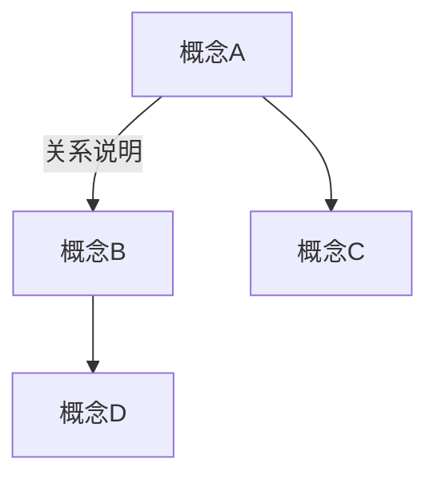
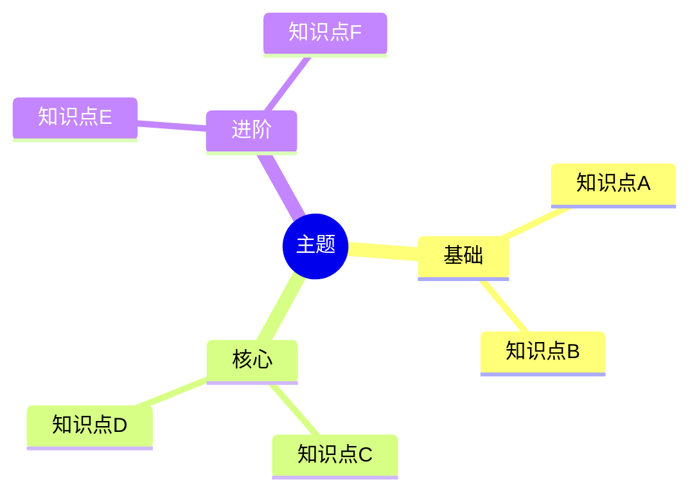

# note-splitter：笔记知识点拆分工具（学习版）

将一篇长笔记/文章/文档按知识点拆分为多个独立的 `.md` 文件，采用 **学习导向格式**——每个知识点文件就像一张精心设计的"学习卡片"，引导用户从浅入深理解概念，而不是机械地做题对答案。

## 设计理念

> **不是做考题，而是学知识。**

传统拆分把知识点变成"面试题 + 答案"（自测区 → 参考答案），这本质上是**考试导向**——你只是在验证自己是否记住。

本版本采用**学习导向**设计，提供两种输出模式：

| 模式 | 核心哲学 | 适用场景 |
|------|----------|----------|
| **学习卡片模式**（默认） | 一张精心设计的"卡片" —— 引子激发好奇 → 图解建立认知 → 动手实践巩固 | 独立阅读学习、知识库构建、笔记存档 |
| **交互式教学模式** | 一个"学习闭环" —— 学习目标明确 → 检查站验证 → AI 自适应推进 | 配合 AGENTS.md 交互式学习系统，一对一教学 |

两种模式共享底层基因：

| 旧（考试导向） | 新（学习导向） |
|---|---|
| "这个知识点要回答：..."（问题先行） | "引子：一个真实场景"（故事先行，激发好奇） |
| ✍️ 自测 → ✅ 参考答案（做题对答案） | 📖 核心理解 → 💡 关键要点 → 🛠️ 动手实践（渐进学习） |
| 纯文字问答 | 📊 图文并茂（mermaid 图表） |
| 孤立的问题和答案 | 🔗 知识连接（明确的关系图谱） |
| 机械记忆 | 🧠 记忆助手（类比、口诀、视觉化） |
| 索引是列表清单 | 🗺️ 知识地图（学习路径 + 关系图） |

### 模式选择机制

在开始拆分前，按以下逻辑判断使用哪种模式：

```
检查当前仓库 AGENTS.md 是否包含"交互式学习系统"章节？
  ├─ 是 → 默认使用「交互式教学模式」
  │   （用户可通过对话明确说"只要学习卡片"来回退）
  │
  └─ 否 → 使用「学习卡片模式」
      （用户可以明确说"按交互式教学格式"来切换）
```

当两种模式都可以时，优先选中用户当前项目环境更匹配的那个。

---

## 触发条件

当用户表达以下意图时，必须使用此 skill：
- 拆分/分解/切分/分割 笔记、文章、文档
- 将长内容整理成多个知识点文件
- "一篇文章拆成多个md"
- 要求按知识点/概念/主题拆分
- 要求做成学习卡片/知识卡片格式

---

## 模式一：学习卡片模式（默认）

> 这是 note-splitter 的经典模式。产出格式化的知识点文件，适合独立阅读和知识库构建。

每个拆分出的 `.md` 文件必须严格遵循以下结构。

### 1. YAML frontmatter（学习卡片模式

```yaml
---
tags: [标签1, 标签2]
difficulty: beginner          # beginner | intermediate | advanced
prerequisites:                # 学习本知识点前需要先了解的知识
  - prerequisite-note         # 不带 .md 后缀
related:
  - related-note1
  - related-note2
---
```

- `tags`：至少一个标签，标明所属主题
- `difficulty`：知识点的难度等级，帮助用户规划学习顺序
- `prerequisites`：前置知识点（新字段！），标注学习本知识点前应先掌握的内容
- `related`：相关的其他知识点
- YAML 中使用 `- ` 列表格式，不要使用 `[]` 内联格式

### 2. 标题 — 用一句话说清楚本质

```markdown
# 💡 知识点名称
```

标题前使用 `💡` emoji。标题要简洁、准确、**有启发感**——让人一看就想了解。

可选的副标题（用一句话提炼本质）：
```markdown
> **一句话**：用最通俗的语言说出这个知识点的核心本质（比如"Redis 就是一台放在内存里的超级字典"）
```

### 3. 🎬 引子：为什么学这个？

每个知识点从一个**真实场景/问题/故事**开始，激发学习动机。

```markdown
## 🎬 引子

你有没有遇到过这种情况：……

这个问题的根源就是 **XXX**。
```

- 用一个具体的、可感知的真实问题引入
- 让用户意识到"这个东西能解决我的问题"
- 控制在 3-5 句话，直奔痛点

### 4. 📖 核心理解

这是知识点的**主体讲解区**。要求：
- **先讲是什么，再讲为什么，最后讲怎么用**
- 使用小标题 `###` 组织子主题
- **关键术语、核心数据、重要结论** 必须加粗
- 每段长度适中，一段讲清楚一个子概念

```markdown
## 📖 核心理解

### 是什么

XXX 是一种……，它的核心思想是……

### 为什么这样设计

之所以这样设计，是因为……

### 怎么用

在实际中，XXX 最常见的用法是：
```

### 5. 📊 图解知识

每个知识点文件**尽可能**包含至少一个 mermaid 图表（流程图、思维导图、时序图等），帮助可视化理解。

```markdown
## 📊 图解知识



**图释**：这张图展示了 XXX 之间的关系，其中……
```

**图表使用建议**：
- **概念关系**：用 `graph` / `mindmap` 展示知识结构
- **流程/机制**：用 `flowchart` / `sequenceDiagram` 展示执行过程
- **对比**：用表格在**图表下方**做对比

每个图表下方必须跟一段**图释**，解释这张图在说什么。

### 6. 💡 关键要点

把知识点压缩为 3-5 个**最需要记住的要点**，用 `🎯` 前缀列表：

```markdown
## 💡 关键要点

- 🎯 **要点一**：核心术语 + 一句话解释
- 🎯 **要点二**：关键数据/限制 + 为什么重要
- 🎯 **要点三**：最常用的场景/模式
- 🎯 **要点四**：容易混淆的概念区分（如果有）
```

- 要点要**少而精**，只选最重要的
- 每个要点都应该是一个**独立的记忆单元**
- 用加粗标注每个要点的核心词

### 7. 🧠 记忆助手

给出**类比、口诀、可视化记忆法**，帮助长期记忆：

```markdown
## 🧠 记忆助手

### 类比理解

可以把 XXX 想象成……就像生活中的……

### 记忆口诀

> **口**·诀·提·示

### 区分记忆

容易和 XX 混淆？记住这个区别：……
```

- **类比理解**：用生活化的类比解释抽象概念（最重要！）
- **记忆口诀**：如果适合，给出一个简短的口诀
- **区分记忆**：如果有容易混淆的概念，给出区分方法

> 如果该知识点不适合记忆助手（比如很简单），可以省略此模块，但**大多数知识点都应该有**。

### 8. 🛠️ 动手实践

引导用户通过**主动实践**来巩固理解，而不是被动对答案：

```markdown
## 🛠️ 动手实践

### 🐣 基础练习

试着回答/做一下：
1. 第一步提示……
2. 第二步提示……

### 🎯 挑战一下

（可选）如果你想加深理解，可以尝试……

> [!tip]- 💡 提示 / 参考思路
> 
> （给出引导性的提示，不是完整答案）
> 
> - 如果内容中有列表，每行前面加 `> `
> - 如果内容中有代码块，每行前面也加 `> `
```

**Callout 格式规则（必须严格遵守）**：
- 使用 Obsidian 原生的**可折叠 Callout**：`> [!tip]- 💡 提示 / 参考思路`
- `-` 表示**默认折叠**，用户点击才展开
- 标题行后用 `> ` 空行分隔
- **所有内容行**（包括空行、列表、代码块）前面都加 `> `
- 代码块的行也同样处理：`> ```bash` ... `> ````
- **禁止使用 `<details>` / `<summary>` HTML 标签**——在 Obsidian 中渲染不可靠

**关键区别**（对比旧版的"自测区"）：

| 旧版自测区 | 新版动手实践 |
|---|---|
| "① 问题是什么？"（封闭问题） | "试着回答/做一下"（开放引导） |
| 问题 → 答案（对答案模式） | 步骤 → 提示（探索模式） |
| 只有文字问答 | 可以包含代码、配置、设计等实操 |
| 评价性质（"我答对了吗？"） | 探索性质（"我理解了吗？"） |
| 答案直接给出 | 用 `> [!tip]-` 可折叠 Callout 给出提示 |

### 9. 🔗 知识连接

展示本知识点在整个知识体系中的位置和关系：

```markdown
## 🔗 知识连接

### 前置知识

学习本知识点前，建议先了解：
- [[前置笔记A]] — 为什么需要先了解它？
- [[前置笔记B]] — 它提供了什么基础？

### 后续知识

学完这个，可以继续学习：
- [[后续笔记A]] — 在这个基础上的进阶
- [[后续笔记B]] — 另一个角度的延伸

### 平行知识

- [[同级笔记A]] — 两者是什么关系？（并列/对比/互补）
```

- **前置知识**：来自 frontmatter 的 `prerequisites` 字段
- **后续知识**：适合下一步学习的内容
- **平行知识**：同级概念之间的关系说明

### 10. 底部导航

```markdown
---

[[_index|← 返回知识地图]]
```

- 固定底部链接回 `_index.md`
- 不需要再列一遍相关笔记（知识连接区已经做了）

---

## 重点加粗规则

每个文件中必须对**关键术语、核心概念、重要数据**进行加粗处理。

**需要加粗的内容类型**（贯穿全文所有模块）：
- **核心术语**：技术名称、方法名、框架名等（如 Agent、RAG、CoT、LangChain）
- **关键数据**：参数值、限制条件、核心指标（如 `temperature` 的取值范围 (0,1.0]）
- **核心结论**：重要的定义、公式、原则（如 `Agent = LLM + 规划 + 记忆 + 工具`）
- **对比要点**：需要特别注意的区别特征
- **经典案例**：代表性案例名称（如 斯坦福小镇、Copilot）

> **规则**：每个文件中至少 8-15 处加粗（视内容长度而定），但不要过度使用——只加粗**真正重要**的内容。

---

## 知识地图（_index.md）

总索引文件改为**知识地图**形式，不再是简单的列表：

```markdown
---
tags: [原笔记标签]
---
# 🗺️ 原笔记名 · 知识地图

> **学习路径**：从基础到进阶，建议按编号顺序学习。
> 每个知识点都标注了难度和前置要求，可以灵活跳转。

---

## 🧭 知识导航



> **图释**：这张思维导图展示了所有知识点之间的层次关系。

---

## 📋 知识点列表

| # | 知识点 | 难度 | 前置知识 | 状态 |
|---|--------|------|---------|------|
| 1 | [[01-知识点A\|知识点 A]] | 🌱 入门 | — | ⬜ |
| 2 | [[02-知识点B\|知识点 B]] | 🌱 入门 | #1 | ⬜ |
| 3 | [[03-知识点C\|知识点 C]] | 🌿 进阶 | #1, #2 | ⬜ |
| 4 | [[04-知识点D\|知识点 D]] | 🌳 深入 | #3 | ⬜ |

### 难度图标说明
| 图标 | 含义 |
|------|------|
| 🌱 入门 | 基础知识，无需前置 |
| 🌿 进阶 | 需要一定前置知识 |
| 🌳 深入 | 较复杂的核心概念 |

### 使用建议
1. 从 **🌱 入门** 开始，按编号顺序学习
2. 每个知识点学习后，在状态列标记 ✅
3. 学完入门后，根据需要选择 🌿 进阶 方向
4. 定期回到知识地图，查看整体知识结构

---

> **提示**：学习不是线性的——遇到难点可以暂时跳过，先学其他相关知识点再回来。
> 
> [[../原笔记名\|← 返回原文]]
```

---

## 命名与目录规则

### 学习卡片模式

- 在原始笔记同目录下创建 `原始笔记名_split/` 子目录
- **子目录名和文件名统一使用中文**，便于阅读和检索
- 文件名使用前缀编号：`01-知识点名.md`、`02-知识点名.md`
- 编号按**学习顺序**（从基础到进阶），不是随机顺序
- 中文文件名不含空格，可用 `-` 或 `_` 连接

### 交互式教学模式

- 在仓库根目录（或用户指定目录）下创建 `主题名/` 目录
- 文件名：`NN_知识点名.md`（两位数字 + 下划线 + 中文标题）
- 编号按学习顺序从基础到进阶
- 同时创建或提示用户创建 `进度.md`

---

## Canvas 思维导图（学习卡片模式专用）

> 交互式教学模式下不使用 Canvas。如需可视化，可在 `_index.md` 或 `进度.md` 中使用 mermaid 图表。

每次拆分完成后，在 `_split/` 目录下自动生成一个 `.canvas` 文件（Obsidian Canvas 格式），作为知识点的**可视化思维导图**。

### 设计理念

采用**三层递进结构**——从总览到分类再到细节，像一张可拖拽的"知识地图"：

```
Layer 1: 中心节点（航图）
  ├─ mindmap 全景图 + 学习路径概述
  │
  ▼ 边标签："先打好基础" / "再深入核心" / "最后攻克难点"
  │
Layer 2: 分类节点（分支）
  ├─ 按难度/主题分组（基础认知 / 核心架构 / 训练机制 等）
  ├─ 说明本组包含什么 + 为什么这样分组
  │
  ▼ 边标签："→" 自然指向
  │
Layer 3: 知识点卡片（细节）
  ├─ 每个知识点一个独立卡片
  └─ 内容 = 标题 + 一句话总结 + 3~5 个关键要点
```

### 节点内容规范

**中心节点**（Layer 1）：
- 位置：Canvas 中央偏左，`x: -200, y: 0`
- 内容：`_index.md` 中的 mermaid mindmap 代码块 + 学习路径简述
- 尺寸：`width: 780, height: 500`

**分类节点**（Layer 2）：
- 位置：中心右侧，按难度从上到下排列
- 内容：简短说明模板——
  ```
  ## 🌱 分类名称
  > 本组核心问题：XXX
  ```
- 尺寸：`width: 600, height: 160`

**知识点卡片**（Layer 3）：
- 位置：每个分类节点的右侧，上下错开排列
- 内容：浓缩卡片模板——
  ```markdown
  💡 知识点名称
  > 一句话总结这个知识点在讲什么

  🎯 要点一
  🎯 要点二
  🎯 要点三
  ```
- 尺寸：`width: 640, height: 240`

### 边（连线）规范

- 中心 → 分类节点：`label` 描述学习路径（如 "先打好基础"、"再深入核心"）
- 分类 → 知识点卡片：`label` 空或简短过渡词（如 "→"）
- 边的 `fromSide`/`toSide` 合理设置，避免交叉重叠

### 位置布局规则

- 中心节点：`x: -200, y: -100`
- 分类节点：`x: 800`，y 按数量均分垂直空间（每个间隔 350-400px）
- 知识点卡片：`x: 1600`，y 基于对应分类节点微调
- 节点之间留足间距，确保连线不重叠

### Canvas JSON 格式

Canvas 文件是一个标准 JSON，结构如下：

```json
{
  "nodes": [
    {
      "id": "唯一随机 hex ID（16 字符）",
      "type": "text",
      "text": "节点内容（支持 Markdown、mermaid、表格）",
      "x": 整数,
      "y": 整数,
      "width": 整数,
      "height": 整数
    }
  ],
  "edges": [
    {
      "id": "唯一随机 hex ID（16 字符）",
      "fromNode": "源节点 ID",
      "fromSide": "top" | "bottom" | "left" | "right",
      "toNode": "目标节点 ID",
      "toSide": "top" | "bottom" | "left" | "right",
      "label": "可选边标签"
    }
  ]
}
```

### 生成流程

1. **确定知识点结构**：从已生成的 md 文件和 `_index.md` 中提取所有知识点名称、编号、难度和一句话总结
2. **分组分类**：按 `_index.md` 中的分类（基础/核心/进阶等）将知识点分组
3. **生成中心节点**：复用 `_index.md` 的 mermaid mindmap
4. **生成分类节点**：每个分类一个节点，内容 = 分类名 + 本组概述
5. **生成知识点卡片**：每个知识点一个精简卡片节点
6. **生成边**：中心 → 分类（label 带学习路径）、分类 → 知识点（无 label）
7. **写入文件**：`_split/{主题名}.canvas`

### 命名规则

- 文件名：`{主题名}.canvas`（如 `Chunking-Free RAG.canvas`）
- 放在 `_split/` 目录下，与 `_index.md` 并列

---

## 模式二：交互式教学模式

> 当用户在 AGENTS.md 交互式学习环境中时，note-splitter 产出的文件直接对接教学闭环。每个文件成为一个「学习单元」而非「学习卡片」。

### 核心哲学

交互式教学模式基于 Benjamin Bloom 的 **2 Sigma 问题**和**掌握学习（Mastery Learning）**理论：

- 接受一对一辅导的学生**超越 98%** 的普通课堂学生
- 核心机制：只有当学生真正理解当前内容，才推进到下一阶段
- **绝不因为进度而跳过未掌握的内容**

在交互式教学模式下，note-splitter 的角色是**准备好每个学习单元**，而 AGENTS.md 定义的 AI 助教负责**根据学生对检查站的回答，自适应决定下一步**（推进 / 补充讲解 / 重新构建）。

### 两个模式的职责边界

```
┌─────────────────────────────────────────────────────┐
│              note-splitter（本 skill）               │
│  负责：拆分知识点 → 生成符合教学格式的 .md 文件         │
│  产出：学习目标 + 内容讲解 + 小结 + 检查站             │
│  不负责：判断用户是否掌握、推进到下一课                 │
└─────────────────────────────────────────────────────┘
                          │
                          ▼
┌─────────────────────────────────────────────────────┐
│          AGENTS.md 交互式学习系统（AI 助教）           │
│  负责：接收用户对检查站的回答 → 评估掌握程度            │
│  决策：完全掌握（推进）/ 部分理解（补充）/ 尚未理解（重建）│
│  不负责：生成知识点文件本身                            │
└─────────────────────────────────────────────────────┘
```

### 知识点文件格式（交互式教学模式）

在交互式教学模式下，每个 `.md` 文件采用以下格式（省略 frontmatter、知识连接等章节）：

```markdown
# [主题] - 第 N 课：[标题]

## 学习目标

本节结束后，你能够：

- ✏️ [可验证的能力描述 1]
- ✏️ [可验证的能力描述 2]
- ✏️ [可验证的能力描述 3]

## 内容讲解

### 情景引入
（从源材料的引子/场景提炼 2-4 句精华，激发学习动机）

### 核心概念
（主体讲解区，保留 mermaid 图表和表格，融入类比和口诀）

## 小结

- 🎯 要点 1（从关键要点精选 3-5 条）
- 🎯 要点 2
- 🎯 要点 3

> 💬 口诀：...（可选，但鼓励包含）

---

## 检查站：请回答以下问题

1. **概念确认**：[检查基本概念是否理解 —— 源文件"基础练习"改造]
2. **理解应用**：[检查能否运用概念分析和解决问题 —— 源文件"基础练习"改造]
3. **开放思考**：[需要综合思考和创造性回答 —— 源文件"挑战"改造]

请把你的答案直接告诉我，我会根据你的回答决定下一步。
```

### 交互式教学模式的文件命名规则

与学习卡片模式不同，交互式教学模式产出文件放在**目标主题根目录**而非 `_split/` 子目录：

```
学习卡片模式                        交互式教学模式
────────────                        ────────────
主题名_split/                       主题名/
├── 01-知识点A.md                   ├── 进度.md          ← 新建
├── 02-知识点B.md                   ├── 01_知识点A.md    ← 下划线编号
├── _index.md                       ├── 02_知识点B.md
└── 主题名.canvas                    ├── 03_知识点C.md
                                    └── ...
```

- 文件名：`NN_标题.md`（两位数字 + 下划线 + 中文标题）
- 编号按学习顺序从基础到进阶
- 包含 `进度.md` 追踪文件（由后续处理生成，或 note-splitter 提示用户需要创建）

### 交互式教学模式的处理流程

在「通用处理流程」基础上，交互式教学模式有以下差异：

1. **不生成 frontmatter**：YAML 元数据（tags、difficulty、prerequisites、related）由 AI 助教在教学对话中动态管理
2. **不生成「知识连接」栏目**：前置/后续知识由 `_index.md` 或 `进度.md` 统一管理，无需在每个文件中重复
3. **不嵌入参考答案**：检查站问题的答案由 AI 在对话中动态给出，不在文件中预埋 `[!tip]-` 折叠块
4. **学习目标前置**：用可验证的能力描述替代「一句话」副标题，让学生明确「学完能做什么」
5. **检查站替代动手实践**：将源材料的「基础练习」改造为概念确认 + 理解应用，「挑战」改造为开放思考
6. **产出来源**：可以是全新拆分，也可以是对已有「学习卡片模式」文件的**改造**（类似 Redis 学习内容重构）

### 从学习卡片模式改造为交互式教学模式

当已有「学习卡片模式」产出的文件，需要改造为交互式教学模式时，执行以下操作：

| 操作 | 说明 |
|------|------|
| 删除 frontmatter | YAML 元数据块整体移除 |
| 删除 `## 🔗 知识连接` | 整节移除，链接由外部索引文件管理 |
| 删除 `[!tip]-` 折叠答案 | 问题保留，答案和提示移除 |
| 重命名「动手实践」→「检查站」 | 基础练习 → 概念确认/理解应用，挑战 → 开放思考 |
| 新增「学习目标」 | 从内容提炼 2-3 条可验证的能力描述 |
| 重组织「内容讲解」 | 将引子、核心概念、图表、类比融合为一个流畅的讲解流程 |
| 保留图表、表格、类比、口诀 | 这些是通用的学习增强要素，两个模式共享 |

### 交互式教学模式下的教学风格原则

融入 AGENTS.md 的教学风格原则（这些原则不写入文件，而是指导内容创作）：

- **费曼技巧**：用最简单的语言解释复杂概念，多用类比和现实例子
- **苏格拉底式提问**：检查站问题应当引导学生自己思考，而非直接问「XX 的定义是什么」
- **脚手架原则**：从已知推向未知，每一步都建立在前一步之上。`prerequisites` 字段（如果保留在索引中）标注前置依赖
- **鼓励犯错**：检查站问题不应有「对错」评判色彩，而是作为理解深度的诊断工具

---

## 通用处理流程

以下流程适用于两种模式，差异部分已通过「模式选择机制」标注。

1. **读取内容**：读取用户提供的笔记内容
2. **分析内容**：识别出独立的、最小化的知识单元
   - 每个知识点只讲一个概念
   - 知识点粒度的判断标准：能在一张"学习卡片"或一个"学习单元"上讲清楚
   - 确定知识点的难度等级和前置依赖关系
3. **判断模式**：按「模式选择机制」决定使用学习卡片模式还是交互式教学模式
4. **设计学习路径**：确定知识点之间的学习顺序（从基础到进阶）
5. **创建目录**：
   - 学习卡片模式：在原始笔记同目录下创建 `原始笔记名_split/` 子目录
   - 交互式教学模式：在仓库根目录下创建 `主题名/` 目录
6. **生成文件**：逐个生成每个知识点的 `.md` 文件
   - 严格遵循所选模式的格式规范
   - 每个文件至少包含一个 mermaid 图表（如果内容适合）
   - 对每个知识点文件执行**重点加粗优化**
7. **生成索引**：
   - 学习卡片模式：生成 `_index.md` 知识地图 + `.canvas` 思维导图
   - 交互式教学模式：提示用户需要创建 `进度.md`（格式参见下方）
8. **告知用户**：告知用户拆分完成，列出生成了多少个文件，以及推荐的学习顺序

---

## 进度追踪文件模板（交互式教学模式）

当产出为交互式教学模式时，提示用户在主题目录下创建 `进度.md`，格式参考：

```markdown
# [主题] 学习进度

> 📅 开始学习日期：____年____月____日
> 掌握程度：⬜ 未学  🔄 学习中  🟡 部分掌握  🟢 完全掌握  ⏭️ 跳过

## 学习路径总览

| 阶段 | 主题 | 课时 | 状态 |
|------|------|------|------|
| ... | ... | ... | ⬜ |

## 详细进度表

| 编号 | 文件名 | 标题 | 难度 | 掌握程度 | 日期 | 备注 |
|------|--------|------|------|----------|------|------|
| 01_01 | `01_01_xxx.md` | XXX | 🌱 入门 | ⬜ | | |

## 知识误区记录表

| 日期 | 相关课时 | 误区描述 | 正确理解 | 是否已纠正 |
|------|----------|----------|----------|-----------|

## 补充课记录表

| 日期 | 原课时 | 补充课编号 | 原因 |
|------|--------|-----------|------|
```

---

## 注意事项

### 两种模式通用

- **最小化知识点**：一个文件只讲一个概念，不要在一个文件里塞多个主题
- **学习导向**：始终记住"这是在帮助用户学习，不是在帮用户备考"
- **mermaid 图表**：每个知识点文件至少含一个图表（除非内容实在不适合画图），图表必须有图释
- **引子要真实**：引子中的场景要具体、可感知，不要空洞的"在实际开发中..."
- **记忆助手要用心**：好的类比比多写三段文字更有价值，花时间想一个好的类比或口诀
- **难度分级**：合理标注难度，🌱 入门的知识点不应该依赖 🌳 深入的知识点
- **重点加粗**：每个输出文件必须对核心术语、关键数据、核心结论进行加粗处理，贯穿所有模块
- **保留原文**：不修改原始笔记文件，拆分结果放在目标目录中

### 学习卡片模式专用

- **实践不要变相自测**：动手实践是引导探索，不是"来，答个题"。用提示代替答案
- **关系要说清**：知识连接中不仅要列链接，还要说明"为什么相关"（一句话解释）
- **wikilink 格式**：使用 `[[文件名]]` 格式，不要带 `.md` 后缀

### 交互式教学模式专用

- **不要嵌入答案**：检查站问题的答案由 AI 在对话中动态给出，不要写参考答案或提示折叠块
- **学习目标要可验证**：不是「了解 XXX」，而是「能画出 XXX 的结构图」「能用自己的话解释 XXX 和 YYY 的区别」
- **检查站三层递进**：概念确认（记忆理解）→ 理解应用（分析推理）→ 开放思考（综合创造），三层缺一不可
- **问题和答案分离**：这是交互式教学的核心设计——问题写在文件里给学生看，答案由 AI 实时评估后针对性给出
- **配合进度系统**：产出文件后提醒用户在主题目录创建 `进度.md`，参考上方模板
- **掌握学习优先**：排列知识点顺序时，确保每个知识点只依赖前面的（或已标注为前置），不要让学习路径出现循环依赖
