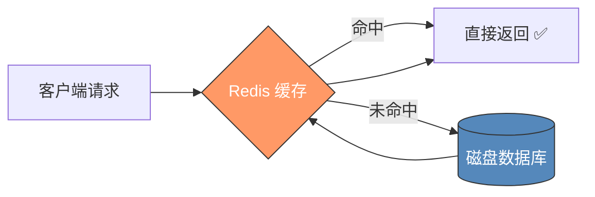

# 💡 Redis 是什么？

> **一句话**：Redis 就是一台放在内存里的超级字典，读写速度是普通数据库的几十倍。

---

## 🎬 引子

你有没有遇到过这种情况：网站访问量一大，页面加载就慢得像蜗牛？每次刷新都要从硬盘数据库里查数据，即使内容根本没变？

这就像每次去图书馆借书都要跑一趟仓库，而不是把常用的书放在办公桌抽屉里。

**Redis 就是那个办公桌抽屉。**

---

## 📖 核心理解

### 是什么

**Redis**（全称 **Remote Dictionary Server**，远程字典服务器）是一个**开源的内存数据结构存储系统**。它属于 **NoSQL** 数据库，数据主要存储在**内存**中，因此读写速度极快。

### 三大核心角色

Redis 可以扮演三个角色：

1. **缓存**（最常用）— 把热点数据放内存，加速访问
2. **消息代理** — 用 List 和 Pub/Sub 实现消息队列
3. **数据库** — 配合持久化机制，可以作为主数据库使用

### 核心优势

| 对比项 | Redis | 传统关系型数据库 (如 MySQL) |
|--------|-------|---------------------------|
| 数据存储 | **内存** | 磁盘 |
| 读写速度 | **10万+ QPS** | 数千 QPS |
| 数据结构 | 丰富（5+种） | 表 + 行 |
| 数据持久化 | 可选（RDB/AOF） | 默认持久化 |

---

## 📊 图解知识



**图释**：这是 Redis 最典型的用法——作为缓存层放在客户端和后端数据库之间。当请求数据时，优先查 Redis（快），没命中才查磁盘数据库（慢），并把结果写回 Redis 供下次使用。

---

## 💡 关键要点

- 🎯 **Redis = 内存 + 丰富数据结构**：它的快来自于内存存储，它的灵活来自于支持多种数据结构
- 🎯 **读写 10万+ QPS**：比传统磁盘数据库快 1-2 个数量级，这是它作为缓存核心的底气
- 🎯 **三种角色**：缓存（最常用）、消息代理、数据库——但不要把它当主力数据库用（内存有限）
- 🎯 **不是万能缓存**：Redis 缓存的数据量受限于内存大小，不适合存大文件或海量数据

---

## 🧠 记忆助手

### 类比理解

> 把 Redis 想象成一个**办公桌抽屉**：
> - 抽屉（内存）里放的是**最常用的文件/工具**
> - 文件柜（磁盘数据库）里是**所有的存档**
> - 每次需要东西，**先翻抽屉**（快），找不到才去文件柜（慢）
> - 抽屉**空间有限**，只能放最常用的东西
> - 每天下班（关机），抽屉里的东西就没了（除非你特意保存=持久化）

### 名字记忆

> **RE**mote **DI**ctionary **S**erver = 远程字典服务器
>
> 拆解：Redis 就是一台放在远程的"字典"——你查一个 key，它给你对应的 value。

---

## 🛠️ 动手实践

### 🐣 基础练习

打开终端（或 Redis 客户端），试试这些命令：

```bash
# 1. 连接 Redis
redis-cli

# 2. 存一个键值对
SET myname "Redis学习笔记"

# 3. 读取它
GET myname

# 4. 检查它的存在
EXISTS myname

# 5. 设置过期时间（10秒后自动删除）
EXPIRE myname 10
```

> 体会一下：这些操作都是**毫秒级**完成的。如果用 MySQL 做同样的事，需要建立连接、拼接 SQL、解析结果——慢得多。

### 🎯 挑战一下

想想你最近做过的项目/应用，哪些数据适合用 Redis 缓存？

<details>
<summary>💡 提示</summary>

适合缓存的数据特征：
1. **频繁读取**但**不频繁修改**（如用户信息、配置项）
2. **计算成本高**（如复杂的 SQL 查询结果）
3. **热点数据**（如热门文章、排行榜）
</details>

---

## 🔗 知识连接

### 前置知识

- 不需要特殊前置知识，可以直接学习

### 后续知识

- [[02-五种基础数据结构]] — Redis 提供了哪些数据结构？各自怎么用？
- [[03-缓存淘汰策略]] — 内存满了怎么办？Redis 如何选择要删除的数据？

### 平行知识

- **Memcached**：另一个内存缓存系统，但只支持 String 类型，功能比 Redis 简单很多

---

[[_index|← 返回知识地图]]
