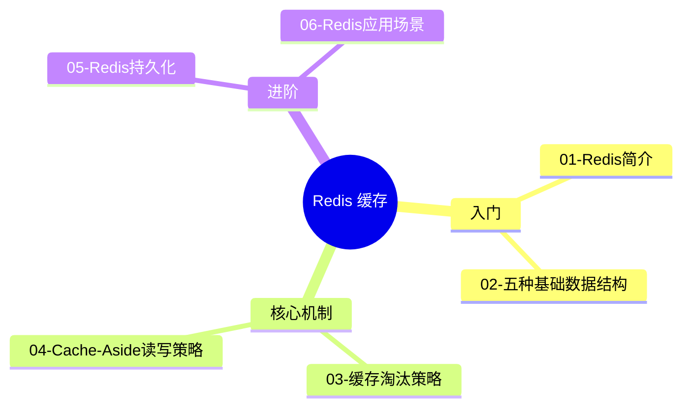

# 🗺️ Redis 缓存核心知识 · 知识地图

> **学习路径**：从基础到进阶，建议按编号顺序学习。
> 每个知识点都标注了难度和前置要求，可以灵活跳转。

---

## 🧭 知识导航

> **图释**：Redis 知识分为三个层次。🌱 入门层建立基础认知；🌿 核心机制层理解工作原理；🌳 进阶层探索实际应用和高级特性。建议按编号顺序从 01 开始。

---

## 📋 知识点列表

| # | 知识点 | 难度 | 前置知识 | 状态 |
|---|--------|------|---------|------|
| 1 | [[01-Redis简介\|Redis 是什么？]] | 🌱 入门 | — | ⬜ |
| 2 | [[02-五种基础数据结构\|Redis 五种基础数据结构]] | 🌱 入门 | #1 | ⬜ |
| 3 | [[03-缓存淘汰策略\|缓存淘汰策略]] | 🌿 进阶 | #1, #2 | ⬜ |
| 4 | [[04-Cache-Aside读写策略\|Cache-Aside 读写策略与三大问题]] | 🌿 进阶 | #1, #2 | ⬜ |
| 5 | [[05-Redis持久化\|Redis 持久化：RDB vs AOF]] | 🌳 深入 | #1, #3 | ⬜ |
| 6 | [[06-Redis应用场景\|Redis 典型应用场景]] | 🌿 进阶 | #1, #2, #3 | ⬜ |

### 难度图标说明

| 图标 | 含义 |
|------|------|
| 🌱 入门 | 基础知识，无需前置 |
| 🌿 进阶 | 需要一定前置知识 |
| 🌳 深入 | 较复杂的核心概念 |

### 使用建议

1. 从 **🌱 入门** 开始，按编号顺序学习
2. 每个知识点学习后，在状态列标记 ✅
3. 学完入门后，根据需要选择 🌿 进阶 方向
4. 定期回到知识地图，查看整体知识结构

---

> **提示**：学习不是线性的——遇到难点可以暂时跳过，先学其他相关知识点再回来。
>
> [[../Redis缓存核心知识\|← 返回原文]]
