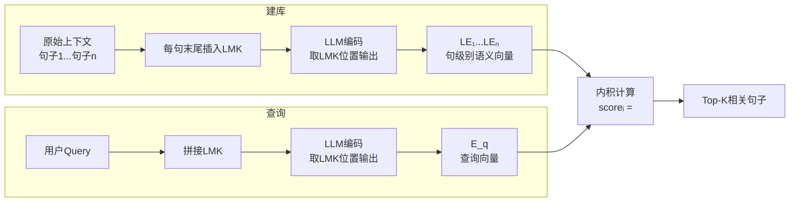

参考论文：《BGE Landmark Embedding: A Chunking-Free Embedding Method For Retrieval Augmented Long-Context Large Language Models》

RAG从大规模语料库中检索相关信息，将长文本压缩成简洁、关键的输入形式，以在不直接修改模型的情况下扩展上下文。为了提高检索效率，**RAG在建库的时候需要将长文本拆成小块**，为每个块生成embedding，通过比较用户查询和文档之间的embedding的相似度来检索最相关的块并作为输入。
**分块带来了严重的问题：**
- **破坏上下文连贯性**：即长文本被切割成不连续的部分（为了尽可能保证连续性，每一块可以有一些重复的），会破坏上下文的完整性。当模型需要理解段落中的复杂关系或连续语义时，分块会使得这些语义信息被分散，导致嵌入表示的准确性降低。
- **信息不完整**：检索系统容易选择显著性较高的块，然而其他重要但不显著的块可能会被忽略。这样一来，模型可能无法获**取完整的背景信息**，影响检索的完整性。

为了解决分块带来的问题，提出了一种**Landmark Embedding**的方法，在chunking-free的情况下实现RAG。

#### 3.2.1 基础知识
大模型生成的过程可以用以下公式表示：
$$
\max(\log LLM(x_t|q, ctx, X_{<t}))
$$
即根据用户查询（$q$）、上下文（$ctx$）以及已经生成的文本（$X_{<t}$）生成下一个词（$x_t$）。

在上下文很长的情况下，传统的基于检索的方法将上下文分块，选择 Top-K 相关的块作为上下文输入。但这种方式会导致两个问题：
1. **上下文关系被破坏**：分块可能切断跨句、跨段的逻辑关联。
2. **信息不完整**：关键信息可能被切分到不同块中，导致检索遗漏。
为解决上述问题，**Landmark Embedding** 提出了一种无需分块的检索方法（$\gamma'(\cdot)$），**直接在一个完整的上下文内生成对查询最有帮助的信息表示**：
$$
C^* := \{c_1, \dots, c_k\} \leftarrow \gamma'(q, ctx)
$$
其中 $c_i$ 表示细粒度单元（例如句子）。由于保留了完整的上下文信息，每个细粒度单元的语义都能被完整保留，从而保障对用户查询的精确检索。
#### 3.2.2 Chunking-Free架构
核心思想：
	在完整上下文中，为每个句子末尾添加特殊标记 **LMK（Landmark）**，让 LMK 聚合所在句子的完整语义，将其作为检索的最小单元，从而避免传统分块带来的上下文割裂和信息丢失问题。

 技术实现流程
	**步骤一：建库标记（为每个句子添加 Landmark）**
	原始上下文由 n 个句子组成：`{c₁, c₂, ..., cₙ}`
	在每个句子末尾插入一个特殊标记 **LMK**，用于捕捉对应句子的底层语义。
	**步骤二：编码 Landmark Embedding（LE）**
		使用大语言模型（LLaMA-2-7B）对 LMK 和用户 Query 进行编码，取最后一个 token 的隐层状态作为该句子的语义表征：
		**句子编码：**
		`LE_i ← LLM(c₁, ..., cᵢ; LMK).embed[-1]`
		**用户 Query 编码：**
		`E_q ← LLM(query; LMK).embed[-1]`
		其中：
			- `LE_i`：第 i 个句子的 Landmark Embedding，聚合了从开头到该句子的所有上文信息
			- `E_q`：用户查询的 Embedding
			- `.embed[-1]`：取最后一个 token（即 LMK 位置）的输出向量
	**步骤三：相关性计算**
		用户 Query 与每个句子的相关性用两个 Embedding 的内积表示：
		`score_i = <E_q, LE_i>`
		分数越高，表示该句子与用户查询越相关。系统据此选出最相关的句子作为检索结果。

 超长上下文处理：滑动窗口机制
	当输入文本超过大模型的上下文窗口限制时，采用**滑动窗口**方式处理，每次只编码当前窗口内的上下文（包含当前句子及前 t 个句子）：
	`LE_i ← LLM(c_{i-t}, ..., c_i; LMK).embed[-1]`
		- `t`：窗口大小，表示当前句子往前追溯 t 个句子的范围
		- 每个句子的 LE 仅依赖其局部窗口内的上文，而非全部历史
		- 滑动窗口机制使得该方法能处理任意长度的文档，突破了模型上下文窗口的限制

|对比维度|传统分块检索|Landmark Embedding|
|---|---|---|
|**粒度**|固定长度块（如512 tokens）|句子级（细粒度单元）|
|**上下文完整性**|分块破坏跨句逻辑|保留完整上下文信息|
|**信息损失**|关键信息可能被切分到不同块|每句语义完整保留|
|**超长文档处理**|分块后独立检索|滑动窗口，任意长度|
|**检索精度**|块内噪声影响匹配|细粒度单元精确匹配|

**Landmark Embedding 通过在每句话末尾插入可训练的锚点标记（LMK），让模型自动学习如何把完整上下文中的句子级语义压缩到锚点向量中，从而实现句子粒度的精确检索，从根本上避免了传统分块带来的上下文割裂。**

