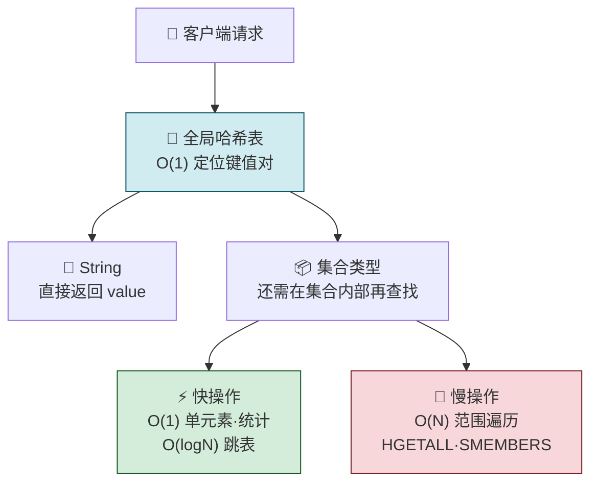

---

## 02 数据结构：快速的 Redis 有哪些慢操作？

> Redis 的快，一靠**内存操作**（百 ns 级），二靠**高效数据结构**。
> 但高效数据结构也有潜在的慢操作——哈希冲突链过长时的 O(N) 退化、rehash 时的阻塞、集合类型的范围遍历 O(N)。
> 本文从全局哈希表讲到六大底层数据结构，用一张复杂度速查表帮你避开这些坑。

---

## 先做一个类比：仓库管理系统

| 仓库系统                     | Redis                             |
| ------------------------ | --------------------------------- |
| 🏢 **仓库（全局哈希表）**         | 数组 + 哈希桶——O(1) 定位到货架              |
| 📦 **货架号冲突（哈希冲突）**       | 多个 key 落到同一个桶 → 链式哈希              |
| 🔧 **仓库扩建（rehash）**      | 桶不够用了 → 扩容 2 倍 → 数据迁移             |
| 🚚 **渐进式搬迁（渐进式 rehash）** | 不关门搬家——每次来一个客人，顺带搬一点货             |
| 📋 **货物清单类型（Value 类型）**  | String / List / Hash / Set / ZSet |
| 🔍 **查货速度（操作复杂度）**       | 有的 O(1) 秒查，有的 O(N) 要逐个翻           |



---

## 一、数据类型 vs 底层数据结构 —— 别搞混了

> 你常说的 String、List、Hash、Set、ZSet 是**数据类型**（数据的保存形式），而本节讲的**数据结构**是它们的**底层实现**。

| 数据类型           | 底层数据结构（两种可选） |     |
| -------------- | ------------ | --- |
| **String**     | 简单动态字符串（SDS） |     |
| **List**       | 压缩列表/双向链表    |     |
| **Hash**       | 压缩列表 / 哈希表   |     |
| **Set**        | 压缩列表 / 哈希表   |     |
| **Sorted Set** | 压缩列表 / 跳表    |     |
压缩列表 都有啊

---

## 二、全局哈希表 —— 键和值之间用什么结构组织？

Redis 用一个**全局哈希表**保存所有键值对。

```
📦 全局哈希表（数组）
├── 桶 0
├── 桶 1 ──> entry (key: K1, value: V1)
├── 桶 2
├── 桶 3 ──> entry (key: K2, value: V2) ──> entry (key: K3, value: V3)
│            └─ 💡 哈希桶存的是指针，不是值本身，所以 value 是集合也能指向
└── ...
```

| 关键设计 | 说明 |
|---|---|
| **数组 + 哈希桶** | 每个桶存一个或多个 entry |
| **存的是指针** | `*key` 指向键，`*value` 指向值——不管值是 String 还是集合，都能通过指针找到 |
| **O(1) 查找** | 计算 key 的哈希值 → 定位桶位置 → 直接访问 entry |

---

## 三、哈希冲突与渐进式 ReHash —— Redis 的「慢操作」根源

### 哈希冲突：链式哈希

当两个 key 落在同一个哈希桶时，Redis 用**链式哈希**解决——同一个桶的多个元素用链表串联：

```
🪣 哈希桶 3
  ↓
[ entry1 ]  (*next 指向下一个)
  ↓
[ entry2 ]  (*next 指向下一个)
  ↓
[ entry3 ]  (*next ──> NULL)
```

| 问题 | 后果 |
|---|---|
| 数据越来越多 → 哈希冲突越来越多 | 冲突链越来越长 → 查找退化到 O(N)（沿链表逐个找） |
⚡ **要打破这个性能瓶颈，核心就是“把长链表拉平”。** 为此，Redis 引入了 **Rehash** 机制
### ReHash：扩容桶数量

rehash = **增加哈希桶数量，让 entry 分散到更多桶中，缩短冲突链**。

```
🔄 Redis Rehash 原理与阻塞瓶颈
│
├── 1️⃣ Rehash 标准三步走
│   ├── ① 空间分配 ── 创建表 2（容量通常是表 1 的 2 倍）
│   ├── ② 数据迁移 ── 将表 1 的 key 重新计算哈希并拷贝到表 2
│   └── ③ 释放切换 ── 释放表 1 空间，将表 2 提升为新的主表
│
├── ⚠️ 致命瓶颈：发生在【第二步数据迁移】
│   ├── 💥 核心矛盾 ── 单线程架构 vs 海量数据拷贝
│   ├── ⚙️ 阻塞原因 ── 1 次性全量迁移百万/千万级 Key，CPU 极度耗时
│   └── 🔴 灾难后果
│       ├── 📌 线程阻塞 ── 单线程被全量拷贝独占，事件循环停滞
│       ├── 📌 连接超时 ── 客户端请求全部挂起（Connection Timeout）
│       └── 📌 服务瘫痪 ── 甚至引发主从误判宕机、集群雪崩
│
└── 💡 破局方案：渐进式 Rehash (Progressive Rehash)
    ├── ⏳ 化整为零 ── 放弃“一次性搬完”，改为“边处理请求边搬”
    ├── 🏃 分摊成本 ── 每次读写请求顺手只迁移 1 个哈希桶
    └── 🛡️ 双表并行 ── 新写入直接进表 2，读操作查表 1 + 表 2
```

### 渐进式 ReHash：不关门搬家

Redis 的解法：**每处理一个客户端请求，顺带拷一点数据**。

| 策略               | 做法         | 效果            |
| ---------------- | ---------- | ------------- |
| ❌ 一次性 ReHash     | 集中拷贝所有数据   | Redis 阻塞，无法响应 |
| ✅ **渐进式 ReHash** | 每次请求顺带拷一个桶 | 拷贝开销分摊，不影响响应  |


> Redis 默认维护**两个全局哈希表**：表 1 在用，表 2 是为扩容预留的。rehash 完成后再切换。

---

## 四、六大底层数据结构 —— 全景对比
```
📐 6 种底层数据结构
├── ⚡ O(1)
│   └── 哈希表
├── 📊 O(logN)
│   └── 跳表
├── 🐢 O(N)
│   ├── 双向链表
│   ├── 整数数组
│   └── 压缩列表（除头尾外）
└── 🔤 简单动态字符串
    └── SDS（后续详解）
```

### 压缩列表（Ziplist）

```
📦 压缩列表结构 (ZipList)
├── 结构布局：[ zlbytes ] ➔ [ zltail ] ➔ [ zllen ] ➔ [ entry1 | entry2 | ... ] ➔ [ zlend ]
├── ✅ 头尾定位 O(1)
│   ├── zlbytes (列表总字节数)
│   ├── zltail (表尾偏移量)
│   └── zllen (entry 个数)
└── ❌ 中间查找 O(N)
    └── entry1 | entry2 | ... | entryN (需逐个节点顺序遍历)

各个部分的作用：
1. zlbytes（总字节数）
   • 作用：记录整个列表一共占了多大内存 space。
2. zltail（尾部位置）
   • 作用：记录距离最后一个数据有多远。有了它，能瞬间直接跳到列表末尾，不用从头一个个找。
3. zllen（数据个数）
   • 作用：记录里面一共存了多少个元素。
4. entry（真实数据）
   • 作用：真正装数据的地方（比如存进去的数字或字符串）。
5. zlend（结束标记）
   • 作用：就像一个句号，告诉 Redis“到这里就全部结束了”。
```


### 跳表（SkipList）

在有序链表基础上**增加多级索引**，层层跳跃定位到目标：

```
📊 跳表（SkipList）多级索引结构
【结构示意图】
二级索引（最稀疏）： 1 ───────────────────> 27 ───────────────────> 100
                     │                      │                      │
一级索引：           1 ─────────> 11 ──────> 27 ─────────> 55 ──────> 100
                     │            │         │            │         │
原始链表：           1 → 3 → 5 → 7 → 11 → 15 → 19 → 27 → 33 → 55 → 78 → 100

──────────────────────────────────────────────────

🔍 查找节点 33 的效率对比：
• 无索引（全表遍历）：遍历 6 次 ➔ O(N)
• 一级索引：比较 4 次
• 二级索引：仅需 3 次 ➔ O(logN)
```

### 六大结构复杂度速查

| 数据结构     | 查找复杂度             | 说明                      |
| -------- | ----------------- | ----------------------- |
| **哈希表**  | O(1)              | 核心——String、Hash、Set 都靠它 |
| **跳表**   | O(logN)           | Sorted Set 的底层，多级索引跳跃查找 |
| **双向链表** | O(N)              | 顺序遍历，但头尾操作 O(1)         |
| **压缩列表** | 头尾 O(1) / 其他 O(N) | 省内存，小数据量时使用             |
| **整数数组** | O(N)              | 顺序遍历                    |
| **SDS**  | —                 | String 专属，后续详解          |

---

## 五、操作复杂度四句口诀


```
📋 集合操作
├── ① 单元素操作
│   ├── HGET · HSET · HDEL · SADD · SREM
│   ├── 复杂度由数据结构决定（哈希表实现 → O(1)）
│   └── 批量操作 (N 个元素) → O(N)
├── ② 范围操作 ⚠️
│   ├── HGETALL · SMEMBERS · LRANGE · ZRANGE
│   ├── O(N) 非常耗时
│   └── 替代方案：SCAN 系列渐进遍历
├── ③ 统计操作 ✅
│   ├── LLEN · SCARD
│   ├── O(1)
│   └── 原因：数据结构内专门记录了元素个数
└── ④ 例外情况
    ├── LPOP · RPOP · LPUSH · RPUSH
    ├── 结构：压缩列表 / 双向链表
    └── 记录头尾偏移量 → O(1)
```


---

## 六、快操作 vs 慢操作全景图
```
⚡ 快操作 vs 🐢 慢操作

├── ⚡ 快操作（放心用）
│   ├── 哈希表查找 → O(1)
│   ├── 单元素增删改查 → O(1)
│   ├── 跳表查找 → O(logN)
│   ├── 统计操作 (LLEN / SCARD) → O(1)
│   └── List 头尾操作 (LPUSH / RPOP) → O(1)
│
└── 🐢 慢操作（要警惕）
    ├── 范围遍历 HGETALL → O(N) ❌
    │   └── 💡 解决方案：用 SCAN / HSCAN / SSCAN / ZSCAN 渐进式遍历替代
    ├── 全量操作 SMEMBERS → O(N) ❌
    ├── 中间元素随机访问 → O(N) ❌
    └── 哈希冲突链过长 → 退化为 O(N) ⚠️
        └── 💡 解决方案：渐进式 ReHash（自动扩容 · 分摊开销）
```

---

## 七、慢操作速查与规避

| 慢操作                    | 原因                       | 规避方法                        |
| ---------------------- | ------------------------ | --------------------------- |
| **HGETALL / SMEMBERS** | 遍历整个集合返回全部元素 → O(N)      | 用 **HSCAN / SSCAN** 渐进式遍历   |
| **LRANGE 取大范围**        | 遍历链表 → O(N)              | 控制 range 长度                 |
| **ZRANGE 取大范围**        | 跳表遍历 → O(N)（虽然索引快但返回元素多） | 控制 range 长度                 |
| **哈希冲突链过长**            | 链式查找退化 → O(N)            | 渐进式 ReHash 自动扩容             |
| **List 随机中间访问**        | LINDEX → O(N)            | **List 只当 FIFO 队列用**，不要随机读写 |

---

> **🧭 接下来看什么？** 数据结构决定了 Redis 在内存里能跑多快。但内存操作只是 Redis 快的第一个原因
> 
> 二个原因是它怎么处理网络请求。
> 	Redis 是单线程的，一个线程既要收网络包、又要解析协议、还要读写数据——它怎么做到不卡住？
> 	下一节讲 IO 模型，把单线程高性能的秘密彻底说透。

## 一句话总结

> Redis 的快 = 全局哈希表 O(1) 定位 + 跳表 O(logN) 支撑 ZSet + 各数据结构内置计数器实现 O(1) 统计。
> 潜在的慢 = 哈希冲突链过长退化为 O(N)（靠渐进式 ReHash 缓解）+ 范围操作遍历全集合 O(N)（用 SCAN 替代）+ List 随机访问 O(N)（List 只当队列用）。
> 记住四字口诀：**单元素快、范围慢、统计快、头尾例外**。
