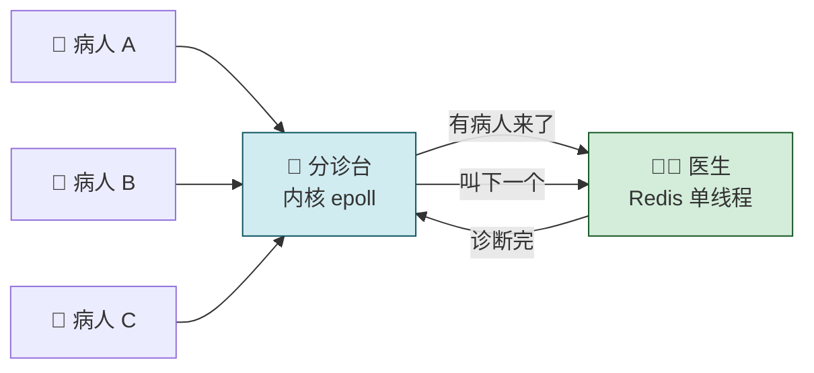
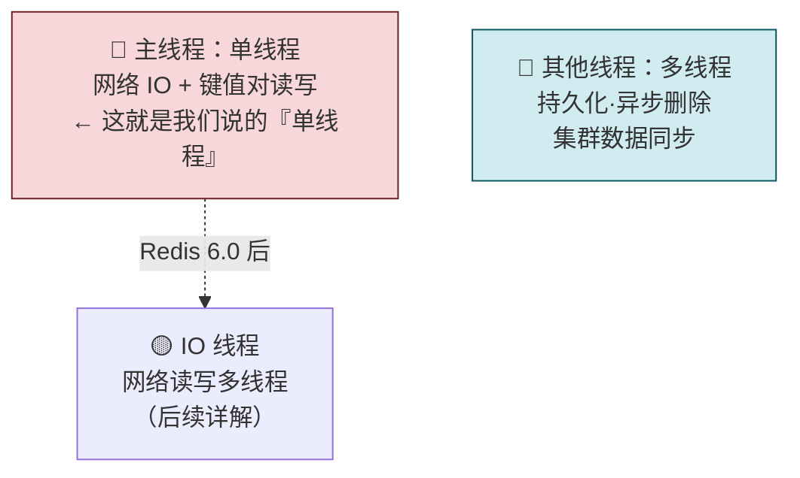

---

## 03 高性能 IO 模型：为什么单线程 Redis 能那么快？

> Redis 单线程却能跑到每秒数十万次处理——这看起来违背直觉。核心答案就三个字：**多路复用**。本节从「为什么用单线程」讲到「单线程为什么快」，逐层拆解阻塞 IO → 非阻塞 → epoll 的演化路径。

> 💡 **从哪里来？** 第 01 节讲了四大模块，第 02 节讲了底层数据结构。这两者解释了「数据操作为什么快」
> ——内存读写百 ns 级 + 哈希 O(1) + 跳表 O(logN)。
> 但还有一个问题：Redis 是单线程的，一个线程既要收网络包、又要解析协议、又要读写数据——它怎么做到不卡住？这就是本节要回答的第三个「为什么快」。

---

## 先做一个类比：医院分诊台

| 医院场景 | Redis |
|---|---|
| 👨‍⚕️ **医生（单线程）** | Redis 主线程——网络 IO + 键值读写 |
| 🏥 **分诊台（内核 epoll）** | 内核监听所有 socket，有请求才通知 Redis |
| 🧑‍🤝‍🧑 **病人（客户端请求）** | 多个客户端同时连接 |
| 📋 **分诊流程（事件回调）** | Accept 事件 → accept 函数；Read 事件 → get 函数 |



> 医生只有一个人，但因为分诊台帮他过滤了「等待」和「空转」，他能高效地一个接一个看病人。
> Redis 单线程也是这个道理——内核 epoll 负责监听所有连接，Redis 只负责处理「已经就绪」的请求。

---

## 一、Redis 真的是单线程吗？—— 先厘清定义



| 说法               | 实际含义                                      |
| ---------------- | ----------------------------------------- |
| **「Redis 是单线程」** | **网络 IO 和键值对读写**由一个线程完成——这是对外提供服务的**主流程** |
| **但实际上**         | **持久化、异步删除、集群同步**等由额外线程执行                 |
| **Redis 6.0+**   | 引入了 IO 多线程（网络读写部分），但**命令执行仍是单线程**         |

---

## 二、为什么用单线程？—— 多线程的代价

### 多线程的理想 vs 现实

```
├── 🌈 理想：线程越多，吞吐越高
│   └── 📈 线性增长
└── ⚠️ 现实：过了拐点，吞吐量反而下降
    ├── 📈 先增 → 📉 后降
    └── ⚙️ 原因分析
        ├── 🔒 锁竞争
        ├── 🔄 上下文切换
        └── 🐢 并行变串行
```

### 核心问题：共享资源的并发访问控制

```
🤼 多线程并发冲突与加锁代价

├── 💥 冲突场景：多线程同时操作同一个 List
│   ├── 🔵 线程 A：LPUSH（队列长度 +1）
│   ├── 🔴 线程 B：LPOP（队列长度 -1）
│   └── ⚡ 结果：两个线程同时修改队列长度 → 产生冲突
│
└── 🔒 解决方案：必须加锁（线程 A 和 B 串行执行）
    └── ❌ 带来的代价
        ├── ① 粗粒度锁 → 并行变串行
        ├── ② 细粒度锁 → 代码复杂
        └── ③ 调试和维护困难
```

> Redis 的核心操作是内存读写，本身就极快。如果引入多线程，**锁竞争的开销可能比实际数据处理还大**——得不偿失。
> Redis 的选择是：**用单线程避开并发控制，用多路复用补偿并发能力。**

---

## 三、单线程为什么这么快？—— 三大支柱

```
⚡ 单线程 Redis（每秒数十万次处理）
├── 💾 支柱一：内存操作
│   └── 百 ns 级 · 不碰磁盘
├── 📐 支柱二：高效数据结构
│   └── 哈希表 O(1) · 跳表 O(logN)
└── 🔀 支柱三：多路复用
    ├── 一个线程监听所有连接
    └── 有请求才处理 · 不空等
```

## 四、IO 模型的演化：从阻塞到多路复用

这是本节的核心——理解 Redis 怎么从**一个请求一个请求串行处理**，进化到**同时处理上千连接**。

### 阶段一：基本阻塞 IO 模型

```
🔌 网络 Socket 处理流程
├── ① bind / listen（监听端口）
├── ② accept（建立连接）⚠️ 阻塞点
├── ③ recv（读取请求）⚠️ 阻塞点
├── ④ parse（解析请求）
├── ⑤ get（读取键值数据）
└── ⑥ send（返回结果）
```

| 阻塞点 | 卡在什么情况 |
|---|---|
| **accept()** | 有客户端尝试连接，但一直未能成功建立——Redis 卡住，其他客户端连不上 |
| **recv()** | 客户端连接已建立，但数据迟迟没发过来——Redis 卡住，无法处理其他已就绪的请求 |

> 一个客户端慢，所有客户端都跟着等——单线程阻塞 IO 的致命缺陷。

### 阶段二：非阻塞模式

Socket 支持设置非阻塞：accept() 没连接？立刻返回。recv() 没数据？立刻返回。**Redis 线程不再卡住**。

```
🔌 Socket 非阻塞处理机制
├── socket()
├── 👂 listen()（主动套接字 → 监听套接字）
│   └── ✅ 设置非阻塞：accept() 无连接时 ➔ 立刻返回，不等待
└── 📥 accept()（返回已连接套接字）
    └── ✅ 设置非阻塞：recv() 无数据时 ➔ 立刻返回，不等待
```

> 但新问题来了：不阻塞了，但怎么知道「什么时候有新连接」「什么时候有数据到达」？——如果靠轮询，CPU 一直在空转。
### 阶段三：IO 多路复用（epoll）—— 终极方案

```
🐧 Linux 内核 epoll 机制与事件循环
├── 🐧 内核态（epoll 监听套接字集合）
│   ├── FD₁：监听套接字（等新连接）
│   ├── FD₂：已连接套接字 A（等数据）
│   ├── FD₃：已连接套接字 B（等数据）
│   └── FD₄：已连接套接字 C（等数据）
│
└── ⚡ 事件分发与处理流程
    ├── 1. 有事件到达 ➔ 传入 📋 事件队列（Accept 事件 / Read 事件）
    └── 2. 🔄 Redis 主线程 ➔ 逐个取出事件 ➔ 调用回调函数（accept() / get()）
```

| 机制           | 做什么                                          |
| ------------ | -------------------------------------------- |
| **epoll 监听** | 内核同时监听多个 FD（监听套接字 + 已连接套接字），有请求才通知           |
| **事件队列**     | 触发的事件放入队列，Redis 单线程逐个处理                      |
| **回调机制**     | Accept 事件 → 调用 accept 回调；Read 事件 → 调用 get 回调 |

```
🔄 事件驱动的回调流程
├── 🟢 Accept 事件（新连接到达）
│   └── 📞 回调 accept 函数 ➔ 建立连接 · 注册 Read 事件
│
└── 🔵 Read 事件（数据到达）
    └── 📞 回调 get 函数 ➔ 读取 · 解析 · 处理 · 返回
```

> epoll 的核心价值：**Redis 不再主动轮询（浪费 CPU），而是被内核通知（事件驱动）。
> ** 没有请求时 Redis 线程休眠，有请求时立刻唤醒处理——既不阻塞，也不空转。

### 三种模型对比

| 模型 | accept() 无连接时 | recv() 无数据时 | CPU 利用率 | 并发能力 |
|---|---|---|---|---|
| **阻塞 IO** | 🔴 卡住等 | 🔴 卡住等 | 低（闲着） | 差——一个慢全慢 |
| **非阻塞 IO** | 🟢 立刻返回 | 🟢 立刻返回 | 低（轮询空转） | 差——CPU 在空转 |
| **IO 多路复用** | 🟢 内核通知 | 🟢 内核通知 | ✅ **高——按需唤醒** | ✅ **高——单线程处理多连接** |

---

## 五、跨平台兼容

IO 多路复用不是 Linux 专属，各平台都有实现，Redis 会自动选择：

| 操作系统                | 多路复用实现           |
| ------------------- | ---------------- |
| **Linux**           | epoll            |
| **FreeBSD / macOS** | kqueue           |
| **Solaris**         | evport           |
| **通用**              | select（最古老，性能最差） |

---

## 六、Redis 快的原因全景图

```
⚡ 为什么单线程 Redis 这么快？
├── 💾 内存操作
│   └── 百 ns 级 · 不走磁盘
├── 📐 高效数据结构
│   └── 哈希 O(1) · 跳表 O(logN)
├── 🔀 I/O 多路复用
│   ├── epoll 监听 · 事件驱动 · 不阻塞 · 不空转
│   └── 机制：一个线程处理所有连接 ➔ 内核监听 FD 集合 ➔ 有请求入队列 ➔ 调回调函数处理
└── 🪡 单线程无锁
    └── 没有锁竞争 · 没有上下文切换
```

---

## 七、Redis 6.0 的多线程预告

| 版本              | 线程模型                              |
| --------------- | --------------------------------- |
| **Redis < 6.0** | 纯单线程——网络 IO + 命令执行都在一个线程          |
| **Redis ≥ 6.0** | IO 多线程——网络读写部分用多线程，但**命令执行仍然单线程** |

> Redis 6.0 的多线程只处理网络包的读写，核心命令执行不碰多线程——**不引入并发控制问题，只加速网络 IO**。后续详解。

---

## 一句话总结

> Redis 单线程的三根支柱 = 内存操作极快（没有磁盘 IO）+ 数据结构高效（哈希 O(1) + 跳表 O(logN)）+ IO 多路复用（epoll 让内核监听所有连接，有请求才通知，不阻塞也不空转）。
> 单线程避开了锁竞争和上下文切换的开销，epoll 补偿了并发能力——以最简单的模型达到每分数十万次处理。阻塞 IO → 非阻塞 → epoll 的演化，本质是从「主动傻等」到「被动通知」的思维转变。
