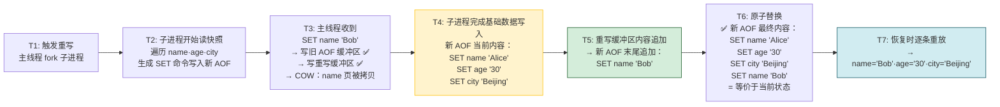
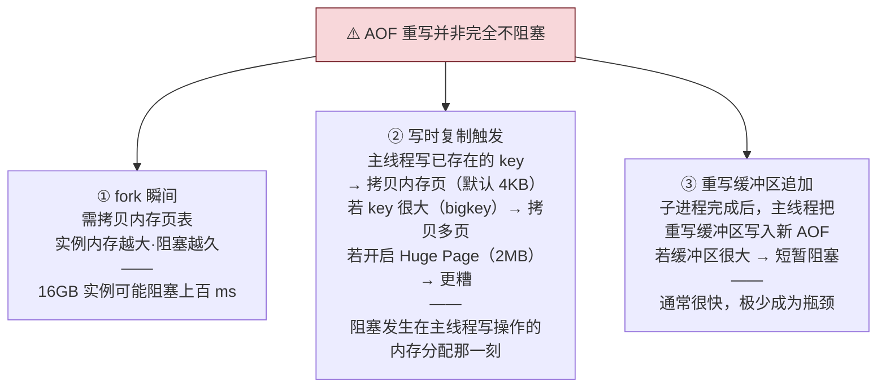
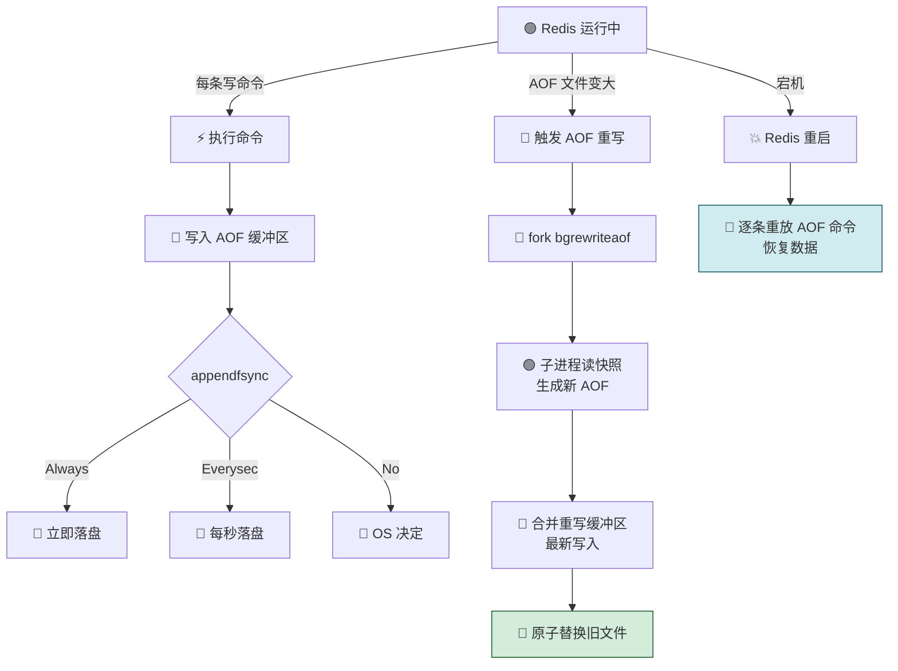

## 04 AOF 日志：宕机了，Redis 如何避免数据丢失？

> Redis 是内存数据库——一旦宕机，所有数据全丢。
> AOF（Append Only File）是 Redis 的两大持久化机制之一：通过记录每一次写命令，在重启时逐条重放来恢复数据。
> 本节从「AOF 是什么」讲到「三种写回策略」再到「重写机制如何一边压缩日志一边不阻塞主线程」。

> 💡 **从哪里来？** 前三节解决了「快」的问题——架构高效、数据结构精巧、epoll 不阻塞。但如果数据不安全，「快」就没有意义。
> 第 04~05 节讲持久化——这是 Redis 从「缓存玩具」升级为「数据库」的基础。
> AOF 和 RDB 是两条完全不同的路：AOF 记录命令，RDB 记录数据本身。先攻 AOF。

---

## 先做一个类比：航行日志

| 航海                      | Redis AOF                |
| ----------------------- | ------------------------ |
| 📝 **航行日志**             | 记录每次操作的 AOF 文件           |
| ⛵ **先转向再记录（写后日志）**      | 先执行命令，再记日志               |
| 🌊 **风浪太大没来得及记（宕机丢数据）** | 命令执行完但没落盘 → 丢失           |
| 📦 **日志太厚了（AOF 过大）**    | 反复修改同一个 key → 日志膨胀       |
| 🗜️ **重新誊抄一遍（AOF 重写）**  | 以当前数据状态为准，一条命令替代多条       |
| 👥 **叫别人誊抄（fork 子进程）**  | bgrewriteaof 后台进程，不阻塞主线程 |

```
📝 AOF 日志基本工作流程
👤 客户端 (SET key value)
  │
  ▼
⚡ ① 执行命令 (写入内存)
  │
  ▼
📝 ② 追加到 AOF 缓冲区
  │
  ▼
💾 ③ 写回磁盘 (Always / Everysec / No)
  │
  ▼
🔄 宕机恢复 (逐条重放 AOF 命令)
```

---

## 一、AOF 是什么？—— 写后日志
AOF（Append Only File）是 Redis 的两大持久化机制之一，简单来说，它就是 **Redis 的“写操作记账本”**。
### AOF vs WAL（写前日志）

| 日志类型 | 记录时机 | 记录内容 | 代表 |
|---|---|---|---|
| **WAL（写前日志）** | 先记日志，再写数据 | 修改后的数据 | MySQL Redo Log |
| **AOF（写后日志）** | **先执行命令，再记日志** | 执行的命令（文本形式） | Redis |

```
📝 WAL 写前日志 vs AOF 写后日志
├── 📝 WAL 写前日志
│   └── 📝 记日志 ➔ 💾 写数据
└── 📝 AOF 写后日志 ✅
    └── ⚡ 执行命令 · 写内存 ➔ 📝 记日志
```

### AOF 日志内容示例

执行 `SET testkey testvalue` 后，AOF 记录：

```
*3          ← 命令有 3 个部分
$3 SET      ← 第 1 部分：3 字节，"SET"
$7 testkey  ← 第 2 部分：7 字节，"testkey"
$9 testvalue ← 第 3 部分：9 字节，"testvalue"
```

> AOF 记录的是 **Redis 协议格式的文本命令**，不是修改后的数据本身。

### 为什么用「写后」？

| 写后日志的好处 | 说明 |
|---|---|
| ✅ **不会记录错误命令** | 先执行命令，成功才记录——避免语法错误的命令污染日志 |
| ✅ **不阻塞当前写操作** | 记日志发生在命令执行后，当前命令的响应不受日志写入影响 |

### 写后日志的风险

```
⚠️ 两大风险（都与『写回磁盘的时机』相关）
├── 风险一：执行完但没来得及记 ➔ 宕机
│   ├── 这条命令和数据丢失
│   └── 用作数据库时不可恢复
└── 风险二：AOF 写盘在主线程
    ├── 磁盘压力大时写盘慢
    └── 下一个操作被阻塞
```

---

## 二、三种写回策略 —— 性能与可靠性的取舍

`appendfsync` 参数控制「什么时候把 AOF 缓冲区的内容写到磁盘」：

```
⚙️ AOF 三种写回策略 (appendfsync)
⚡ 命令执行完 ➔ 📝 AOF 内存缓冲区 ➔ appendfsync 策略选择：
├── 💾 Always（同步落盘）
│   ├── 每次命令都同步落盘
│   ├── ✅ 基本不丢数据
│   └── ❌ 每次都有磁盘 I/O · 性能最差
├── 💾 Everysec（每秒落盘）
│   ├── 每秒落盘一次
│   ├── ✅ 折中 · 性能好
│   └── ⚠️ 最多丢 1 秒数据
└── 💾 No（操作系统决定）
    ├── 由 OS 决定何时落盘
    ├── ✅ 性能最好
    └── ❌ 丢多少数据不可控
```

| 策略 | 落盘时机 | 可靠性 | 性能 | 宕机丢失 |
|---|---|---|---|---|
| **Always** | 每次命令立即同步落盘 | ⭐⭐⭐ 最高 | ⭐ 最低 | 几乎不丢 |
| **Everysec** | 每秒一次 | ⭐⭐ 中等 | ⭐⭐ 中等 | 最多 1 秒 |
| **No** | 操作系统自己决定 | ⭐ 最低 | ⭐⭐⭐ 最高 | 不可控 |

### 选型指南

| 场景             | 推荐策略              |
| -------------- | ----------------- |
| 🏦 金融交易·不能丢数据  | **Always**        |
| 🛒 电商缓存·允许少量丢失 | **Everysec**（最常用） |
| 📊 日志统计·丢一点没关系 | **No**            |
> 核心哲学：**Trade-off**——在性能（快）和可靠性（不丢）之间做取舍，没有十全十美。

---

## 三、AOF 重写 —— 日志文件太大了怎么办？

### AOF 不断膨胀的原因
同一个 key 被多次修改，AOF 会记录**每一条**操作命令：

```
🔄 AOF 重写流程（多变一）
├── 📜 历史修改过程（共 6 条命令）
│   └── LPUSH list 'A' ➔ LPUSH list 'B' ➔ LPUSH list 'C' ➔ LPOP list ➔ LPUSH list 'D' ➔ LPUSH list 'N'
├── 📋 最终数据状态
│   ├── 内存中 list 最终内容：['N', 'D', 'B', 'A']
│   └── 重写前问题：AOF 日志记录了全部 6 条命令 ❌
│
└── 🔄 AOF 重写后
    └── 直接读取当前数据状态，合成 1 条命令：LPUSH list 'N', 'D', 'B', 'A' ✅
```

### AOF 重写的核心：「多变一」
```
🔄 AOF 重写核心思想：多变一（只记最终状态）
├── ❌ 重写前（旧 AOF：记录历史过程）
│   ├── 机制：记录每一次写操作（增、删、改）
│   ├── 表现：6 次修改 ➔ 记 6 条命令；成百上千次修改 ➔ 记成百上千条命令
│   └── 弊端：文件剧烈膨胀，重启恢复时要重放所有历史过程，速度极慢
└── ✅ 重写后（新 AOF：只记当前结果）
    ├── 机制：不读旧日志，直接读取当前内存的数据状态
    ├── 表现：无论历史修改过多少次 ➔ 最终只用 1 条命令替代
    └── 优势：大幅压缩日志体积，极大地缩短宕机后的恢复时间
```

### 不重写的三大问题

| **维度**   | **不重写（后果）**            | **重写后（效果）**          |
| -------- | ---------------------- | -------------------- |
| **文件体积** | 无限变大，直至塞爆磁盘            | 只记录最终状态，大幅瘦身         |
| **系统性能** | 磁盘 I/O 压力大，易卡顿阻塞主线程    | 文件小、开销低，读写流畅         |
| **重启恢复** | 几百万条历史命令逐条重放，**耗时几小时** | 只重放极少数精简命令，**耗时几秒钟** |

---

## 四、AOF 重写会阻塞吗？—— 「一个拷贝，两处日志」

### 为什么需要「一个拷贝」？

AOF 重写的目标是生成一份精简的新日志，但**如果主线程一边处理新写入、一边读数据状态来重写**，就会出现「读到的数据不是最新状态」的问题。而加锁又会阻塞主线程。
所以 Redis 用了一个巧妙的办法：**fork 子进程，利用操作系统的写时复制（Copy On Write）机制，让子进程看到一个「冻结时刻」的内存快照。**

### 写时复制（Copy On Write）怎么工作？

```
📋 Redis Fork 与写时复制（Copy On Write, COW）机制
├── 1️⃣ fork 之前
│   └── 📦 物理内存：Key1: 'hello' · Key2: 'world' · Key3: 'redis'
├── 2️⃣ fork 瞬间（仅拷贝页表）
│   └── ⚡ 主线程 fork 子进程
│       ├── ❌ 不拷贝实际数据
│       ├── ✅ 只拷贝内存页表（虚拟地址 → 物理地址映射）
│       └── ⚠️ 阻塞风险：页表越大 · 阻塞越久（实例内存越大 · 页表越大）
├── 3️⃣ fork 之后（父子进程共享内存）
│   ├── 🔴 主线程（页表 ➔ 指向物理内存）
│   ├── 🟢 子进程（页表 ➔ 指向同一块物理内存）
│   └── 📦 共享物理内存：Key1 · Key2 · Key3
└── 4️⃣ 主线程写入 Key2 时（COW 触发）
    ├── 🔴 主线程触发写入：SET Key2 'new'
    ├── 📋 操作系统处理流程
    │   ├── ① 把 Key2 所在页（默认 4KB）复制一份
    │   ├── ② 修改主线程页表，指向新页
    │   ├── ③ 主线程在新页上写 'new'
    │   └── ④ 子进程页表保持不变，仍指向旧页
    └── 📦 物理内存分裂结果
        ├── 主线程：Key2 = 'new'（新页）
        ├── 子进程：Key2 = 'world'（旧页）
        └── Key1 · Key3：未被修改，继续共享
```

| 阶段          | 发生了什么                                        | 关键点                        |
| ----------- | -------------------------------------------- | -------------------------- |
| **fork 之前** | 所有数据在物理内存中                                   | —                          |
| **fork 瞬间** | 拷贝内存页表（虚拟→物理映射表），不拷贝实际数据                     | ⚠️ 唯一阻塞主线程的时刻，阻塞时长与实例内存正相关 |
| **fork 之后** | 父子进程共享同一块物理内存，标记为「只读」                        | 内存占用几乎不增加                  |
| **主线程写入时**  | 触发 COW——操作系统复制待修改的页（默认 4KB），主线程在新页上写，子进程仍看旧页 | 只有被修改的页才真正拷贝，读操作的页继续共享     |

> **写时复制的精髓**：读共享，写复制。子进程读的快照不会被主线程的新写入污染——因为主线程写的时候，操作系统把那一页单独拷了一份给主线程改。

### COW 的实际效果

|**业务写入场景**|**页复制（COW）触发情况**|**额外内存开销**|**风险与评估**|
|---|---|---|---|
|**主线程只读不写**|完全不触发页复制|**几乎为 0**（父子进程全程共享物理内存页）|✅ **安全**：最理想状态，完全无内存暴涨风险。|
|**主线程大量写入（普通 Key）**|每修改一个不同 Key，其所在页（默认 4KB）被复制一次|**根据写入量线性增加**（修改的 Key 越多，额外开销越大）|⚠️ **注意**：需保证系统预留足够的空闲内存，防止写入量大时挤爆内存。|
|**主线程修改 Bigkey**（如 10MB 的 List/Hash）|该 Bigkey 跨越的所有物理页会被逐步全部复制一遍|**极高，可能导致内存翻倍**（10MB 数据对应的全部页都会被拷贝）|❌ **高危**：极易触发系统 OOM（内存溢出）导致宕机；业务中应严格避免 Bigkey。|

---

### 「两处日志」的完整时间线

子进程负责把 fork 时刻的数据快照写成新的 AOF 文件。但在这期间，主线程仍在处理新的写请求——这些新写入的数据必须也出现在新 AOF 里，否则重写完的新文件比实际数据少。

Redis 的解法：新写入**同时记两份日志**。

```

```

### 一步一步走一遍完整流程

假设一个 Redis 实例有 3 个 key：

| Key | fork 时刻的值 |
|---|---|
| `name` | `"Alice"` |
| `age` | `"30"` |
| `city` | `"Beijing"` |

**时间线推演**：



| 时间点 | 主线程 | 子进程 | 旧 AOF | 新 AOF | 重写缓冲区 |
|---|---|---|---|---|---|
| **T1** | fork 子进程 | 启动 | 正常记录 | 空 | 空 |
| **T2** | 处理请求 | 读快照，写 SET name 'Alice'... | 正常记录 | 逐步写入基础数据 | 空 |
| **T3** | SET name 'Bob'，同时记两份日志 | 继续 | 追加 SET name 'Bob' | 还在写基础数据 | 追加 SET name 'Bob' |
| **T4** | 处理请求 | ✅ 基础数据写完 | 正常记录 | 有 fork 时刻的全部数据 | 可能有新积累 |
| **T5** | 把重写缓冲区追加到新 AOF | 退出 | 正常记录 | ✅ 补完最新数据 | 清空 |
| **T6** | rename 替换 | — | 被新文件替换 | 成为主 AOF | — |

> 关键理解：新 AOF 文件 = **fork 时刻的快照** + **重写期间的新写入**。两条时间线的数据在重写缓冲区汇合，保证了最终一致性。

### 「两处日志」为什么不能省略任何一处？

| 如果省略... | 后果 |
|---|---|
| ❌ 省略**旧 AOF 缓冲区** | 重写期间宕机 → 旧 AOF 没有新写入的记录 → 数据丢失。旧 AOF 必须在重写期间也保持完整，随时能独立恢复。 |
| ❌ 省略**重写缓冲区** | 新 AOF 只有 fork 时刻的数据 → 缺少重写期间的新写入 → 新文件比实际数据旧。下一次宕机恢复时，重写期间的数据全丢。 |

---

### 潜在的阻塞风险



| 阻塞点 | 触发时机 | 严重程度 | 建议 |
|---|---|---|---|
| **fork 瞬间** | 每次 AOF 重写 / RDB 生成时 | ⚠️ 中——与实例内存正相关，16GB 实例约百 ms 级 | 控制单个实例内存 < 10GB |
| **COW 触发** | 主线程修改已有 key 时 | ⚠️ 取决于写入量——bigkey + Huge Page 时严重 | 避免 bigkey；**务必关闭 Huge Page** |
| **重写缓冲区追加** | 子进程完成后 | ✅ 通常无感 | — |

---

### 为什么不复用旧 AOF 文件？

| 原因 | 详细说明 |
|---|---|
| 🔒 **竞争问题** | 父子进程写同一个文件需要加锁——加锁本身阻塞主线程。即使无锁，文件偏移量的并发更新也极难正确实现。 |
| ☣️ **污染风险** | 重写是「先写新文件，成功后再替换」。如果直接覆写旧文件：重写到一半失败 → 旧 AOF 被写坏 → 日志不可恢复。写新文件，失败只需删除新文件，旧文件毫发无损。 |
| 🧹 **干净替换** | 新文件写完后 `rename()` 是原子操作——要么旧文件还在（失败），要么新文件生效（成功），不存在中间状态。 |

---

## 五、AOF 完整生命周期图



---

## 六、AOF 优缺点总结

| 维度 | 优点 | 缺点 |
|---|---|---|
| **数据安全** | Always 策略几乎不丢数据 | Everysec/No 策略有丢失风险 |
| **可读性** | 文本格式，人类可读·可手动修复 | — |
| **文件大小** | 重写机制可压缩 | 不重写时比 RDB 大很多 |
| **恢复速度** | — | 🔴 **慢**——需逐条重放所有命令 |
| **性能影响** | Everysec 策略几乎无影响 | Always 策略每次写盘明显拖慢 |

> **🧭 接下来看什么？** AOF 解决了数据安全问题，但有一个致命短板——**恢复极慢**。如果 AOF 记录了几百万条命令，宕机后逐条重放可能要几分钟。有没有既能保证可靠性，又恢复很快的方法？这就是下一节要讲的 RDB——走另一条完全不同的路：不记录命令，直接给内存拍全量快照。

---

## 一句话总结

> AOF = 写后日志（先执行再记录→不错录错误命令）+ 三种写回策略（Always 安全慢 / Everysec 折中 / No 快但不可靠）+ AOF 重写（fork 子进程根据当前数据状态生成精简新日志，多变一，一个拷贝两处日志）。核心权衡是可靠性与性能的 Trade-off，重写不是完全不阻塞——fork 瞬间拷贝页表和写时复制触发都是潜在阻塞点。AOF 最大短板是**恢复慢**（逐条重放），这也是下节 RDB 要解决的问题。
