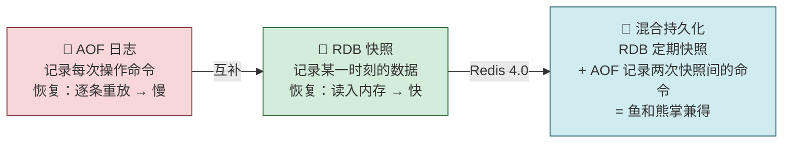
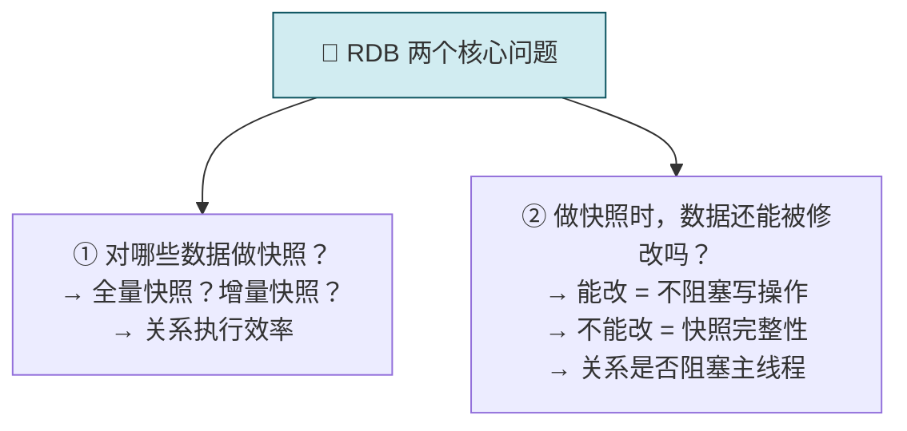
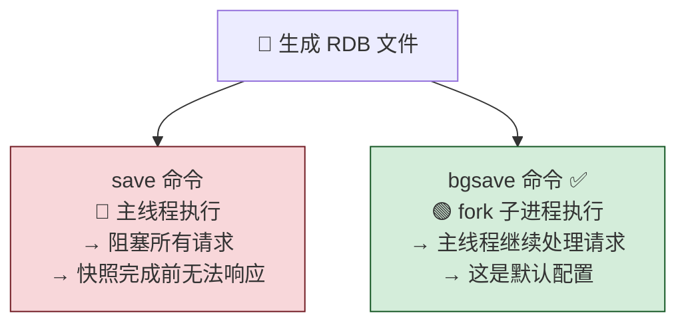
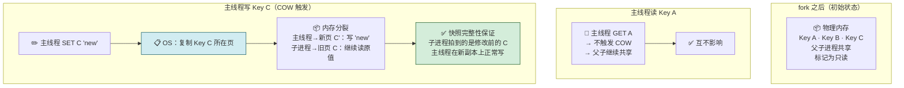
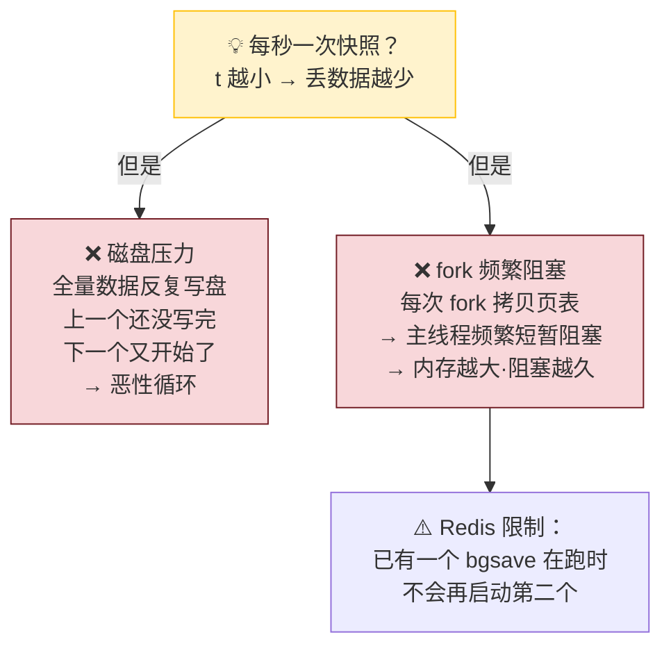
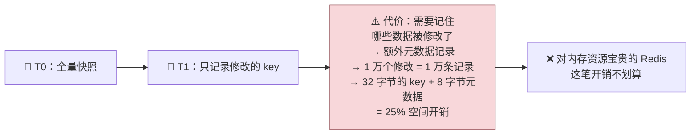
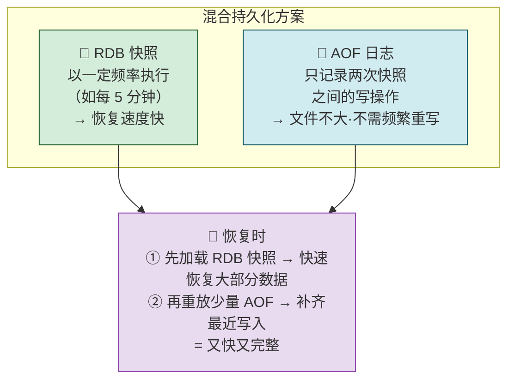
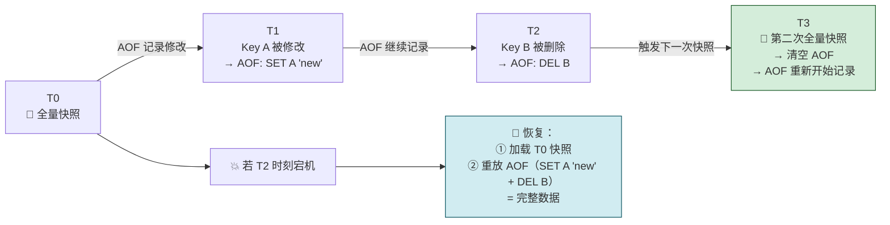
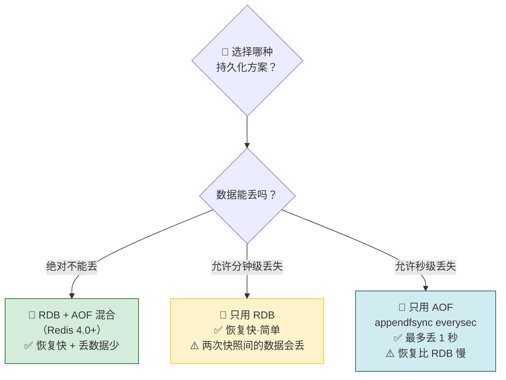
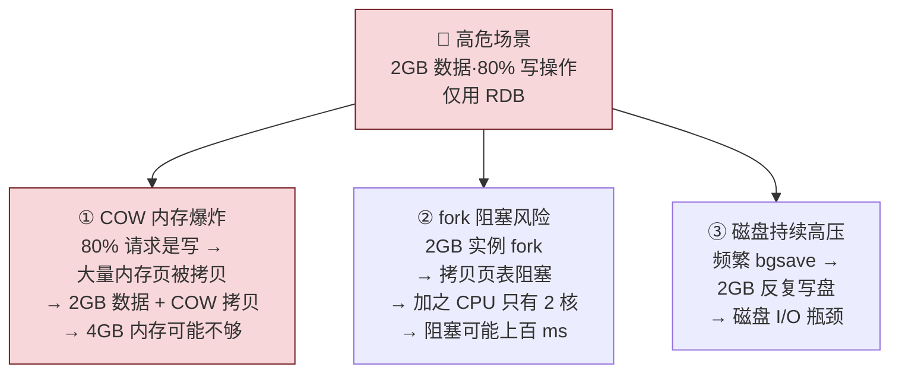

---

## 05 内存快照（RDB）：宕机后，Redis 如何实现快速恢复？

> AOF 恢复慢——要逐条重放命令。RDB（Redis DataBase）走了另一条路：**直接给内存拍一张照片存到磁盘**，恢复时把文件读回来就行——秒级恢复。但拍全量快照又重又慢，所以 Redis 用 bgsave + COW 让快照不阻塞读写，再用「RDB + AOF 混合」取两者之长。

> 💡 **从哪里来？** 第 04 节的 AOF 解决了「数据不丢」，但恢复要逐条重放——日志越多越慢。本节讲 RDB，核心卖点就是「恢复极快」——直接读文件到内存。但代价是两次快照之间的数据全丢。两种方案各有优劣，所以 Redis 4.0 把两者融合了。

---

## 先做一个类比：拍照

| 拍照                     | Redis RDB                |
| ---------------------- | ------------------------ |
| 📸 **全量快照 = 拍大合影**     | 把内存所有数据一次写入磁盘            |
| 👤 **取景 = 对哪些数据做快照**   | 全量——所有数据都拍进去             |
| 🧊 **别动！= 快照时数据不能改**   | 写时复制（COW）——要改就复制一份再改     |
| ⚡ **连拍 = 每秒一次快照**      | 不行——fork 会频繁阻塞，磁盘压力大     |
| 🎬 **视频 + 照片 = 混合持久化** | RDB（定期快照）+ AOF（两次快照间记命令） |

---

## 一、RDB 是什么？—— 给内存拍一张全量照片

| 维度 | AOF | RDB |
|---|---|---|
| **记录什么** | 每次写操作的命令 | 某一时刻内存中的**数据本身** |
| **文件格式** | Redis 协议文本 | 二进制压缩格式 |
| **恢复方式** | 逐条重放命令 | **直接读入内存** |
| **恢复速度** | 🔴 慢（命令越多越慢） | 🟢 快（一次加载） |
| **文件大小** | 持续增长（需重写压缩） | 与数据量成正比 |

### RDB 的两个核心问题

---

## 二、给哪些数据做快照？—— 全量快照 + bgsave 避免阻塞

Redis 执行的是**全量快照**——把内存中所有数据都记录到磁盘。这就像拍 100 人的大合影，一个都不能少。

### save vs bgsave

| 命令 | 执行者 | 阻塞主线程？ | 适用场景 |
|---|---|---|---|
| **save** | 主线程 | 🔴 阻塞——快照完成前无法响应 | 几乎不用 |
| **bgsave** | fork 出的子进程 | 🟢 不阻塞——主线程照常工作 | 默认·生产环境 |

---

## 三、快照时数据能修改吗？—— 写时复制（COW）

### 问题：4GB 数据，磁盘带宽 0.2GB/s，需要 20 秒

在这 20 秒内，如果数据不能修改 → Redis 停止写操作 20 秒 → 业务不可接受。

**常见误区**：bgsave 避免阻塞 ≠ 可以修改数据。bgsave 只是让主线程不被阻塞，但如果要保证快照完整性，**逻辑上不应该允许修改正在被快照的数据**。

### 解法：写时复制（Copy-On-Write）

| 角色 | 做了什么 | 看到的数据 |
|---|---|---|
| **bgsave 子进程** | 逐一读取内存，写入 RDB 文件 | **fork 时刻的快照**——即使主线程修改了，子进程仍读旧页 |
| **主线程（读）** | GET 操作 | 共享内存，不触发 COW，无额外开销 |
| **主线程（写）** | SET 操作 | OS 复制该页 → 主线程在新页上写 → 子进程不受影响 |

> COW 的核心价值：**读共享，写复制。** 子进程拿到的是 fork 瞬间的「冻结」快照，主线程的后续写入不会污染这份快照。

### 实际开销分析

| 场景 | 额外内存开销 |
|---|---|
| 快照期间主线程**只读不写** | 几乎没有——所有页仍共享 |
| 快照期间主线程**大量写入**（如 80% 是写） | ⚠️ 每写一个 key，其所在页被拷贝（4KB/页）。写入越多，额外内存越多 |
| 修改了 **bigkey** | 🔴 大 key 占多页，所有页逐步被拷贝，内存可能翻倍 |

---

## 四、可以每秒做一次快照吗？—— 为什么不能「连拍」

| 问题 | 具体影响 |
|---|---|
| **磁盘带宽竞争** | 全量数据反复刷盘，磁盘 I/O 成为瓶颈 |
| **fork 频繁阻塞** | fork 本身阻塞主线程（拷贝页表），内存越大阻塞越久。频繁 fork = 频繁卡顿 |

### 增量快照？—— 理想很丰满，现实很骨感

能不能第一次全量，后续只记录修改的部分？

> Redis 没有选择增量快照——因为「记住哪些被修改了」的元数据开销太大了。

---

## 五、混合持久化（Redis 4.0+）—— 鱼和熊掌兼得

### 核心思路

### 时间线推演

| 组件 | 做什么 | 解决了什么问题 |
|---|---|---|
| **RDB（定期全量快照）** | 每隔一段时间拍一次全量照 | 恢复时大部分数据直接加载——快 |
| **AOF（快照间增量日志）** | 只记录两次快照之间的写命令 | 文件不大——不需要频繁重写；宕机丢数据少 |
| **每次全量快照后清空 AOF** | 因为修改已合并到快照中 | AOF 始终只覆盖最近一个间隔 |

---

## 六、持久化方案选型决策

| 场景 | 推荐方案 | 理由 |
|---|---|---|
| 🏦 金融·不能丢 | RDB + AOF 混合 | 双重保障，恢复快 + 丢数据少 |
| 🛒 缓存·分钟级丢失可接受 | 只用 RDB | 简单，恢复极快 |
| 📊 秒级丢失可接受 | 只用 AOF（everysec） | 兼顾可靠性和性能 |

---

## 七、AOF vs RDB vs 混合 全面对比

| 维度 | AOF | RDB | 混合持久化（Redis 4.0+） |
|---|---|---|---|
| **记录内容** | 每次写命令 | 某一时刻的全量数据 | RDB 定期快照 + AOF 增量日志 |
| **恢复方式** | 逐条重放命令 | 直接读入内存 | RDB 加载 + 少量 AOF 重放 |
| **恢复速度** | 🔴 慢 | 🟢 极快 | 🟢 快 |
| **文件大小** | 持续增长（需重写压缩） | 与数据量成正比 | 适中 |
| **数据丢失** | Everysec 最多 1 秒 | 两次快照间的全部 | 很少（仅两次 RDB 间且 AOF 未落盘） |
| **性能影响** | Everysec 几乎无影响 | fork 短暂阻塞 + COW 内存开销 | 同 RDB 的开销 |
| **优点** | 数据安全·可读·可手动修复 | 恢复极快·文件紧凑 | ✅ 两者之长 |
| **缺点** | 恢复慢 | 可能丢较多数据 | 稍复杂 |

---

## 八、实战分析：高写入场景下 RDB 的风险

> ⚠️ 场景：2 核 CPU、4GB 内存、Redis 数据量 2GB，写读比 8:2（80% 写操作），仅用 RDB 做持久化。

| 风险 | 原因 | 建议 |
|---|---|---|
| **内存不足** | 2GB 数据 + COW 大量页拷贝 → 可能超出 4GB 内存 | ① 升级内存；② 切换到混合持久化降低 bgsave 频率 |
| **fork 阻塞** | 2GB 实例的页表拷贝 + 2 核 CPU 争抢 | 控制单个实例内存大小；避免频繁触发 bgsave |
| **磁盘瓶颈** | 每次全量写 2GB，写入比例又高 | 混合持久化减少全量快照频率 |

> **🧭 接下来看什么？** 前五节都在讲**单机 Redis**——架构、数据结构、IO 模型、两种持久化。单机解决了「快」和「数据不丢」，但有一个致命问题：**宕机期间服务完全中断。** 即使有 AOF+RDB 混合持久化，Redis 重启恢复也需要时间，这段时间所有请求都失败。怎么办？答案是多部署几台——这就引入了主从复制、哨兵、集群。接下来的三节（06→07→08）进入**分布式 Redis** 的世界。

---

## 一句话总结

> RDB = 全量内存快照，恢复极快（直接读入内存）但两次快照间数据全丢。bgsave 用 fork + COW 让快照不阻塞主线程，但 fork 本身短暂阻塞、COW 会在高写入时增加内存开销。频繁快照不可行——磁盘压力和 fork 阻塞都扛不住。Redis 4.0 给出了最优解：RDB 定期快照 + AOF 记录快照间的增量，恢复时先加载 RDB（快）再重放少量 AOF（完整），真正做到鱼和熊掌兼得。
