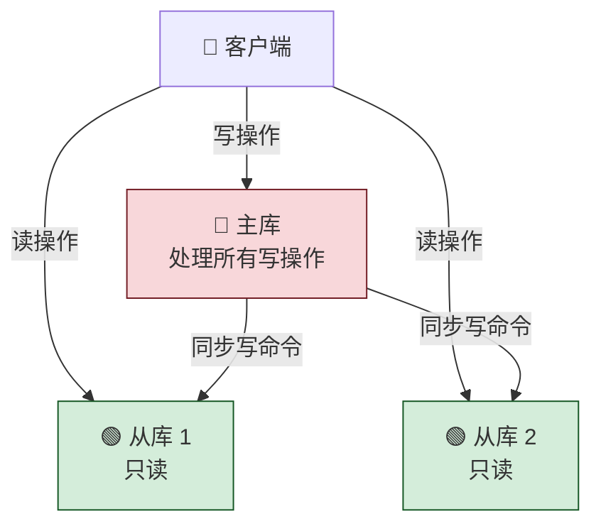
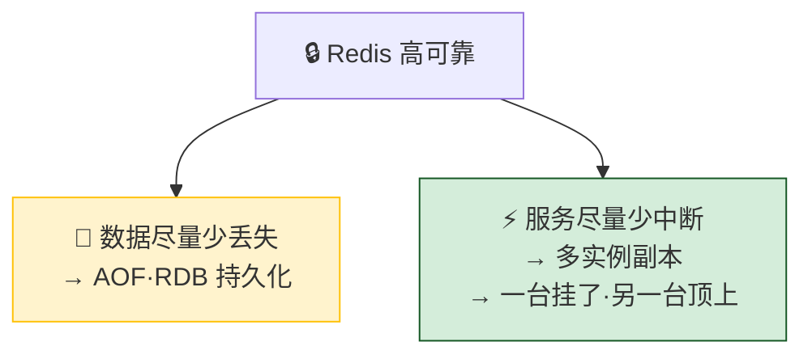
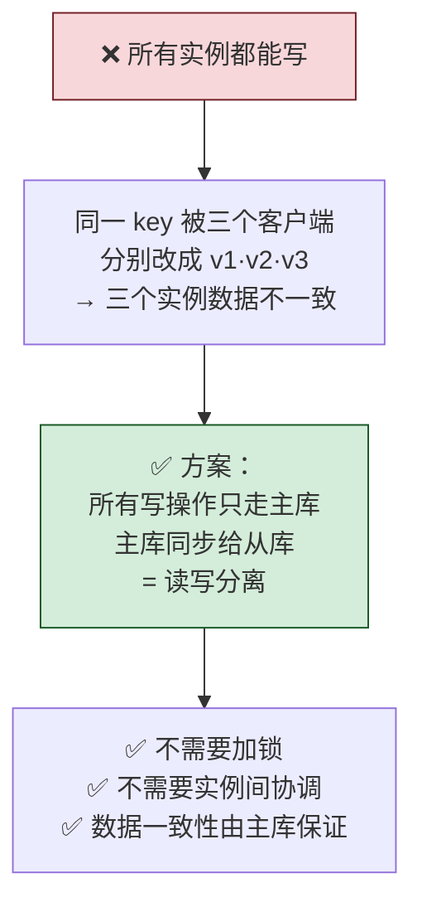
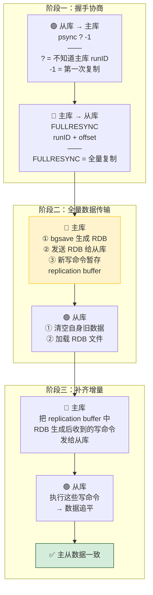
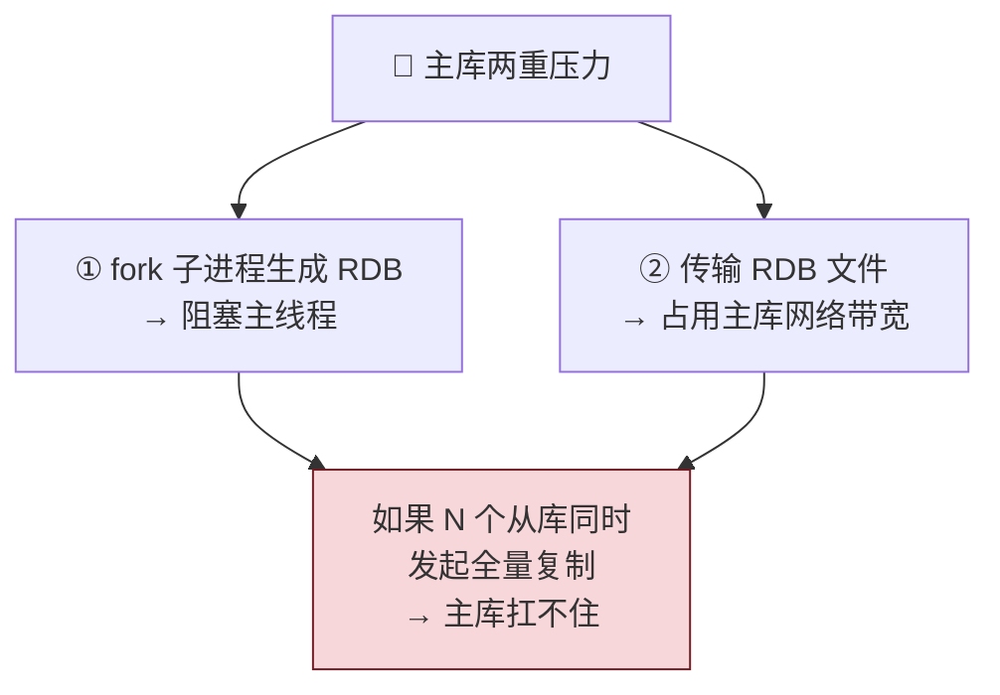
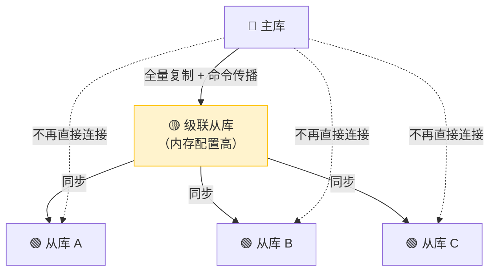
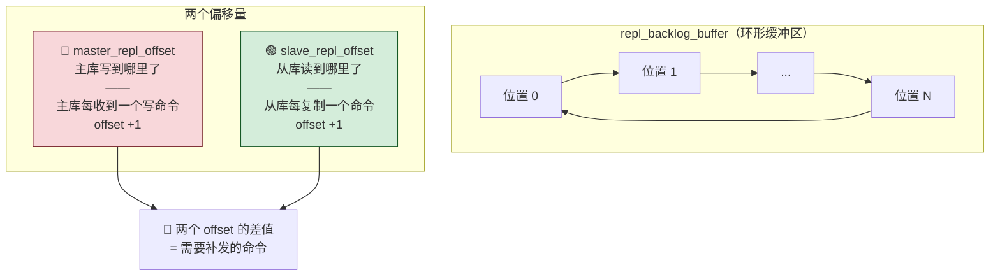
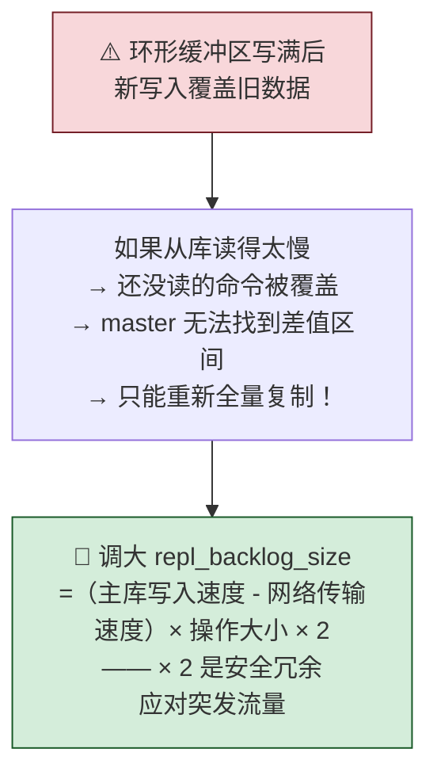
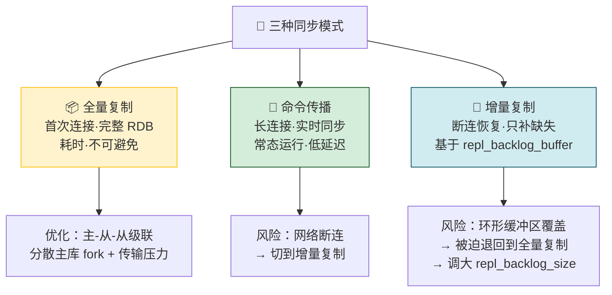

---

## 06 数据同步：主从库如何实现数据一致？

> AOF 和 RDB 解决了「数据少丢失」，但单个实例宕机意味着**服务中断**。Redis 的高可靠第二层：**增加副本冗余**——多实例部署，一台挂了其他的顶上。主从模式 + 读写分离是基础，全量复制（首次）+ 长连接命令传播（常态）+ 增量复制（断连恢复）是三种同步方式。

> 💡 **从哪里来？** 第 01~03 节解决了「单机快」，第 04~05 节解决了「数据不丢」。但宕机恢复期间——不管 AOF 重放还是 RDB 加载——服务是中断的。Redis 不能接受这一点。于是出现了「多副本」思路：一台挂了，另一台立刻顶上。但多个副本之间数据怎么保持一致？这就是本节要解决的核心问题——主从同步。

---

## 先做一个类比：出版社发行体系

| 出版社 | Redis 主从 |
|---|---|
| 📖 **原稿（主库）** | 所有修改在主库完成 |
| 🏭 **印刷厂批量印刷（全量复制）** | 首次同步——主库把完整 RDB 文件发给从库 |
| 📬 **新章节陆续寄送（命令传播）** | 正常运行——长连接实时同步每条写命令 |
| 📋 **漏寄补发（增量复制）** | 断连恢复——只补发断连期间缺失的命令 |
| 🏢 **分印厂代印（级联模式）** | 「主-从-从」——从库帮主库分担同步压力 |

---

## 一、为什么需要主从库？—— 高可靠的两层含义

### 为什么必须读写分离？

| 操作 | 主库 | 从库 |
|---|---|---|
| **读** | ✅ 可以 | ✅ 可以（分担压力） |
| **写** | ✅ 唯一入口 | ❌ 不允许——只从主库同步 |

---

## 二、第一次同步：全量复制的三个阶段

| 阶段         | 主库做什么                                        | 从库做什么           |
| ---------- | -------------------------------------------- | --------------- |
| **① 握手协商** | 响应 `FULLRESYNC runID offset`                 | 发送 `psync ? -1` |
| **② 全量传输** | bgsave 生成 RDB → 发送；新写命令暂存 replication buffer | 清空旧数据 → 加载 RDB  |
| **③ 补齐增量** | 把 replication buffer 中的命令发送                  | 执行补齐命令 → 追平     |

### psync 命令的两个参数

| 参数 | 含义 | 首次同步的值 |
|---|---|---|
| **runID** | 每个 Redis 实例的唯一随机 ID | `?`——还不知道主库是谁 |
| **offset** | 复制进度偏移量 | `-1`——表示第一次复制 |

### 为什么用 RDB 而不是 AOF 做首次同步？

| 维度 | RDB | AOF |
|---|---|---|
| **文件大小** | 紧凑·二进制压缩 | 累积所有命令·更大 |
| **传输效率** | ✅ 更高 | ❌ 低 |
| **加载速度** | ✅ 直接读入内存 | ❌ 需逐条重放 |
| **首次同步的核心诉求** | 把主库当前的**全量状态**快速传给从库 | — |

> 首次同步要的是「主库当前状态的一份完整副本」，RDB 天生适合。AOF 记录的是历史操作序列，恢复时还要逐条重放——主从同步如果也逐条重放，太慢了。

---

## 三、主从级联模式 —— 分担主库压力

### 全量复制的两个开销（都落在主库）

### 解法：「主-从-从」级联

| 模式 | 主库压力 | 适用 |
|---|---|---|
| **直连模式**（所有从库连主库） | 🔴 重——每个从库都要主库 fork + 传 RDB | 从库少 |
| **级联模式**（主-从-从） | 🟢 轻——主库只同步给一个级联从库 | 从库多 |

---

## 四、正常运行：基于长连接的命令传播

首次全量复制完成后，主从之间维持一个**长连接**，主库每收到一条写命令，就实时同步给从库——避免频繁建立连接的开销。

---

## 五、网络断了怎么办？—— 增量复制 + repl_backlog_buffer

> Redis 2.8 之前：断连 → 只能重新全量复制 → 开销巨大。
> Redis 2.8+：断连 → **增量复制**——只补发断连期间主库新收到的命令。

### 核心机制：环形缓冲区 + 双偏移量

### 增量复制流程

### ⚠️ 环形缓冲区的风险：覆盖

### repl_backlog_size 计算示例

| 参数 | 值 |
|---|---|
| 主库每秒写入 | 2000 个操作 |
| 每个操作大小 | 2 KB |
| 网络每秒传输 | 1000 个操作 |
| 积压操作 = 2000 - 1000 | 1000 个 |
| 最小缓冲 = 1000 × 2KB | **2 MB** |
| 最终设置（×2 冗余） | **4 MB** |

---

## 六、三种同步模式全景对比

| 同步方式 | 触发时机 | 传输内容 | 开销 |
|---|---|---|---|
| **全量复制** | 首次连接 / 增量复制失败 | 完整 RDB 文件 | 🔴 大——主库 fork + 网络传输 |
| **命令传播** | 正常运行 | 每条写命令 | 🟢 小——长连接实时推送 |
| **增量复制** | 网络断连恢复 | 断连期间的写命令 | 🟡 中——取决于断连时长 |

> **🧭 接下来看什么？** 主从模式解决了多副本数据一致的问题。但还有一个尴尬的空白——主库挂了以后，谁来「顶上」？从库可以继续提供读服务，但写操作必须由主库执行。主库挂了，写操作全部失败。这时需要一套**自动故障转移机制**——自动检测主库下线、自动选一个新主库、自动通知所有从库和客户端。这就是哨兵（Sentinel），下一节讲。

---

## 一句话总结

> 主从同步 = 全量复制（首次 RDB）+ 命令传播（常态长连接）+ 增量复制（断连后基于 repl_backlog_buffer 环形缓冲区补缺失命令）。读写分离避免了多主写冲突；主-从-从级联把全量复制的压力从主库分散到中间节点；repl_backlog_size 决定增量复制能不能成功——太小会触发回退全量复制。核心记住：全量靠 RDB（快照传输），增量靠环形缓冲区 + 双偏移量（master_repl_offset - slave_repl_offset = 要补的命令）。
