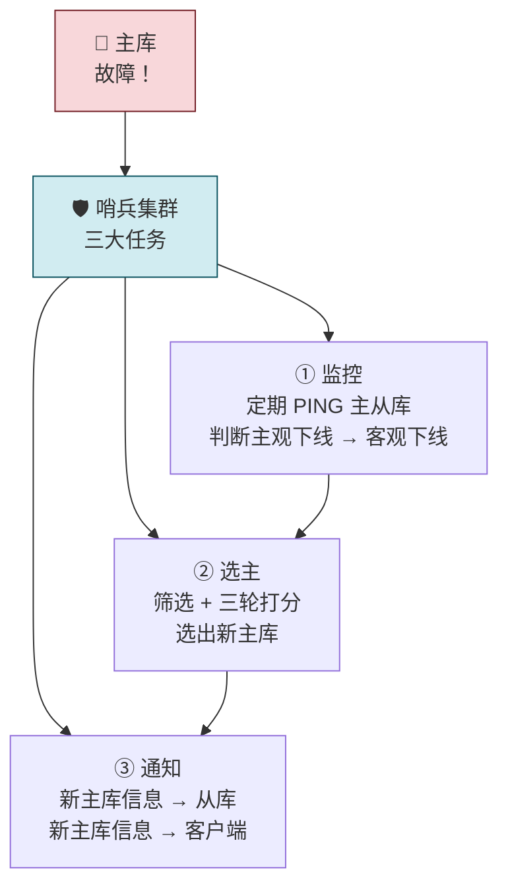
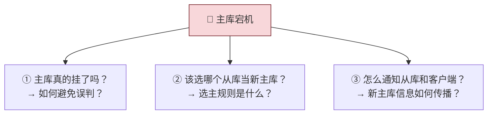
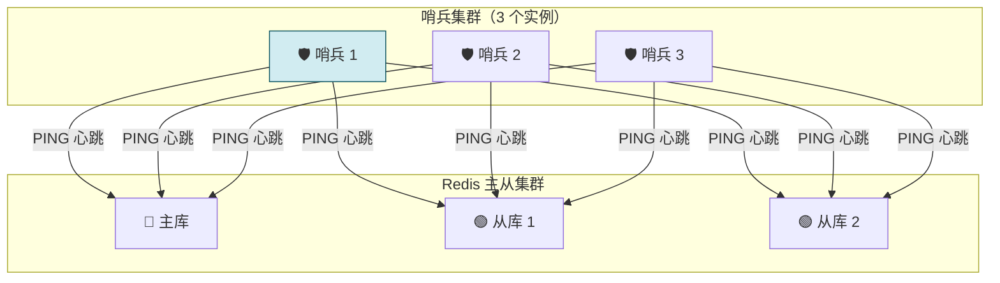
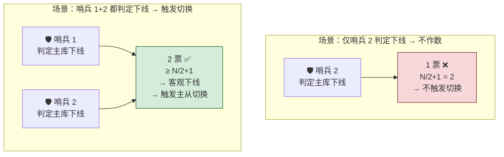
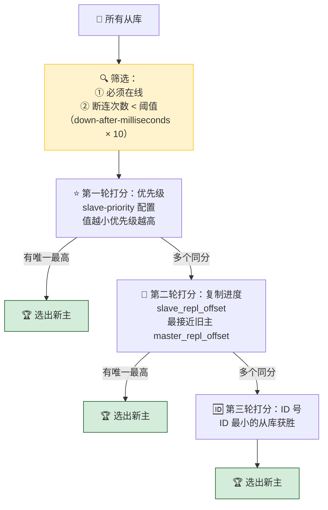
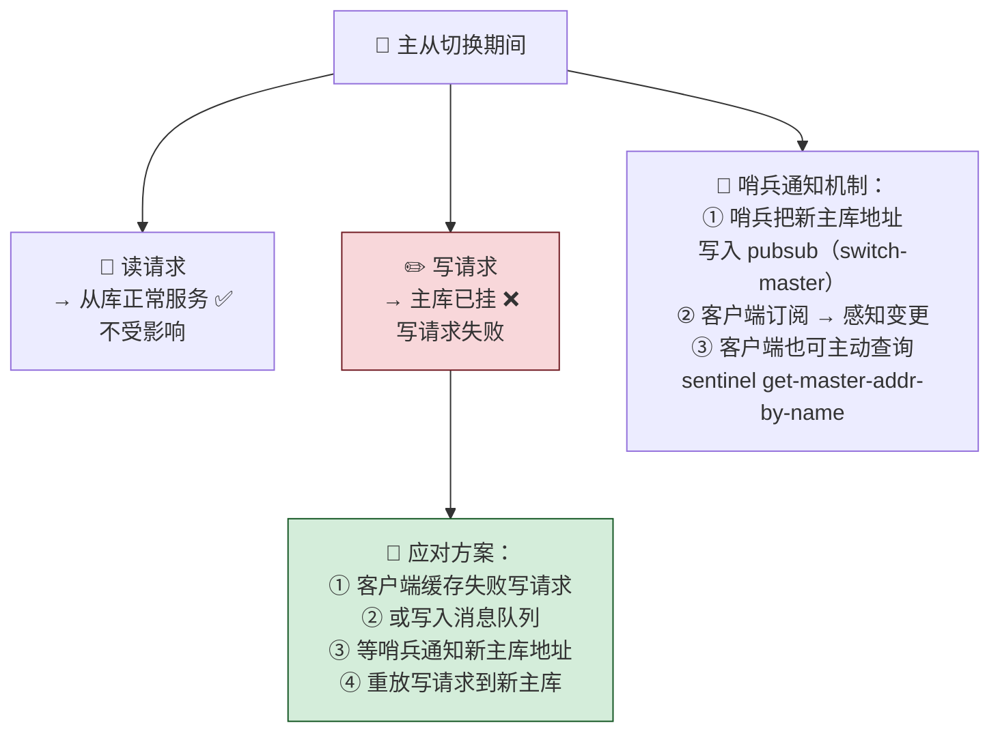
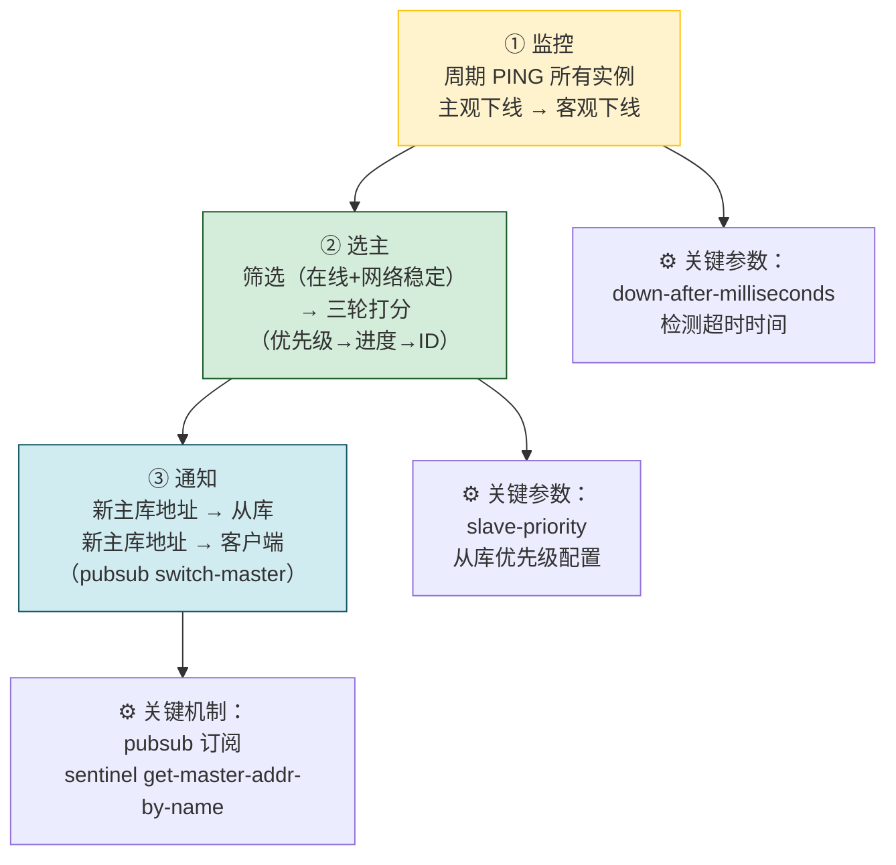

---

## 07 哨兵机制：主库挂了，如何不间断服务？

> 主从模式下，主库一挂，写操作全部中断。**哨兵（Sentinel）** 是实现主从自动切换的关键——监控主库是否存活、从从库中选一个新主库、通知所有从库和客户端切换。核心机制：主观下线 vs 客观下线（N/2+1 投票）、筛选 + 三轮打分选主、摘录 Kaito 精选留言解答切换期间客户端应对方案。

> 💡 **从哪里来？** 第 06 节解决了「主从之间怎么同步数据」，但留下了一个关键空白：如果主库挂了，谁来顶上？从库不会自己晋升为主库——需要外部观察者监控、决策、通知。这就是哨兵。它要回答三个问题：主库真挂了吗（避免误判）？选谁当新主库（数据最新、网络稳定）？怎么通知所有人（从库 + 客户端）？

---

## 先做一个类比：自动化消防系统

| 消防系统 | Redis Sentinel |
|---|---|
| 🔥 **烟雾探测器（监控）** | 哨兵定期 PING 所有实例——检测是否存活 |
| 📢 **多探测器交叉验证（客观下线）** | 多个哨兵投票，N/2+1 确认才判下线——防止误报 |
| 🚒 **自动选定备用水源（选主）** | 从从库中筛选 + 打分，选出最优的做新主库 |
| 📡 **通知所有消防栓切换水源（通知）** | 把新主库信息推送给所有从库和客户端 |

---

## 一、主库挂了会怎样？—— 哨兵要解决的三个问题

| 问题 | 哨兵的答案 |
|---|---|
| 主库真挂了吗？ | 多哨兵投票——主观下线 → 客观下线 |
| 选哪个从库？ | 筛选（在线+网络稳定）+ 三轮打分（优先级→复制进度→ID） |
| 怎么通知？ | 哨兵把新主库信息推送给所有从库和客户端 |

---

## 二、哨兵是什么？—— 运行在特殊模式下的 Redis 进程

哨兵本质上是一个**运行在特殊模式下的 Redis 进程**，不存储数据，只做监控和决策。一般部署**多实例哨兵集群**（至少 3 个，推荐 3/5 个）。

---

## 三、主观下线 vs 客观下线 —— 如何避免误判？

### 主观下线（Subjective Down）

**单个哨兵**发现实例 PING 超时 → 标记为「主观下线」。

| 检测对象 | 后果 |
|---|---|
| **从库** 主观下线 | 影响不大——直接标记即可 |
| **主库** 主观下线 | ⚠️ 不能直接切换——可能是哨兵自身网络问题导致的误判 |

### 客观下线（Objective Down）

**多个哨兵**（≥ N/2+1）都认为主库主观下线 → 标记为「客观下线」→ 触发主从切换。

| 概念 | 谁来判 | 票数要求 | 触发什么 |
|---|---|---|---|
| **主观下线** | 单个哨兵 | 1 票 | 仅记录·不触发切换 |
| **客观下线** | 哨兵集群投票 | ≥ N/2+1 | **触发主从切换** |

> 为什么需要多哨兵？因为**哨兵自己的网络也可能出问题**——哨兵和主库间的网络断了，主库其实在线。多个哨兵同时网络不稳定的概率小，误判率大幅降低。

---

## 四、如何选定新主库？—— 「筛选 + 三轮打分」

### 筛选条件

| 条件 | 规则 |
|---|---|
| **在线状态** | 必须正常运行 |
| **网络稳定性** | 过去断连次数 < 阈值（`down-after-milliseconds` × 10） |

> 为什么还要筛选网络稳定性？因为一个从库如果历史上频繁断连，即使此刻在线，选它当主库后很快又会掉线——又要重新选主。

### 三轮打分

| 轮次 | 评分依据 | 配置方式 | 说明 |
|---|---|---|---|
| **第一轮** | 从库优先级 | `slave-priority` 配置项 | 值越小优先级越高——给「好机器」设高优先级 |
| **第二轮** | 复制进度 | `slave_repl_offset` 最接近旧主 | 数据最新的从库——丢数据最少 |
| **第三轮** | 实例 ID | 自动生成 | ID 最小的获胜——保底规则，一定能选出 |

### 复制进度打分详解

```mermaid
graph LR
    subgraph "旧主库 offset = 1000"
        OldMaster["🔴 旧主库<br/>master_repl_offset=1000"]
    end

    subgraph "三个从库的 slave_repl_offset"
        S_A["🟢 从库 1<br/>slave_repl_offset=950<br/>差距 50"]
        S_B["🟢 从库 2<br/>slave_repl_offset=990<br/>差距 10 ✅"]
        S_C["🟢 从库 3<br/>slave_repl_offset=900<br/>差距 100"]
    end

    S_B --> Win["🏆 从库 2 胜出<br/>同步最接近旧主<br/>数据最新·丢最少"]

    style S_B fill:#d4edda,stroke:#155724
```

> ⚠️ FAQ：旧主库挂了，`master_repl_offset` 怎么获取？答案是——每个从库在同步时就知道旧主的 offset，哨兵通过 PING 从库时就能拿到这个值，不需要访问旧主。

---

## 五、切换期间客户端怎么办？—— Kaito 精选留言精华

### 切换期间的影响

| 请求类型 | 影响 | 时长 |
|---|---|---|
| **读请求** | ✅ 正常——从库可服务 | 无影响 |
| **写请求** | ❌ 失败 | = 哨兵切换时长 + 客户端感知新主库的时长 |

### 客户端如何感知新主库？

| 方式       | 说明                                                  |
| -------- | --------------------------------------------------- |
| **被动通知** | 哨兵把新主库地址写入 pubsub（`switch-master`），客户端订阅即可感知        |
| **主动查询** | 客户端调用 `sentinel get-master-addr-by-name` 主动获取最新主库地址 |

> 工程建议：客户端**不能写死主库地址**——要通过哨兵动态获取。Redis SDK 通常已经封装好这个逻辑。

---

## 六、哨兵三大任务全景图

> **🧭 接下来看什么？** 第 07 节讲了哨兵**做什么**（监控、选主、通知），但留下了四个悬而未决的问题：多个哨兵之间怎么互相发现？怎么发现从库地址？客户端怎么感知切换进度？谁来做实际切换？这些问题归结为一个答案：哨兵集群 + pub/sub + Leader 选举。下一节深入哨兵集群的内部运作机制。

---

## 一句话总结

> 哨兵 = 特殊模式的 Redis 进程，三件事——监控（主观下线 → 多哨兵投票 N/2+1 → 客观下线）、选主（筛选在线+网络稳定 → 三轮打分：优先级→复制进度→ID）、通知（新主库地址推送给从库和客户端）。多哨兵部署是为了降低误判率——单个哨兵自己的网络也可能出问题。客户端要动态发现主库（pubsub 订阅或主动查询 sentinel），不能写死地址。哨兵集群怎么投票选出领导哨兵、哨兵间怎么协调——下节详解。
