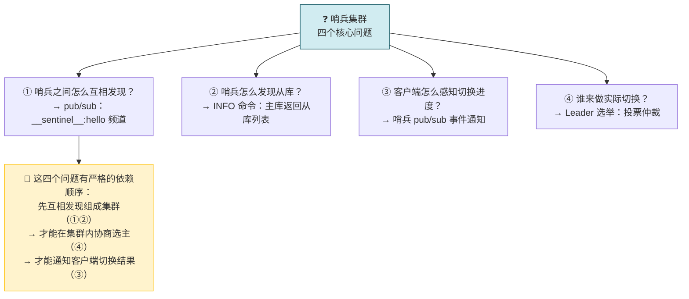
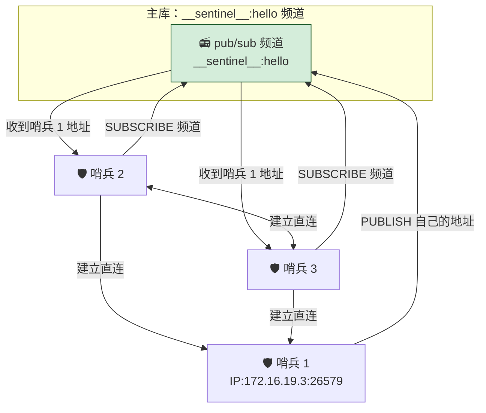
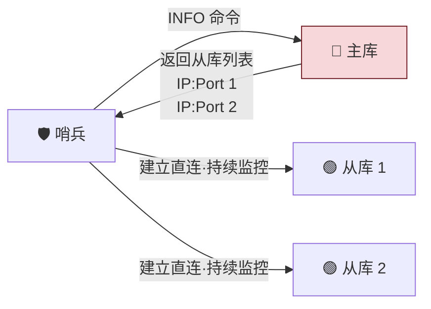
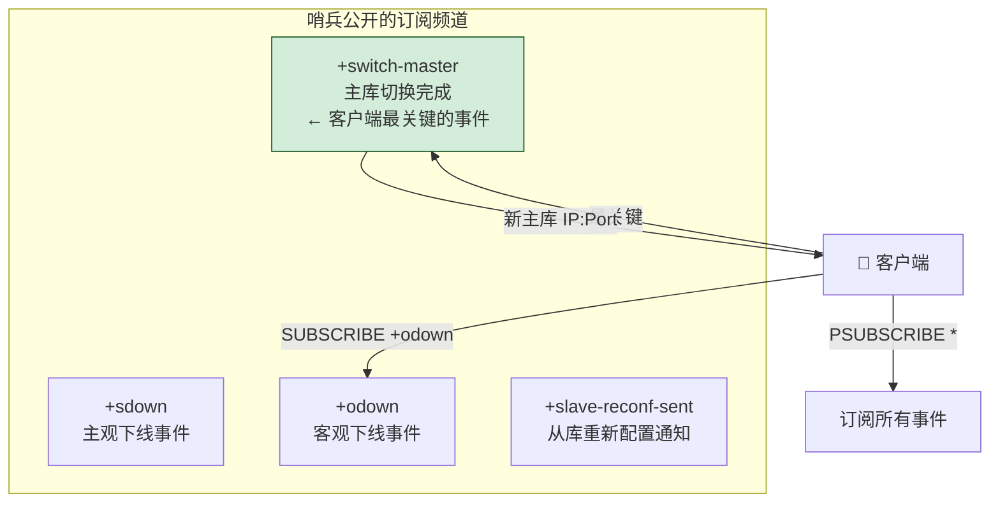
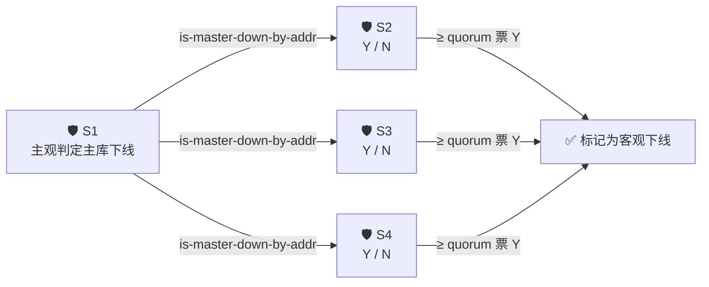
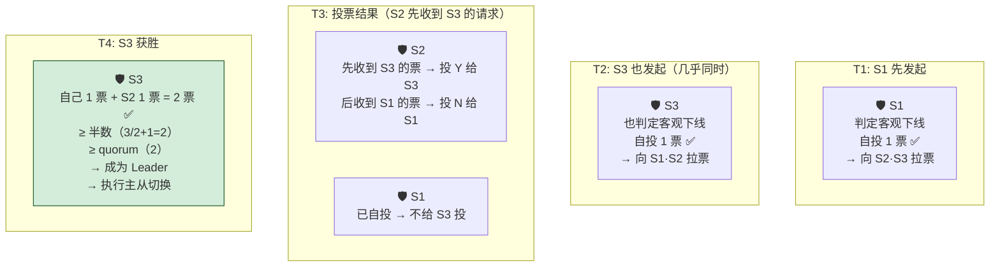
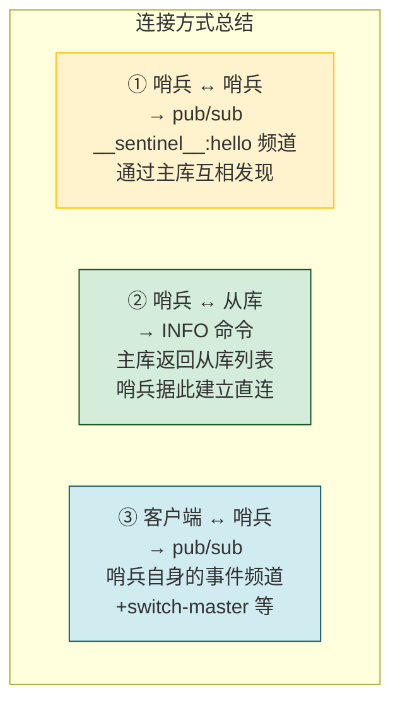
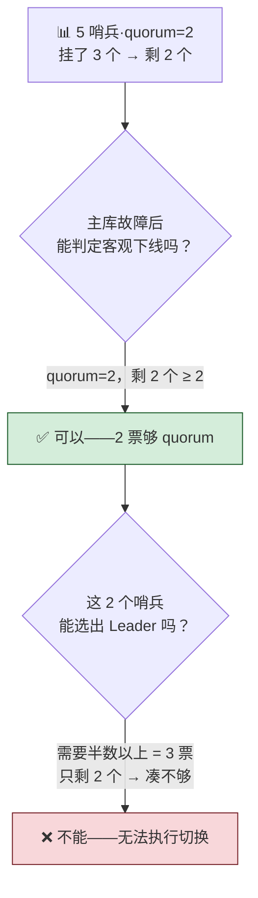

---

## 08 哨兵集群：哨兵挂了，主从库还能切换吗？

> 多个哨兵组成集群可以降低误判。但哨兵之间怎么互相发现？从库地址怎么获取？客户端怎么知道切换进度？最终由哪个哨兵来执行切换？本节四个问题，都围绕一个核心机制：**Redis 的 pub/sub（发布/订阅）**。

---

## 先做一个类比：对讲机群组

| 对讲机群组 | Redis Sentinel 集群 |
|---|---|
| 📻 **所有人调到同一频道** | 哨兵在 `__sentinel__:hello` 频道发布/订阅 |
| 👮 **只有在这个频道的人能互相听到** | 订阅同一频道的哨兵才能互相发现 |
| 📋 **总台告诉谁在值班** | 主库用 INFO 命令返回从库列表 |
| 📢 **广播紧急通知** | 哨兵 pub/sub 通知客户端主从切换事件 |
| 👑 **谁当现场指挥？先举手先得** | Leader 选举——先到先投票 |



这四个问题不是孤立的——只有先解决「怎么互相发现」，哨兵才能组成一个整体去协商选主；只有选出了主，才能通知客户端。接下来按这个依赖顺序逐一展开。

---

## 一、哨兵之间怎么互相发现？—— pub/sub 集群自发现

> 配置哨兵时只需指定**主库 IP 和端口**，不用配置其他哨兵地址。那它们怎么互相认识？

```bash
sentinel monitor <master-name> <ip> <redis-port> <quorum>
```

### 答案：主库的 `__sentinel__:hello` 频道



| 步骤 | 说明 |
|---|---|
| ① 哨兵连接主库 | 配置中指定了主库地址，哨兵启动后直接连接 |
| ② 各哨兵发布自己的地址 | 在 `__sentinel__:hello` 频道发布（IP + 端口） |
| ③ 各哨兵订阅该频道 | 从频道中获取其他哨兵的地址 |
| ④ 哨兵之间建立直连 | 形成全连接的 Sentinel Mesh 网络 |

> pub/sub 的核心：**只有订阅了同一个频道的应用，才能通过发布的消息进行信息交换**。主库充当了哨兵之间的「公告板」。

**但光互相认识还不够**——哨兵还需要监控从库。哨兵之间通过主库的 `__sentinel__:hello` 频道形成了集群，但集群里的每个哨兵还不知道从库在哪里。没有从库的连接信息，哨兵就没法做心跳检测，也没法在主库挂了之后通知从库切换。那从库的地址怎么获取？

---

## 二、哨兵怎么发现从库？—— INFO 命令



| 步骤 | 说明 |
|---|---|
| ① 哨兵向主库发 INFO | 主库维护了所有从库的连接信息 |
| ② 主库返回从库列表 | 包含每个从库的 IP + 端口 |
| ③ 哨兵与从库建立连接 | 持续 PING 监控 + 切换后通知 |

---

**到这里，哨兵集群的「内部网络」就搭好了**——哨兵之间通过 pub/sub 互相知道彼此，哨兵和从库之间通过 INFO 命令建立了直连。但现在还有一个关键角色没接入这个网络：**客户端**。主从切换完成后，新主库地址必须通知到客户端，否则客户端还往已经挂了的旧主库发请求。而且客户端也想感知切换进度，知道现在进行到哪一步了。这又回到了 pub/sub——只不过这次的频道来自哨兵自己。

## 三、客户端怎么感知切换？—— 哨兵 pub/sub 事件通知

哨兵本身也是 Redis 实例，提供 pub/sub 机制，客户端可以**从哨兵订阅事件**。



### 关键订阅频道

| 频道 | 含义 | 客户端用途 |
|---|---|---|
| `+sdown` | 实例被标记为主观下线 | 了解下线检测进度 |
| `+odown` | 实例被标记为客观下线 | 了解下线检测进度 |
| **`+switch-master`** | 🔑 主从切换完成——**最核心** | 拿到新主库地址，切换连接 |
| `+slave-reconf-sent` | 从库重新配置已通知 | 了解切换进度 |

### 关键命令

```bash
# 订阅客观下线事件
SUBSCRIBE +odown

# 订阅所有事件（通配符）
PSUBSCRIBE *

# switch-master 事件格式
switch-master <master-name> <old-ip> <old-port> <new-ip> <new-port>
```

---

**前三节讲完了三种连接关系的建立。** 现在哨兵集群已经形成了完整的感知网络——知道彼此（互发现）、知道所有 Redis 实例（主+从）、知道怎么通知客户端。它们可以正常做监控了：定期 PING 所有实例，标记主观下线，投票判定客观下线。

但客观下线只是「认定主库挂了」——接下来要真正执行切换了。这时出现一个新问题：**集群里有多个哨兵实例，到底由谁来执行主从切换？** 总不能大家一起动手，那就乱套了。所以还需要最后一步：投票选出 Leader。

## 四、谁来做实际切换？—— Leader 选举

主库客观下线后，哨兵集群有多个实例——谁来执行切换？答案：**投票仲裁选出 Leader**。

### 判定客观下线：quorum 仲裁



| 参数 | 含义 |
|---|---|
| **quorum** | 判定客观下线所需的最少赞成票数（包括自己的一票） |
| 例：5 个哨兵，quorum=3 | 一个哨兵需要**自己 1 票 + 另外 2 票 = 3 票**才能标记客观下线 |

### Leader 选举：谁来做切换

客观下线判定后 → 判定者发起 Leader 选举：



### Leader 获胜条件

| 条件 | 说明 |
|---|---|
| ✅ **拿到半数以上赞成票** | 3 个哨兵需要 ≥ 2 票；5 个哨兵需要 ≥ 3 票 |
| ✅ **票数 ≥ quorum 值** | 配置文件中的 `quorum` 参数 |
| ⚠️ **先投票先得** | 每个哨兵只投给第一个拉票请求的发送者（先到先投，后续全拒） |

### 为什么只有 2 个哨兵不行？

| 哨兵数量 | Leader 所需票数 | 挂 1 个后 |
|---|---|---|
| **2 个** | 需要 2 票 | 只剩 1 个 → 凑不够 2 票 → 🔴 无法切换 |
| **3 个** | 需要 2 票 | 挂 1 个 → 还剩 2 个 → 刚好够 ✅ |
| **5 个** | 需要 3 票 | 挂 2 个 → 还剩 3 个 → 刚好够 ✅ |

> **至少 3 个哨兵**——这是工程底线。另外务必保证所有哨兵的 `down-after-milliseconds` 配置**完全一致**，否则可能有哨兵认为主库活着、有的认为挂了，永远无法达成共识。

### 哨兵集群的三种连接全景



| 连接关系 | 谁问谁 | 用的是什么 | 得到什么 |
|---|---|---|---|
| **哨兵 ↔ 哨兵** | 哨兵问主库 | pub/sub `__sentinel__:hello` | 其他哨兵的地址 |
| **哨兵 ↔ 从库** | 哨兵问主库 | INFO 命令 | 从库列表（IP:Port） |
| **客户端 ↔ 哨兵** | 客户端问哨兵 | pub/sub 事件频道 | 主从切换事件·新主库地址 |

---

**到这里，哨兵集群运作的四个核心问题就全部讲完了。** 但还有一个常被忽视的细节：quorum 和哨兵存活数虽然都跟「票数」相关，但它们控制的是两件完全不同的事。下面用一个实战场景来检验理解是否到位。

## 五、实战分析：5 哨兵 + quorum=2，挂 3 个还剩 2 个

> 场景：一主四从、5 个哨兵、quorum=2，运行中 3 个哨兵故障。



| 能力 | 条件 | 结果 |
|---|---|---|
| **判定客观下线** | quorum=2，剩 2 个 ≥ 2 | ✅ 可以判定——主库被标记为客观下线 |
| **执行主从切换** | Leader 需要半数以上票（3 票），只剩 2 个 | 🔴 无法执行——无 Leader |

> 启示：quorum 决定了「能不能判定下线」，哨兵存活数决定了「能不能选出 Leader 执行切换」。两者不可混为一谈。

---

## 一句话总结

> 哨兵集群 = pub/sub 三板斧——哨兵互发现靠主库的 `__sentinel__:hello` 频道、从库发现靠 INFO 命令、客户端感知靠哨兵的 `+switch-master` 事件频道。实际上执行切换的只有一个 Leader 哨兵，通过投票仲裁选出（半数以上 + ≥ quorum，先到先投）。工程底线：至少 3 个哨兵（2 个挂了就无法选 Leader）+ 所有哨兵 `down-after-milliseconds` 配置必须一致 + 哨兵不是越多越好（增加通信开销）。
