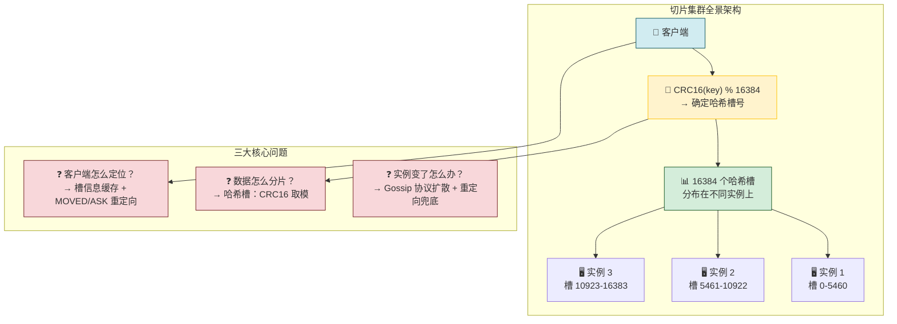
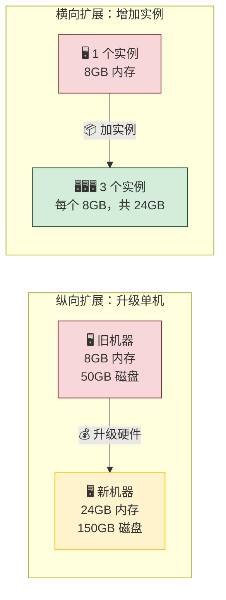
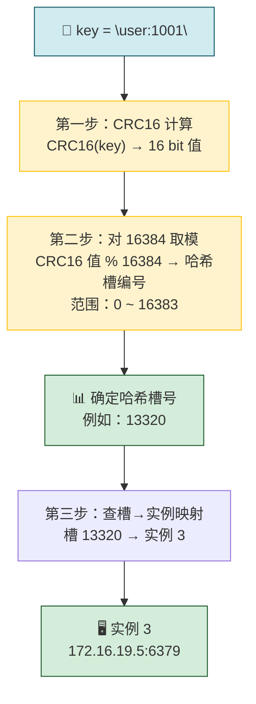
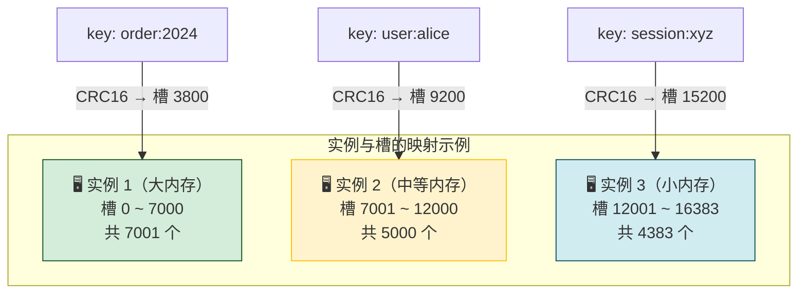
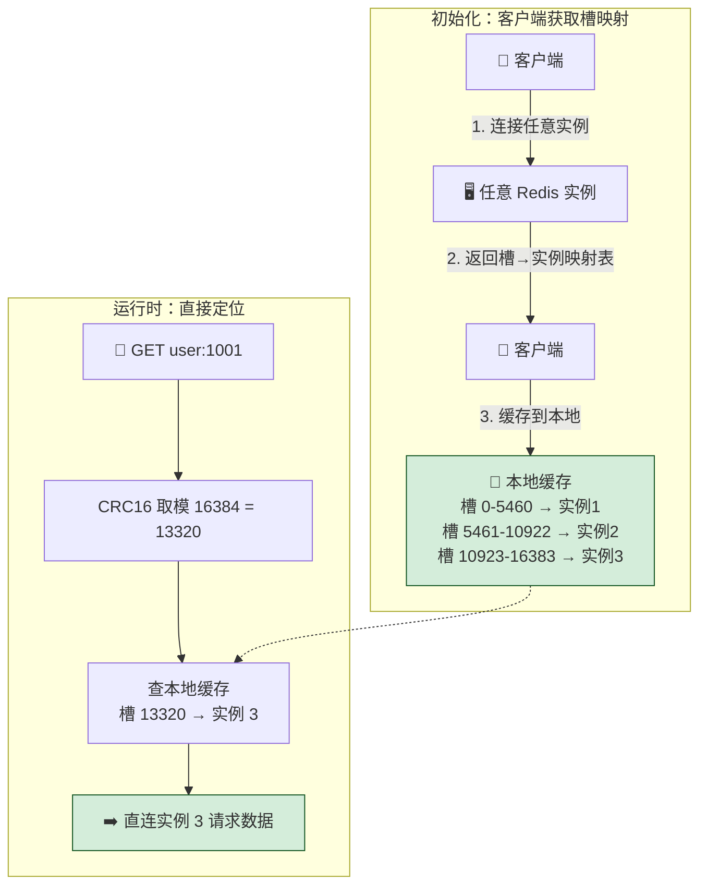
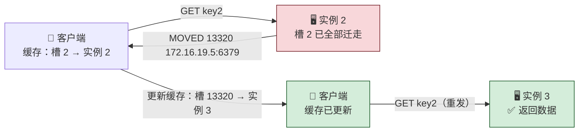
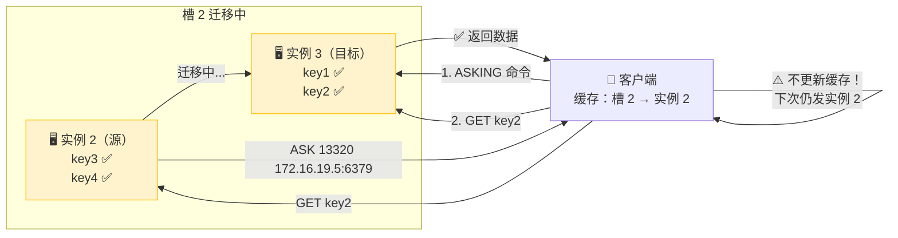
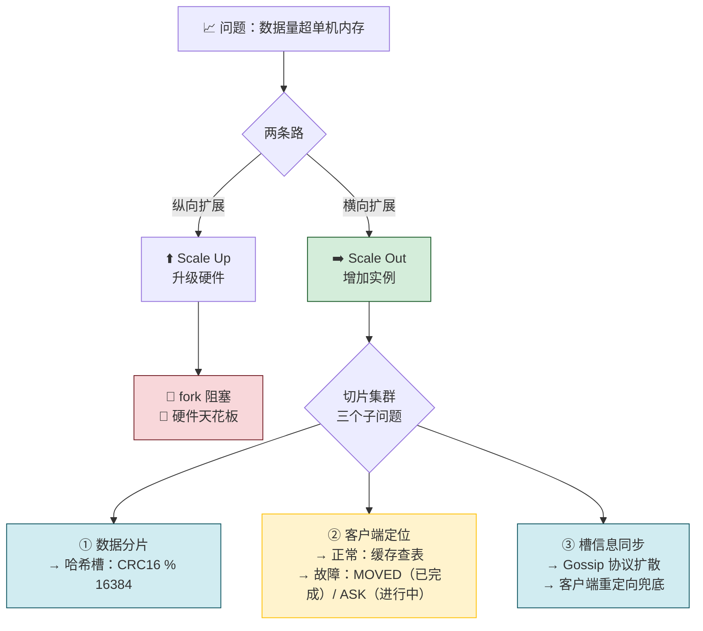

---

## 09 切片集群：数据增多了，是该加内存还是加实例？

> 💡 **从哪里来？** [[08 哨兵集群：哨兵挂了，主从库还能切换吗？|上一节]] 我们解决了 **高可用** 问题——哨兵集群通过 pub/sub 三板斧（互发现、从库感知、事件通知）加上 Leader 选举，在主库故障时能自动切换。但高可用只保证「挂了能恢复」，不解决「数据太多存不下」。当业务规模从百万级涨到千万级、数据量突破单机内存上限，怎么办？这就引出了本节的核心方案——**切片集群**。

---

## 先做一个类比：图书馆分馆

| 图书馆场景                          | Redis 切片集群               |
| ------------------------------ | ------------------------ |
| 🏛️ **总馆装不下所有书** → 开分馆         | 单机内存装不下所有数据 → 加 Redis 实例 |
| 📚 **按图书分类号（如 A 类、B 类）分到不同分馆** | 按 key 的哈希值分到不同实例         |
| 🗺️ **读者查目录卡片，知道去哪个分馆找书**      | 客户端计算哈希槽，知道去哪个实例访问       |
| 🔄 **某分馆装修，书临时搬到另一分馆**         | 哈希槽迁移，MOVED/ASK 重定向      |
| 📦 **分馆扩容只需租新场地**              | 横向扩展只需加实例——没有硬件天花板       |

**图释：** 切片集群的核心思想——把数据通过哈希算法分散到多个实例上，每个实例只扛一部分数据。这带来了三个必须解决的问题，本节逐一拆解。

---

## 一、数据多了怎么办？—— 纵向扩展 vs 横向扩展

> 场景还原：5000 万个键值对，每个约 512B，总数据量约 **25GB**。第一反应是买台 32GB 内存的云主机——结果发现 RDB 持久化时 **fork 子进程阻塞主线程接近秒级**，Redis 响应突然变慢。

这是因为 RDB 持久化的 `fork` 操作耗时与数据量**正相关**，25GB 数据 fork 时主线程被阻塞，导致客户端感知到明显延迟。

面对数据增长，有两种策略：

| 维度 | 纵向扩展（Scale Up） | 横向扩展（Scale Out） |
|---|---|---|
| **做法** | 升级单机配置：加内存、加磁盘、换更强 CPU | 增加 Redis 实例数量 |
| **实施难度** | 🟢 简单直接——买更大机器就行 | 🟡 需要引入分布式管理机制 |
| **fork 阻塞** | 🔴 数据越多，fork 越慢，主线程阻塞越长 | 🟢 每个实例数据量小，fork 几乎不阻塞 |
| **硬件天花板** | 🔴 有上限——1TB 以上内存的成本和可行性骤降 | 🟢 无上限——加实例即可 |
| **适用场景** | 数据量不大、不需要持久化 | **百万/千万级用户规模** |

**图释：** 纵向扩展是「让一匹马跑更快」，横向扩展是「多加几匹马一起拉」。后者没有单机物理极限，是应对大规模数据的正确方向。

---

**选横向扩展就万事大吉了吗？** 还没有——单个实例时，数据在哪、客户端访问哪，一目了然。但引入多个实例后，立刻出现两个新问题：**数据怎么分布到各个实例？** 和 **客户端怎么知道去哪个实例找数据？** 下面逐一解决。

## 二、数据怎么分片？—— 哈希槽（Hash Slot）

### Redis Cluster：官方切片集群方案

切片集群是一种**通用机制**，可以有不同实现。在 Redis 3.0 之前，业界已有基于客户端分区的 ShardedJedis、基于代理的 Codis/Twemproxy 等方案。Redis 3.0 起，官方提供了 **Redis Cluster** 方案，核心机制就是**哈希槽（Hash Slot）**。

### 映射过程：两步走

**图释：** 每个 key 经过 CRC16 计算和取模后，必然落入 0~16383 中的某一个哈希槽，再根据槽与实例的映射关系找到目标实例。

### 为什么是 16384？

| 考量维度 | 分析 |
|---|---|
| **心跳包大小** | 槽分配信息需要在实例间通过 Gossip 协议传递，16384 个槽的位图只需 **2KB**，如果选 65536 则需要 8KB |
| **网络开销** | 集群规模通常不会超过 1000 个节点，16384 个槽足够均匀分布 |
| **设计平衡** | 太少（如 1024）→ 迁移时粒度太粗；太多了 → 心跳包过大。16384 是折中 |

### 哈希槽如何分配到实例？

有两种方式：

| 方式 | 操作 | 适用场景 |
|---|---|---|
| **自动分配** | `cluster create` 命令创建集群，Redis 自动均分 16384 个槽 | 所有实例配置相同 |
| **手动分配** | `cluster meet` 建立连接 + `cluster addslots` 指定槽范围 | 实例内存大小不一，按需分配 |

⚠️ **关键约束：16384 个槽必须全部分配完，否则集群无法正常工作。**

**图释：** 手动分配哈希槽可以根据实例的内存大小灵活配置——内存大的实例多扛几个槽，小的少扛几个。这比均匀分配更合理地利用了硬件资源。

---

**数据分布到实例的规则搞清楚了。** 但客户端呢？它怎么知道 key 对应哪个哈希槽、这个槽又在哪个实例上？总不能每次都让客户端遍历所有实例吧？下面看客户端的数据定位机制。

## 三、客户端怎么定位数据？—— 重定向机制

### 正常流程：槽信息缓存

**图释：** 客户端首次连接集群时获取并缓存槽映射表，后续请求直接计算 key 的槽号并在本地查表定位实例，**无需每次都问服务器**——这是高性能的关键。

### 槽映射会变化：两种场景

但缓存不一定永远准确。两种常见变化：

| 变化类型 | 原因 | 影响 |
|---|---|---|
| **实例增减** | 扩容加新实例 / 缩容下线实例 → 槽需重新分配 | 缓存中部分槽→实例映射失效 |
| **负载均衡** | 某实例数据过热 → 将部分槽迁移到其他实例 | 同上 |

实例之间通过 **Gossip 协议**相互传递最新槽分配信息，但 **客户端无法主动感知这些变化**。缓存过期了怎么办？

### 方案一：MOVED 重定向（迁移已完成）

当客户端请求的槽**已经完全迁移**到新实例：

**图释：** MOVED 是「永久的地址变更通知」——客户端收到后会**更新本地缓存**，后续所有对该槽的请求都直接发往新实例。

### 方案二：ASK 重定向（迁移进行中）

当槽的数据**正在迁移，只迁了一部分**：

**图释：** ASK 是「临时的通行证」——只让客户端对这次请求换实例，**不更新本地缓存**。因为迁移还没完成，槽 2 上还有数据在实例 2，下次请求可能又需要问实例 2。

### MOVED vs ASK：核心区别

| 维度 | MOVED | ASK |
|---|---|---|
| **触发时机** | 槽迁移**已完成** | 槽迁移**进行中** |
| **是否更新客户端缓存** | ✅ 是——永久改道 | ❌ 否——仅本次请求 |
| **后续相同槽的请求** | 直接发往新实例 | 仍发往旧实例（除非又 ASK） |
| **需要 ASKING 命令** | 不需要 | ✅ 必须先发 ASKING，让目标实例接受请求 |
| **语义** | 「数据搬家了，新地址是…」 | 「数据正在搬，这次你先去那边拿」 |

> 📌 **记忆口诀：** MOVED = **搬完了**（Moved → 永久改道），ASK = **搬着呢**（Asking → 临时借道）。

---

## 四、回到最开始的问题：为什么不直接查表？

> Redis Cluster 通过 CRC16 计算 + 对 16384 取模来确定 key 属于哪个槽，再查槽→实例映射。那为什么不直接维护一张「key → 实例」的映射表？

| 方案 | 做法 | 优点 | 缺点 |
|---|---|---|---|
| **直接查表** | 维护 key→实例 映射表，每次请求查表 | 绝对精确 | 🔴 表随 key 数量线性增长——5000 万个 key 就是 5000 万条记录 |
| **哈希槽** | CRC16(key) % 16384 → 槽号 → 查槽→实例映射 | 🟢 槽→实例映射**只有 16384 条**，与数据量无关 | 可能不均匀（靠 CRC16 算法保证分布） |

**核心优势：** 哈希槽方案将「数据量级的问题」化简为「固定 16384 个槽的管理问题」。无论存 1 个 key 还是 1 亿个 key，客户端和集群之间需要同步的**只有这 16384 个槽的分配信息**——这是 O(1) 空间复杂度，而不是 O(N)。

---

## 小结

---

## 一句话总结

> 切片集群 = 横向扩展解决数据量问题——将 16384 个哈希槽分配到多个实例上（CRC16 取模），客户端缓存槽映射实现快速定位，槽迁移时通过 MOVED（已完成，永久改道）和 ASK（进行中，临时借道）两种重定向保证数据可访问。核心设计智慧：用 **O(1) 的槽映射表** 替代 **O(N) 的 key 映射表**。

> 🧭 **接下来看什么？** Redis Cluster 是官方方案，但不是唯一的切片集群方案。在实际业务中，基于客户端分区的 ShardedJedis、基于代理的 Codis 和 Twemproxy 也各有优势（比如不需要改造客户端、支持跨机房部署等）。后面会专门讨论这些方案的实现机制和选型经验。另外，本节讲了「数据怎么分布」，但还没讲「集群节点之间怎么通信和容错」——这是 Redis Cluster 的另一半核心能力。
