> 💡 **从哪里来？** 前 9 讲分别建立了 Redis 的架构认知（基本架构、数据结构、IO 模型）、持久化机制（AOF、RDB）、高可用体系（主从复制、哨兵、切片集群）。本篇是这些内容的一次**集中回顾与深化**——把分散在各讲的思考题和常见疑问串成一条线，帮你查漏补缺。

# 第 1~9 讲课后思考题答案 & 常见问题答疑

## 先做一个类比：把学 Redis 当作"汽车体检"

本篇本质上是一次 **「全车体检」**——前 9 讲各自讲了发动机、变速箱、刹车系统，但你需要有人把各系统之间的**关联和边界**说清楚。

| 体检项目 | 本篇对应内容 |
|---|---|
| 发动机评估 —— 架构够不够完整？ | Part 1：SimpleKV 缺了什么（第 1 讲） |
| 油耗测试 —— 内存和性能怎么平衡？ | Part 1：数据结构取舍 + IO 瓶颈（第 2~3 讲） |
| 刹车检查 —— 宕机了数据丢不丢？ | Part 2：AOF 重写阻塞 + RDB 风险（第 4~5 讲） |
| 备胎系统 —— 主库挂了怎么办？ | Part 3：主从复制 + 哨兵（第 6~8 讲） |
| 载重扩展 —— 数据多了怎么扩？ | Part 4：哈希槽 vs 查表（第 9 讲） |
| 深度拆解 —— 核心零件的内部原理 | Part 5：rehash、写时复制、进程/线程、buffer 区别 |

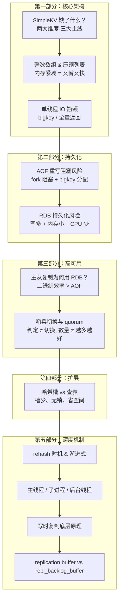

> **图释**：本篇从「宏观架构缺什么」出发，一路贯穿持久化、高可用、扩展性，最后深入到四个核心机制的底层原理——这是一条从「是什么」到「为什么」再到「怎么实现」的完整知识链。

---

## 第一部分：核心架构 —— Redis 到底比 SimpleKV 强在哪？

### 一、SimpleKV 还缺少什么？（第 1 讲思考题）

这个问题检验你对 Redis **全局架构**的理解程度。我们套用开篇词中的 **「两大维度·三大主线」** 框架来回答：

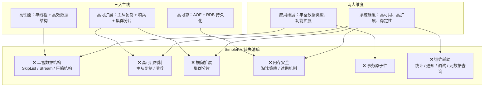

> **图释**：Redis 不是在 SimpleKV 基础上修修补补做出来的，而是从一开始就在性能、可靠、扩展三个维度上系统设计。

| 维度 | SimpleKV | Redis |
|---|---|---|
| **数据结构** | 基础 KV | String / List / Set / ZSet / Hash / Stream / HyperLogLog…… |
| **内存效率** | 无优化 | 压缩列表、整数数组等紧凑结构 |
| **高可用** | 无 | 主从复制 + 哨兵自动故障切换 |
| **横向扩展** | 无 | 哈希槽集群分片 |
| **内存安全** | 无 | 8 种淘汰策略 + TTL 过期 |
| **事务** | 无 | MULTI/EXEC（原子性）+ Lua 脚本 |
| **运维能力** | 无 | INFO / MONITOR / SLOWLOG / DEBUG |

---

**但光知道「缺什么」还不够**——第 2 讲马上追问：Redis 用来填补这些缺口的**数据结构**，到底快在哪、慢在哪？

### 二、数据结构的性能取舍（第 2~3 讲思考题）

#### 整数数组 & 压缩列表：为什么「省」就是「快」？

这两个结构的核心设计哲学是：**用连续内存替代指针链式结构。**

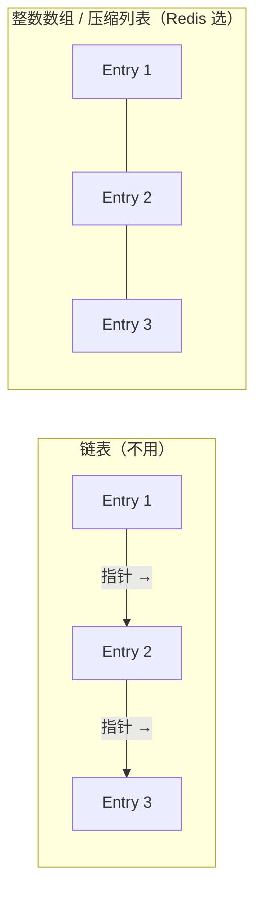

> **图释**：左边链表每个节点需要额外指针（8 字节 × 2 = 16 字节开销），右边连续内存直接把元素挨个排列，零额外指针。**省掉指针 = 省内存 + 更好的 CPU 缓存命中率 = 更快。**

核心逻辑：**连续内存 → 无指针开销 → 紧凑 → 节省空间 + 高缓存局部性 → 快。** 这是一种「以空间换时间」的**反向思维**——不是省空间就慢，而是**省空间带来了更好的缓存效果，反而更快**。

#### IO 模型中的隐藏瓶颈

第 3 讲讲了 Redis 单线程快，但**快不等于没有瓶颈**。潜在阻塞点：

| 阻塞来源 | 原因 | 影响 |
|---|---|---|
| **bigkey 操作** | 单个 key 的 value 过大，操作耗时长 | 阻塞主线程处理后续请求 |
| **全量返回** | `KEYS *`、`SMEMBERS` 等返回数据量大 | 输出缓冲区爆满，阻塞 |
| **高复杂度命令** | `SORT`、`SINTER` 等 CPU 密集型操作 | 占用主线程 CPU |
| **fork 子进程** | 内核复制 PCB 和页表 | 内存越大，fork 越慢 |

> 💡 **记忆口诀**：单线程世界，**一个慢操作 = 全世界等你一个**。

---

**前面聊的是「内存里的数据结构」和「CPU 上的 IO 模型」**——但数据终究要落盘。如果宕机了，内存里的数据怎么办？这就进入第二部分。

---

## 第二部分：持久化 —— 数据落盘的那些坑

### 三、AOF 重写有什么隐藏阻塞风险？（第 4 讲思考题）

AOF 重写不是「把旧日志删掉重写」那么简单，它有两个容易被忽略的阻塞点：

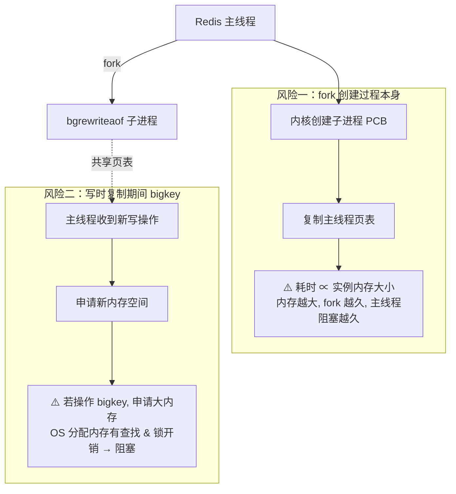

> **图释**：AOF 重写的阻塞风险不在「写日志」本身，而在 **fork 创建子进程**（风险一）和 **bigkey 触发大内存分配**（风险二）这两个环节。

#### 为什么 AOF 重写不直接复用 AOF 日志文件？

一句话：**文件锁竞争。** 主线程要写 AOF，bgrewriteaof 子进程也要读/写 AOF——两个进程抢同一把文件锁，主线程会被拖慢。

---

**AOF 重写解决了日志膨胀问题**——但还有一个更根本的问题：如果数据量大、写操作为主，持久化本身就会拖垮系统。第 5 讲直面了这个问题。

### 四、RDB 持久化：写多 + 内存小 + CPU 少 = 危险（第 5 讲思考题）

**场景**：2 核 CPU、4GB 内存、数据量 2GB、写读比 8:2。

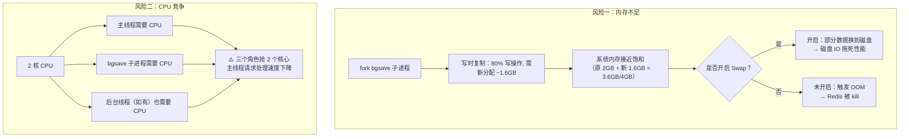

> **图释**：在「写多 + 内存紧 + CPU 少」的场景下，RDB 持久化是一把双刃剑——**写时复制消耗内存，fork 进程消耗 CPU**，两个资源同时承压。

| 关键计算 | 数值 |
|---|---|
| 原数据量 | **2GB** |
| 写比例 80% | 写时复制需额外分配 ≈ **1.6GB** |
| 总内存需求 | **2GB + 1.6GB ≈ 3.6GB（/4GB）** |
| CPU 需求 | 主线程 + 子进程 + 后台线程 → **2 核不够** |

> 💡 **记忆口诀**：**写多别用 RDB，内存小别 fork，CPU 少别并发。** 三条全中 = 千万别这么配。

---

**数据能持久化了**——但单机总归会挂。要让服务不中断，就需要多机协作。第三部分讲的就是这个。

---

## 第三部分：高可用 —— 一台挂了，另一台顶上

### 五、主从复制为什么选 RDB 而不是 AOF？（第 6 讲思考题）

两个硬理由：

| 维度 | RDB | AOF |
|---|---|---|
| **IO 效率** | 二进制文件，体积小，读写快 | 文本协议，体积大，写入慢 |
| **恢复效率** | 二进制直接加载，速度快 | 逐条回放命令，速度慢 |

**核心结论**：RDB 是**二进制文件**，从网络传输到磁盘写入到数据恢复，全链路都碾压 AOF 的文本格式。

---

**主从复制能同步数据了**——但主库挂了，怎么自动把从库升级成主库？客户端怎么无感知切换？第 7~8 讲的哨兵回答了这个问题。

### 六、哨兵切换：客户端怎么办？（第 7 讲思考题）

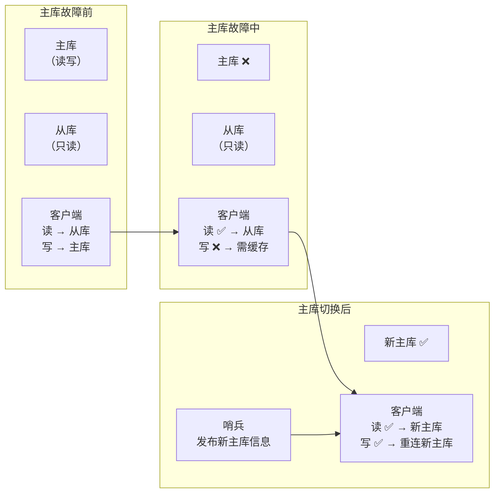

> **图释**：主从切换分三阶段——故障前（读写分离正常）、故障中（读可用、写需缓存）、切换后（客户端重连新主库）。

客户端需要做两件事：

| 客户端要做的事   | 怎么实现                 |
| --------- | -------------------- |
| **缓存写请求** | 切换期间收到的写请求暂存，切换完成后重发 |
| **感知新主库** | 订阅哨兵频道，或主动向哨兵询问新主库信息 |

---

**哨兵能切换了**——但哨兵本身怎么决策？quorum 到底怎么设？第 8 讲深入了这个问题。

### 七、Quorum 的核心误区：判定 ≠ 切换（第 8 讲思考题）

**场景**：5 个哨兵，quorum = 2，3 个哨兵故障，主库故障。

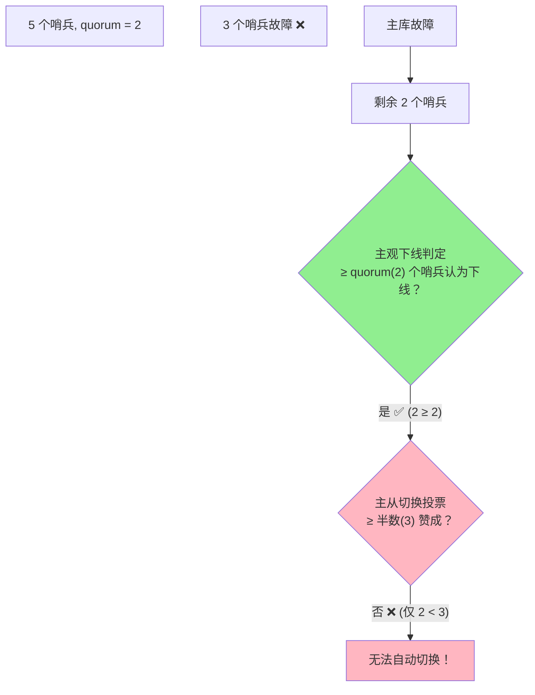

> **图释**：**判定客观下线**和**执行主从切换**是两个独立步骤。前者需要 ≥ quorum 票（这里 2 = 2，能判定），后者需要 ≥ 半数哨兵投票赞成（这里 2 < 3，无法切换）。**quorum 管判定，半数管选举——不要混淆。**

#### 哨兵越多越好吗？

| 维度 | 哨兵少 | 哨兵多 |
|---|---|---|
| **误判率** | 高 | 低 |
| **投票时间** | 快 | 慢（需等更多哨兵投票） |
| **切换速度** | 快 | 慢 |
| **客户端堆积风险** | 低 | 高（切换慢 → 请求堆积 → 可能超时） |

另外，**调大 `down-after-milliseconds`** 会降低误判，但代价是：主库真挂了也要等更久才能被发现——**可用性下降**。

> 💡 **记忆口诀**：**哨兵多 → 误判少但切换慢；时间大 → 误判少但发现慢。** 都是 trade-off。

---

**单集群高可用搞定了**——但如果数据量增长到单机装不下怎么办？第四部分回答这个问题。

---

## 第四部分：扩展 —— 数据多了，怎么分？

### 八、哈希槽 vs 查表映射（第 9 讲思考题）

为什么 Redis 不直接用一张表记录「键 → 实例」的映射？

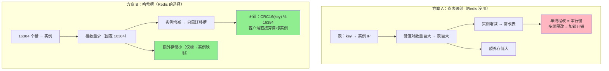

> **图释**：哈希槽方案的精妙之处在于——**用一个小的、固定的中间层（16384 个槽）解耦了「海量键」与「少量实例」之间的映射关系。**

| 对比维度 | 查表映射 | 哈希槽（Redis 方案） |
|---|---|---|
| **映射粒度** | 每个 key | 16384 个槽（每个槽包含多个 key） |
| **表大小** | O(键数量) → 巨大 | O(1) → 仅 16384 条 |
| **实例变更成本** | 需修改海量 key 的映射 | 只需迁移槽（批量操作） |
| **并发安全** | 需加锁 | 客户端本地计算，**无锁** |
| **扩缩容开销** | 极高 | 槽迁移而已，低很多 |

---

**以上是前 9 讲思考题的系统回顾**——但同学们在留言中反复追问了四个更底层的机制问题。接下来是深度拆解。

---

## 第五部分：深度拆解 —— 四个最容易被追问的机制

### 九、Rehash 到底什么时候触发？没请求还做吗？

这是同学们问得最多的一个问题。Redis 的哈希表 rehash 有两个触发条件和一个「偷偷做」的后门：

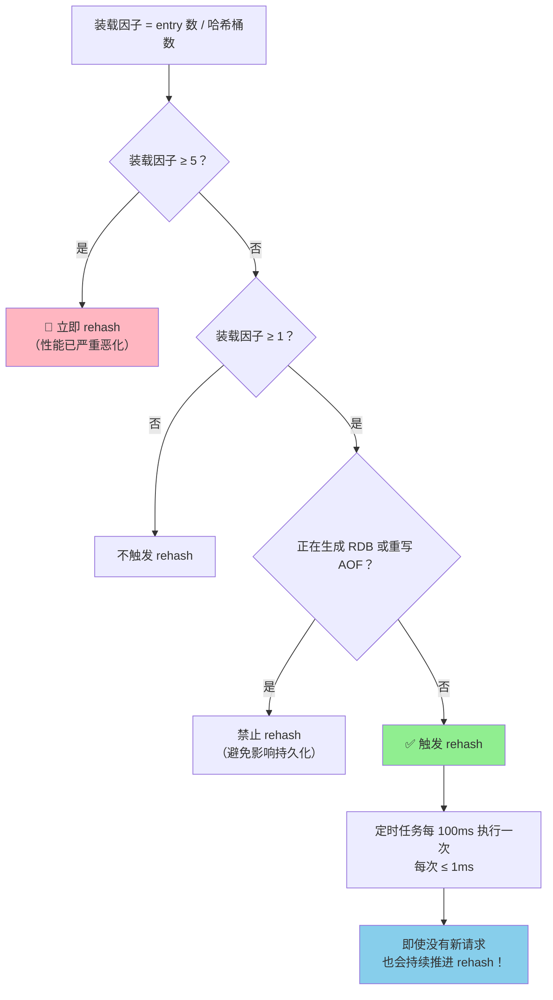

> **图释**：rehash 有两个触发条件——**≥ 5 时紧急触发**（不管有没有持久化），**≥ 1 时条件触发**（需允许 rehash）。触发后通过定时任务渐进执行，**哪怕没有新请求，每 100ms 也会推进 ≤ 1ms**。

关键数值速记：

| 条件 | 装载因子 | 是否强制 |
|---|---|---|
| 条件一 | **≥ 1** | 否（持久化期间禁止） |
| 条件二 | **≥ 5** | 是（立即执行） |

> 💡 **记忆口诀**：**1 看心情（允许就做），5 不要命（必须做）。做了就不停，定时偷偷推进。**

---

**Rehash 涉及到内存操作**——而 Redis 里做内存操作的角色有三个：主线程、子进程、后台线程。它们到底什么关系？

### 十、主线程 / 子进程 / 后台线程：一张图说清楚

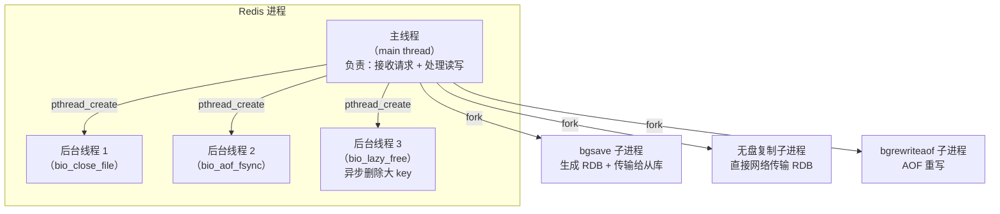

> **图释**：**主线程是老板**（处理所有客户端请求），**子进程是外包团队**（fork 出来的独立进程，做 RDB/AOF 重写等重活），**后台线程是助理**（主线程内部创建的轻量线程，做文件关闭、AOF fsync、异步删除等杂务）。

| 概念 | 本质 | 创建方式 | 在 Redis 中的角色 |
|---|---|---|---|
| **主线程/主进程** | Redis 启动后的唯一执行实体 | 进程启动 | 处理所有客户端请求 |
| **子进程** | 独立进程，复制主进程页表 | `fork()` | bgsave / bgrewriteaof / 无盘复制 |
| **后台线程** | 主进程内的轻量线程 | `pthread_create()` | 异步删除大 key / 关闭文件 / AOF fsync |

关键区分：**fork 创建的是「子进程」**（独立地址空间、共享页表），**pthread_create 创建的是「线程」**（共享地址空间、独立调度）。

---

**子进程共享页表**——这背后就是经典的写时复制机制。但它的底层到底怎么工作的？

### 十一、写时复制（Copy-on-Write）底层原理

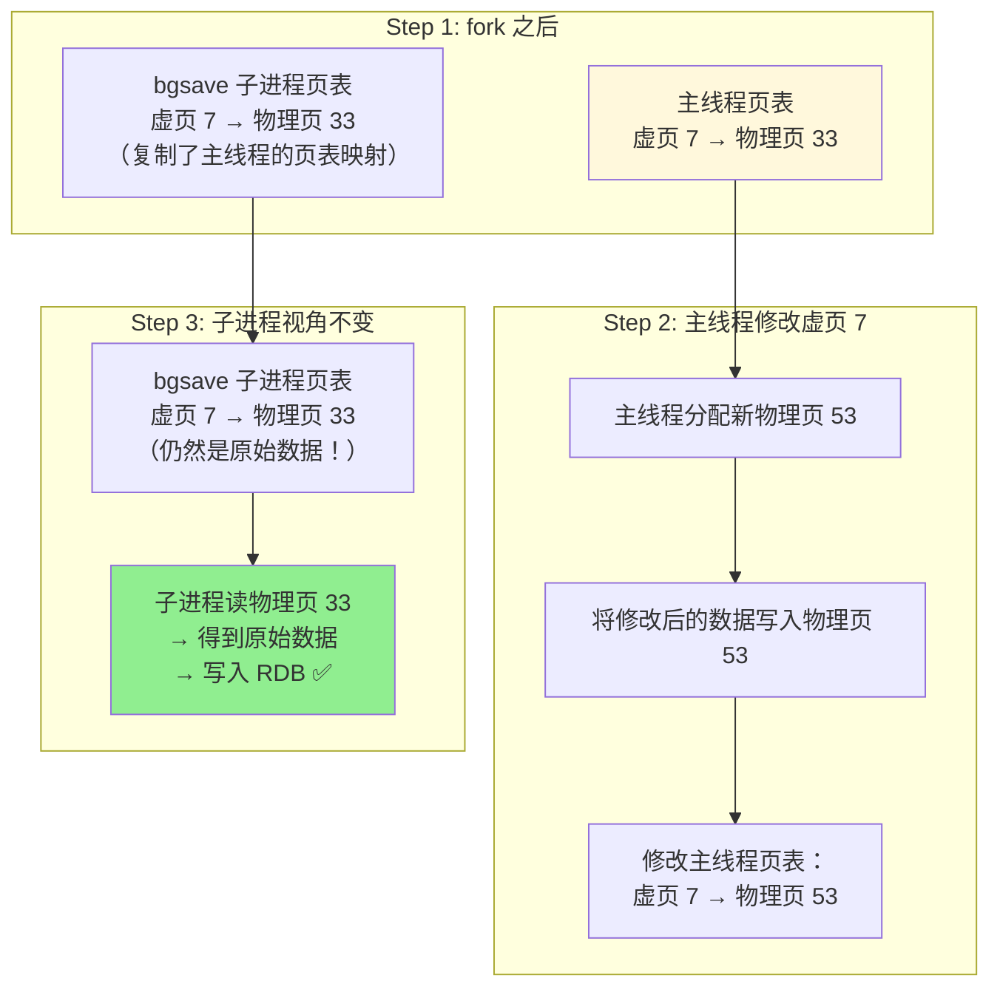

> **图释**：写时复制的核心是**「谁写谁复制」**——主线程修改数据时，才会为新数据分配新物理页并修改自己的页表映射；子进程的页表指向的始终是**原始物理页**，所以它能读到一致的历史快照。

一句话说透：**fork 时并不复制数据本身（太贵了），只复制页表（指针）。只有当主线程要写某个页时，才为这个页分配新物理地址——「复制」只发生在真正「写」的那一刻。**

---

**写时复制涉及内存**——Redis 中还有两个容易混淆的内存 buffer，最后一个问题把它们讲清楚。

### 十二、Replication Buffer vs Repl_Backlog_Buffer

这两个 buffer 名字像、都跟主从复制有关，但功能完全不同：

> **图释**：replication buffer 是**「私聊窗口」**（每个从库一个，全量复制时用），repl_backlog_buffer 是**「群公告栏」**（所有从库共享一块，增量复制时按各自的 offset 各取所需）。

| 对比维度 | replication buffer | repl_backlog_buffer |
|---|---|---|
| **共享方式** | 每个从库独享一份 | 所有从库共享一块 |
| **生命周期** | 全量复制期间使用 | Redis 启动后持续存在 |
| **数据内容** | 该从库全量复制期间的写命令 | 主库所有写命令（环形覆盖） |
| **大小控制** | `client_buffer` 配置 | `repl-backlog-size` 配置 |
| **典型场景** | 全量复制：主库把积压命令发给从库 | 增量复制：从库断连重连后补数据 |
| **类比** | 给每个学生单独发一份讲义 | 公告栏贴一份，学生按需查看 |

> 💡 **记忆口诀**：**replication buffer = 私聊记录（一对一），repl_backlog_buffer = 群公告（一对多，各取所需）。**

---

## 一句话总结

> 核心概念 = **SimpleKV 到 Redis 的进化体现在三大主线（高性能数据结构 + 持久化 + 高可用集群）**，关键机制 = **rehash 靠装载因子 + 定时渐进推进，写时复制是 fork 后只复制页表不复制数据、写时才分配新页，哨兵用 quorum 判定下线但用半数投票执行切换（两阶段不同），哈希槽用固定 16384 个小槽解耦海量键与少量实例，replication buffer 是一对一全量复制专用、repl_backlog_buffer 是一对多增量复制共享。** 核心结论：**Redis 的每个设计都在「快 vs 安全 vs 空间」三者间做精确的 trade-off，理解这些取舍比记住参数更重要。**

---

> 🧭 **接下来看什么？** 前 9 讲建立了 Redis 核心知识体系的地基，本篇做了集中回顾和深度补全。如果你对某个主题还想深入——rehash 的源码实现、哨兵的故障模拟、写时复制的性能压测——可以回到对应笔记做专题研究。准备好以后，我们进入第 10 讲及后续内容。
