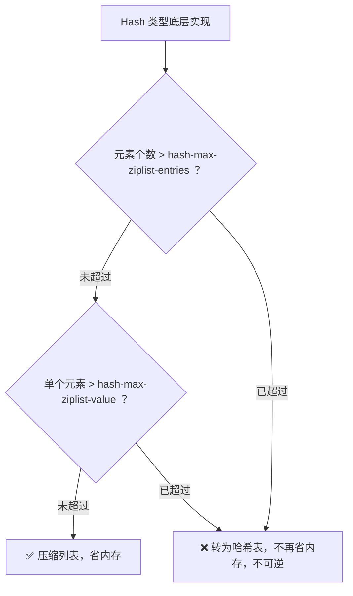

> 💡 **从哪里来？** 上一篇 [[10 第1～9讲课后思考题答案及常见问题答疑.md|第 1~9 讲 Q&A]] 回顾了 Redis 的架构全景和核心机制。从本篇起进入「实践篇」——先直面一个真实的线上事故：用 String 存 1 亿条数据，**6.4GB 内存里有 4.8GB 是元数据垃圾。**

# 11 "万金油"的 String，为什么不好用了？

## 先做一个类比：用搬家纸箱寄一枚硬币

String 类型之所以被称为「万金油」，是因为它什么都能存——整数、字符串、二进制随便往里塞。但「什么都能干」往往意味着「什么都干不精」。

| 搬家场景 | Redis String 的内存问题 |
|---|---|
| 你寄一枚硬币（实际物品 **1 克**） | 有效数据只有 **16 字节**（两个 Long 整数） |
| 快递要求使用标准纸箱（自带填充物） | RedisObject 元数据 **8 字节** + 指针 **8 字节** |
| 还要套一层运输箱（外包装） | dictEntry 三个指针占 **24 字节**（jemalloc 实配 **32 字节**） |
| 最后用胶带封口标记（标签信息） | SDS 的 len + alloc 额外开销（int 编码下可省略） |
| **结果：寄一枚硬币用了 64 克包装** | **最终一条记录 = 64 字节，有效数据仅 1/4** |

<div style="border:2px solid var(--text-accent); border-radius:12px; padding:16px; background:var(--background-secondary); text-align:center; margin:16px 0;">

<div style="font-size:1.15em; font-weight:bold; margin-bottom:4px; color:var(--text-normal);">📦 全局哈希表 — dictEntry</div>
<div style="font-size:0.9em; color:var(--text-muted); margin-bottom:10px;">每个键值对一条记录，三条指针 24B → jemalloc 向上取整</div>

<div style="border:2px solid rgba(255,180,100,0.5); border-radius:8px; padding:10px; background:rgba(255,180,100,0.08); margin-bottom:12px;">
  <strong style="color:var(--text-normal);">📋 dictEntry = 32 字节</strong><br>
  <span style="font-size:0.85em; color:var(--text-muted);">*key(8B) + *value(8B) + *next(8B) = 24B → jemalloc 取 2⁵</span>
</div>

<div style="display:flex; gap:10px; justify-content:center; align-items:stretch;">

<div style="flex:1; border:2px solid rgba(100,180,255,0.5); border-radius:8px; padding:12px; background:rgba(100,180,255,0.08);">
  <div style="font-weight:bold; margin-bottom:6px; color:var(--text-normal);">🔑 键 RedisObject</div>
  <div style="font-size:1.5em; font-weight:bold; color:var(--text-accent);">16 B</div>
  <div style="font-size:0.8em; color:var(--text-muted);">8B 元数据 + 8B(int)</div>
</div>

<div style="display:flex; align-items:center; font-size:1.3em; font-weight:bold; color:var(--text-muted);">+</div>

<div style="flex:1; border:2px solid rgba(100,180,255,0.5); border-radius:8px; padding:12px; background:rgba(100,180,255,0.08);">
  <div style="font-weight:bold; margin-bottom:6px; color:var(--text-normal);">💾 值 RedisObject</div>
  <div style="font-size:1.5em; font-weight:bold; color:var(--text-accent);">16 B</div>
  <div style="font-size:0.8em; color:var(--text-muted);">8B 元数据 + 8B(int)</div>
</div>

</div>

<div style="margin-top:14px; padding-top:12px; border-top:2px dashed var(--text-accent);">
  <span style="font-size:1.1em; font-weight:bold; color:var(--text-normal);">🔺 合计 = dictEntry + 键 RO + 值 RO = </span>
  <span style="font-size:1.6em; font-weight:bold; color:var(--text-accent);">64 字节 / 条</span><br>
  <span style="font-size:0.85em; color:var(--text-muted);">有效数据仅 16 字节（两个 Long），元数据占比 <span style="color:var(--text-accent); font-weight:bold;">75%</span></span>
</div>

</div>

> **图释**：String 类型的内存开销来自三层结构——**dictEntry（哈希表条目）+ RedisObject × 2（键和值各一个）+ 实际数据**。当数据本身很小时，元数据就成了主角。

---

## 一、真实痛点：1 亿张图片吃了 6.4GB 内存

**场景**：图片存储系统，需要「图片 ID → 存储对象 ID」的快速映射。

| 参数 | 值 |
|---|---|
| 图片数量 | **1 亿** |
| 图片 ID | **10 位数字**（如 `1101000051`） |
| 存储对象 ID | **10 位数字**（如 `3301000051`） |
| 有效数据量 | 两个 8 字节 Long = **16 字节** |
| 实际内存占用 | 平均每条 **64 字节** |
| 总内存 | **≈ 6.4 GB** |
| 其中元数据浪费 | **≈ 4.8 GB**（占 75%！） |

**后果**：大内存实例生成 RDB 时响应变慢——这是第 5 讲提到的 **fork 阻塞 + 写时复制**问题在数据量大时的必然表现。

---

**问题已经摆在面前了**——但要知道怎么省，得先知道钱花在哪了。下面逐层拆解 64 字节的账单。

---

## 二、根因分析：64 字节到底是怎么算出来的？

### 第一层：键和值各自的 RedisObject

Redis 用 **RedisObject** 统一管理所有数据类型的元数据（最后访问时间、引用计数等）：

```
RedisObject = 8 字节元数据 + 8 字节指针 = 16 字节
```

对于 **Long 类型整数**（图片 ID 和存储对象 ID 都是 10 位数，Long 完全装得下），Redis 做了三种编码优化：

---

**✅ int 编码** — 整数专用，最省内存

- RedisObject：8B 元数据 + 8B 指针位
- **指针位直接存整数值**，不额外分配内存
- 总计 **16 字节**，额外开销 **0**

---

**⚡ embstr 编码** — 短字符串 ≤ 44B，紧凑布局

RedisObject 和 SDS **连续分配**在一块内存中：

- RedisObject 元数据：8B
- RedisObject 指针：8B（指向同块内存的 SDS）
- SDS.len：4B
- SDS.alloc：4B
- SDS.buf + 结束符 `\0`：1B
- **额外开销：9B**（SDS 头 8B + 结束符 1B）

---

**🐌 raw 编码** — 长字符串 > 44B，分离布局

RedisObject 和 SDS **分开分配**（两块独立内存）：

- RedisObject 元数据：8B
- RedisObject 指针：8B（指向独立的 SDS 内存块）
- SDS.len：4B
- SDS.alloc：4B
- SDS.buf + 结束符 `\0`：1B
- **额外开销：9B**，外加**内存碎片风险**

---

> **一句话对比**：int 不分配额外内存，embstr 一次分配连续内存，raw 两次分配独立内存。越往后越费。三种编码的核心差异——**int 最省**（指针位直接存整数），**embstr 次之**（RedisObject + SDS 连续分配），**raw 最费**（SDS 独立分配 + 指针碎片）。

| 编码模式 | 适用场景 | 内存布局 | 额外开销 |
|---|---|---|---|
| **int** | 整数（Long 范围） | 8B 元数据，指针位直接存整数 | 无 |
| **embstr** | 字符串 ≤ **44 字节** | RedisObject + SDS 连续分配 | SDS 头（len+alloc = 8B） + `\0` = **9B** |
| **raw** | 字符串 > **44 字节** | RedisObject + 独立 SDS | 同上 + 内存碎片风险 |

本案例中图片 ID 是纯数字 → **int 编码** → 每个 RedisObject = **16 字节**。键 + 值 = **32 字节**。

---

**但 32 字节只占了一半**——还有一半去哪了？答案藏在全局哈希表里。

### 第二层：全局哈希表的 dictEntry

所有键值对存在一张全局哈希表中，每个条目叫 **dictEntry**：

```
dictEntry 结构：
  - *key   → 8 字节（指向键的 RedisObject）
  - *value → 8 字节（指向值的 RedisObject）  
  - *next  → 8 字节（指向下一个 dictEntry，拉链法解决哈希冲突）
  合计：24 字节
```

### 第三层：jemalloc 的「向上取整」

Redis 使用 **jemalloc** 分配内存，核心规则：**申请的字节数 N → 找 ≥ N 的最小 2 的幂次。**

| 你申请 | jemalloc 实际分配 |
|---|---|
| 6 字节 | **8** 字节（2³） |
| 24 字节 | **32** 字节（2⁵） |
| 50 字节 | **64** 字节（2⁶） |

所以 dictEntry 的 24 字节 → jemalloc 实配 **32 字节**。

### 最终账单

逐层累加：

| 步骤    | 组件                     | 字节       | 构成                   |
| ----- | ---------------------- | -------- | -------------------- |
| ①     | 键 RedisObject（int 编码）  | **16 B** | 8B 元数据 + 8B 整数       |
| ②     | 值 RedisObject（int 编码）  | **16 B** | 8B 元数据 + 8B 整数       |
| ③     | dictEntry（jemalloc 取整） | **32 B** | 申请 24B → 实配 2⁵ = 32B |
| **=** | **🔺 合计**              | **64 B** | 有效数据仅 16 字节          |

**拆账：64 字节里钱花在哪了？**

| 开销项 | 字节 | 类型 |
|---|---|---|
| dictEntry | **32 B** | 哈希表条目 |
| 键 RedisObject | **16 B** | 结构体元数据 |
| 值 RedisObject | **16 B** | 结构体元数据 |
| 有效数据 | **16 B** | 两个 Long 整数 |
| 总浪费 | **48 B**（75%） | 元数据 & 对齐 |

> **图释**：三层结构逐层累加——RedisObject × 2（32B）+ dictEntry（32B）= **64 字节**。其中只有 16 字节是真正的业务数据。

> 💡 **记忆口诀**：**16 + 16 + 32 = 64。RO 二八开，dictEntry 占一半，jemalloc 再补一刀。**

---

**问题定位清楚了——元数据是元凶，dictEntry 是头号开销。** 那么有没有办法消灭 dictEntry 的 32 字节？这就引出了压缩列表方案。

---

## 三、解决方案：压缩列表 —— 把 1000 个值塞进一个 dictEntry

### 压缩列表（ziplist）是什么？

**一句话**：一块连续内存，把所有元素挨个排列，不用指针连接。

压缩列表在内存中按以下顺序紧凑排列，从头到尾共五段：

> **头部** → **尾部** → **元素数** → **entry 序列** → **尾部标记**

| 位置 | 字段 | 大小 | 含义 |
|---|---|---|---|
| 头部 | `zlbytes` | 4 B | 整个列表占用的总字节数 |
| 头部 | `zltail` | 4 B | 最后一个 entry 的偏移量（方便反向遍历） |
| 头部 | `zllen` | 2 B | 列表中的 entry 个数 |
| 中部 | entry × N | 可变 | 实际数据，每个 entry 结构见下表 |
| 尾部 | `zlend` | 1 B | 固定值 `0xFF`，标记列表结束 |

**每个 entry 的内部结构：**

| 字段 | 大小 | 说明 |
|---|---|---|
| `prev_len` | 1 B 或 5 B | 前一个 entry 长度。前一个 < 254B 时用 1B，否则用 5B |
| `encoding` | 1 B | 编码方式（整数 / 字符串等） |
| `content` | 可变 | 实际数据 |

> **图释**：压缩列表 = 固定表头（zlbytes + zltail + zllen）+ 连续 entry 序列 + 固定表尾（zlend）。每个 entry 自带长度信息，**无需额外指针就能定位前后元素**——这正是它省内存的根本原因。

### 为什么压缩列表能省掉 dictEntry？

| 方案 | 1000 条数据需要的 dictEntry | dictEntry 总开销 |
|---|---|---|
| **String 类型** | 1000 个（每个键值对一个） | 1000 × 32B = **32,000 字节** |
| **集合类型（压缩列表）** | 1 个（整个集合一个） | 1 × 32B = **32 字节** |

**dictEntry 开销缩减了 1000 倍！** 这就是「用集合替代 String」的核心收益。

### 单条数据的内存对比

每个 entry 保存一个 8 字节的存储对象 ID 时：

| 组成部分                            | 字节数       |
| ------------------------------- | --------- |
| prev_len（前一个 entry < 254B，取 1B） | **1**     |
| len（自身长度）                       | **4**     |
| encoding（编码方式）                  | **1**     |
| content（实际数据）                   | **8**     |
| **合计**                          | **14 字节** |
| jemalloc 实配                     | **16 字节** |

对比直观看：

| 方案 | 每条记录 | 1 亿条总量 |
|---|---|---|
| String | **64 字节** | **≈ 6.4 GB** |
| 压缩列表 | **16 字节** | **≈ 1.6 GB** |
| **节省** | **75%** | **≈ 4.8 GB** |

---

**但这里有一个矛盾**——压缩列表用在集合类型（List/Hash/Sorted Set）上，而集合类型是一个 key 对应多个 value。我们的场景是一个图片 ID 对应一个存储对象 ID（单值映射），怎么用集合存？

---

## 四、工程落地：二级编码 —— 把单值键值对「伪造成」集合

### 核心思路

**把一个 key 拆成两段**：前一段做 Hash 的外层键，后一段做 Hash 的内层 field。

用一张表对比新旧方案，差异立现：

| | 原始 String 方案 | 二级编码 Hash 方案 |
|---|---|---|
| **存储方式** | 1 个 key = 1 个 dictEntry | 1000 个 key 共享 1 个 dictEntry |
| **外层键** | `photo_id: 1101000060` | `Hash key: 1101000`（前 7 位） |
| **内层 field** | — | `060`（后 3 位） |
| **值** | `photo_obj_id: 3302000080` | `3302000080` |
| **dictEntry 开销** | 每条记录 32 B | 1000 条分摊 32 B，每条仅 0.032 B |

> **图释**：**前 7 位做 Hash 键 → 后 3 位做 field → 存储对象 ID 做 value。** 这样 1000 个图片 ID（后 3 位从 000 到 999）共享同一个 dictEntry，dictEntry 开销从 1000 份缩到 1 份。

### 通俗理解：用具体数字走一遍

拿两个图片 ID 举例：`1101000060` 和 `1101000061`。

**方案 A：原始 String**

```
SET 1101000060 3302000080
SET 1101000061 3302000081
```

Redis 内部：

```
dictEntry #1（32B）              dictEntry #2（32B）
  key   → RedisObject(1101000060)   key   → RedisObject(1101000061)
  value → RedisObject(3302000080)   value → RedisObject(3302000081)
```

两条记录 = 2 × 64 = **128 字节**，每条都要一份 dictEntry + 两个 RedisObject。

**方案 B：二级编码 Hash**

第一步——把 10 位 ID 拆两段：

```
1101000060
  │      │
  │      └── 后 3 位 = "060"  →  Hash 的内部字段名（field）
  └───────── 前 7 位 = "1101000" → Hash 的外部键名（key）
```

第二步——存入 Redis：

```
HSET 1101000 060 3302000080
HSET 1101000 061 3302000081
```

意思是：在 Hash `1101000` 里，把 field `060` 的值设为 `3302000080`。

第三步——Redis 内部：

```
dictEntry #1（32B）—— 只有这一个！
  key   → RedisObject("1101000")
  value → RedisObject(ziplist 指针)
             │
             ▼
  ┌─ 压缩列表（连续内存，存 1000 条）──┐
  │  060 → 3302000080                │
  │  061 → 3302000081                │
  │  ...（最多 1000 条）              │
  └──────────────────────────────────┘
```

当 1000 条记录（后三位 000~999）都存进同一个 Hash 时：**1 个 dictEntry 的 32 字节，摊到 1000 条 → 每条只摊 0.032 字节。**

**一张图对比两种方案的 dictEntry 数量：**

```
原始 String：                    二级编码 Hash：

key1 → dictEntry → value1       Hash key → dictEntry → ziplist
key2 → dictEntry → value2                           ├─ field1 → value1
key3 → dictEntry → value3                           ├─ field2 → value2
  ...（N 条 = N 个 dictEntry）                       ├─ field3 → value3
                                                     └─ ...（N 条 = 1 个 dictEntry！）

dictEntry 数量：N                 dictEntry 数量：N / 1000
```

> **一句话直觉**：String 方案里每条数据是一个独立的钥匙，每个钥匙都要在 Redis 全局哈希表里挂号（dictEntry），挂号费 32 字节一分不少。Hash 方案把 1000 个数字相近的数据塞进同一个 Hash 筐，这个筐只挂一次号（一个 dictEntry），筐里的 1000 个格子紧凑排列，不需要各自挂号。**就像寄 1000 个快递——String 是每个单独打包（1000 个纸箱），Hash 是装进一个大箱子（1 个纸箱 + 内部 1000 小格）。**

### 分段长度不是随便选的

分法决定了每个 Hash 里有多少元素，而元素数量决定了底层是否用压缩列表。



> **图释**：Hash 类型有**两个阈值**控制底层结构。一旦触发任一阈值转为哈希表，就**再也回不去压缩列表了**——所以二级编码的分段长度必须精心设计，确保每个 Hash 内元素数不超阈值。

| 配置项                          | 含义         | 典型值          |
| ---------------------------- | ---------- | ------------ |
| **hash-max-ziplist-entries** | 压缩列表最大元素个数 | 建议设 **1000** |
| **hash-max-ziplist-value**   | 单个元素最大字节数  | 建议设 **64**   |

后 3 位 = 000~999 = 最多 **1000 个元素** → 刚好不超阈值 → **永远使用压缩列表**。

**验证数据**：插入一条记录后 `used_memory` 从 `1039120` 变为 `1039136`，只增加了 **16 字节**——是 String 方案（64 字节）的 **1/4**。

> 💡 **记忆口诀**：**前 7 后 3，千条封顶。阈值一过，哈希表来，省内存变费内存，而且一去不复返。**

---

## 五、实战总结：String → 压缩列表的迁移决策

| 你的场景 | 推荐方案 |
|---|---|
| 海量单值小数据（如 ID 映射），百万级以上 | **二级编码 Hash + 压缩列表** |
| 数据量不大，内存充裕 | **String**，简单直接 |
| 数据天然是集合（如标签列表） | **Set / List / Hash**，Redis 自动选压缩列表 |
| 值是大字符串或大对象 | 直接用对应集合类型即可 |
| 需要原子操作 | **String**（集合类型的单字段操作不保证原子性） |

**迁移前必查的两个阈值：**

- `hash-max-ziplist-entries`：调成你预期每个 Hash 最多装多少元素（如 **1000**）
- `hash-max-ziplist-value`：调成单个 element 的最大字节数（如 **64**）

### 额外工具

想知道不同类型实际占多少内存？用 [Redis 内存计算器](http://www.redis.cn/redis_memory/)——输入键值对长度和类型，直接看结果。

---

## 一句话总结

> 核心概念 = **String 的 64 字节由三层构成（dictEntry 32B + RedisObject × 2 共 32B），有效数据仅 16 字节（25%）**，关键机制 = **压缩列表用连续内存替代指针链节省 dictEntry 开销（1000 条共享 1 个），二级编码通过拆分 key（前 7 位做 Hash 键 + 后 3 位做 field）将单值映射伪装成集合从而利用压缩列表，且必须控制元素数不超过 hash-max-ziplist-entries 否则底层退化为哈希表（不可逆）。** 核心结论：**String 是万金油但绝不是省油灯——当数据小、量极大时，元数据占比 75%，换压缩列表可省 75% 内存。**

---

> 🧭 **接下来看什么？** 本节用 Hash + 压缩列表解决了「单值小数据」的内存问题。但 String 还有个更大的坑——**当数据量大到需要统计时（比如 UV 计数），String 的内存消耗更是灾难级的。** 下一讲将介绍 Redis 的「统计神器」——HyperLogLog 和 Bitmap，用极少的内存搞定海量数据统计。
>
> **每课一问**：除了 String 和 Hash，你觉得还有哪些类型可以用于这个场景？提示——想想 Sorted Set 的 member 也可以存数据。欢迎思考。
