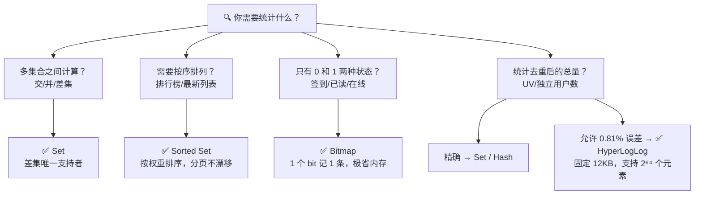
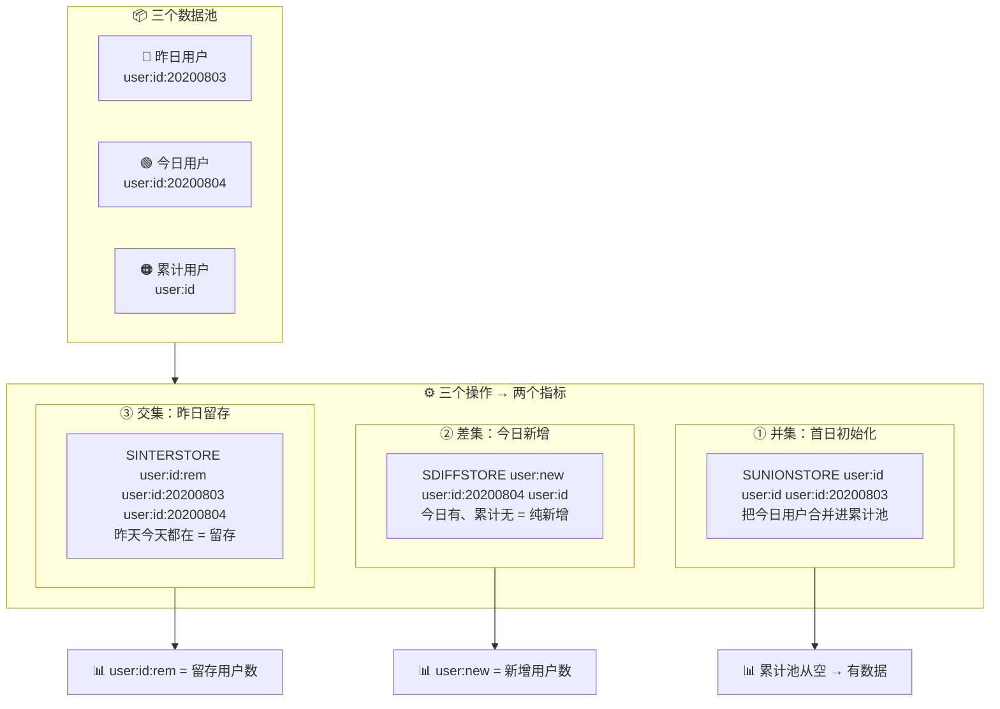
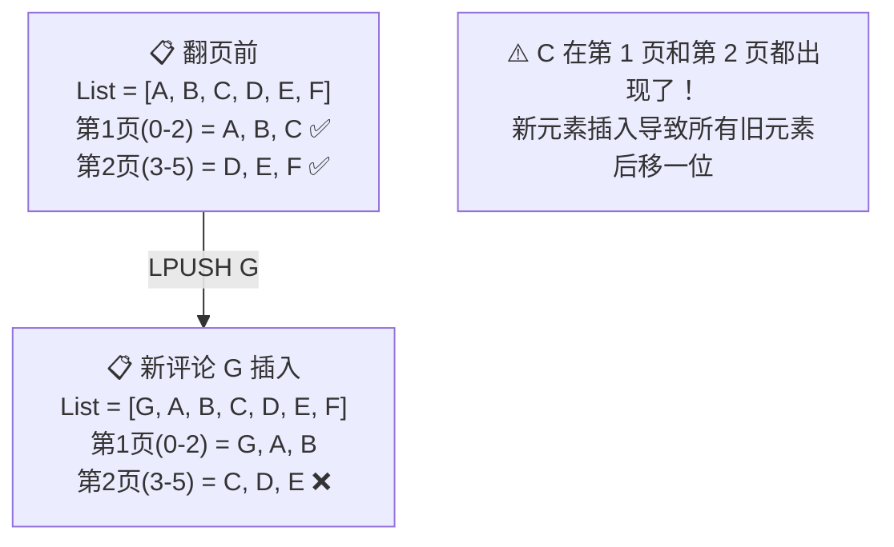
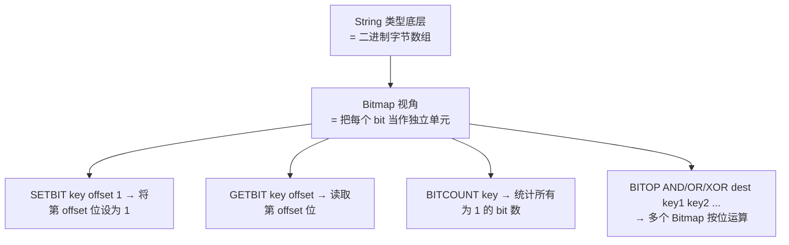
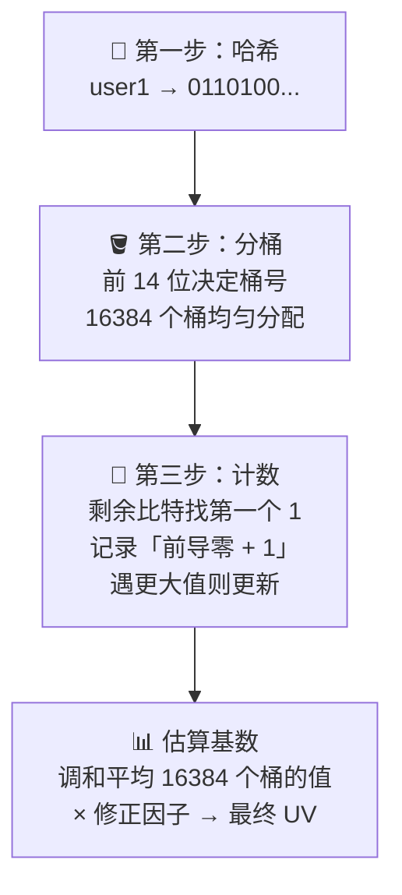
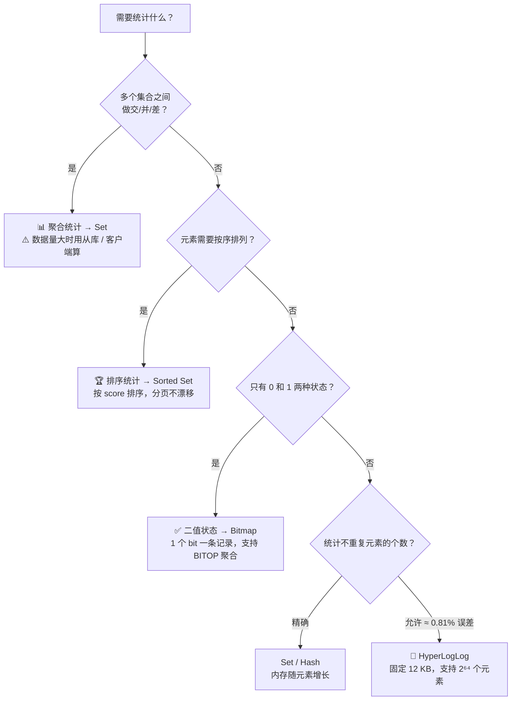

> 💡 **从哪里来？** 上一讲 [[11 万金油的String，为什么不好用了？.md|11 String 为什么不好用？]] 解决了「单值小数据」的内存问题——用 Hash + 压缩列表替代 String，省下 75% 内存。但 String 还有个更大的坑：**当你要对海量数据做统计时（UV 计数、用户留存、签到汇总），用错类型不仅浪费内存，甚至可能直接阻塞主库。** 本篇就用 4 个真实场景，帮你建立「一看需求就知道该选哪种集合」的条件反射。

# 12 有一亿个 keys 要统计，应该用哪种集合？

## 先做一个类比：四种统计需求 → 四种"工具箱"

集合统计不是「一个工具箱打天下」——不同需求对数据结构的要求完全不同，就像你不会用皮尺去称重量。

| 生活场景 | 类比解释 | 对应 Redis 统计模式 | 核心需求 |
|---|---|---|---|
| 📊 物流公司统计「两个仓库共有的货」（交集） | 聚合统计 | **聚合统计** | 多集合之间的交/并/差 |
| 🏆 热榜排行「按销量给商品排 Top100」 | 排序统计 | **排序统计** | 元素需要按权重有序排列 |
| ✅ 30 天打卡记录「标记签到了没」 | 二值状态统计 | **二值状态统计** | 每个元素只有 0/1 两种状态 |
| 👤 网站 UV「统计到底有多少个不同访客」 | 基数统计 | **基数统计** | 统计不重复的元素个数，允许误差 |



> **图释**：四种统计模式对应四种「王牌」数据类型。关键决策点：要不要精确？要不要排序？要不要多集合运算？回答这三个问题，你就知道该选哪个。

---

## 一、聚合统计——多集合之间的"集合运算"

聚合统计是最直观的模式：把多个集合放在一起，算交集、并集、差集。最典型的场景就是 **App 日活留存**——今天新增了多少用户？昨天的用户今天还在吗？

### 核心思路：两个 Set 的"套娃"操作

我们需要维护两个 Set：

| 集合           | Key 示例             | 内容            | 作用         |
| ------------ | ------------------ | ------------- | ---------- |
| **累计用户 Set** | `user:id`          | 所有曾经登录过的用户 ID | 作为「对照基准」   |
| **每日用户 Set** | `user:id:20200804` | 当天登录的用户 ID    | 每日新增的「待检集」 |




> **图释**：三个 Set 池（昨日 / 今日 / 累计）通过三个操作（并集 → 初始化、差集 → 新增、交集 → 留存）产出两个核心运营指标。每天跑一遍三步流程：SUNIONSTORE 扩充累计池 → SDIFFSTORE 统计新增 → SINTERSTORE 统计留存。


### ⚠️ 一个必须知道的坑

| 风险 | 原因 | 后果 |
|---|---|---|
| 聚合计算复杂度高 | Set 的交/并/差在数据量大时是 O(N) 级别 | **直接阻塞主库**，影响所有读写请求 |

**解法有两个：**

1. 🏗️ **从库专用**：从主从集群中选一个从库，专门跑聚合计算
2. 📤 **客户端计算**：把数据拉到客户端做聚合，Redis 只负责存取

---

**但聚合统计解决的是「多集合之间的关系」——如果你只需要在一个集合内部按顺序取数据呢？** 比如电商评论列表，用户想看第 3 页的最新评论。这就引出了排序统计。

---

## 二、排序统计——分页不漂移的关键

排序统计的核心诉求：**当数据持续新增时，分页结果不能「漂移」**。典型场景是电商商品的最新评论列表。

### List 为什么翻车？

List 按**插入位置**排序——最新的评论通过 `LPUSH` 插到队头，读的时候按索引 `LRANGE start end` 取。这套逻辑看起来没毛病，直到你开始分页：



> **图释**：一条 `LPUSH` 就把所有元素往后挤了一位——原本属于第 2 页的 C，被挤到了第 1 页的末尾，又从第 2 页的开头冒出来。

**根因就一句话：List 用「座位号」定位元素，有人插队，后面所有人的座位号都变了。**

那有没有一种「不靠座位号」的排序方式？有的——给每条评论一个**独立的分数**，比如用发布时间的毫秒值。不管多少条新评论插进来，老评论的分数纹丝不动，按分数区间取数据永远准确。这正是 Sorted Set 的设计思路：

| 维度 | List（按位置排序） | Sorted Set（按权重排序） |
|---|---|---|
| 排序依据 | 插入顺序 → 像电影院座位号 | 自定义 score → 像考试成绩排名 |
| 新元素插入影响 | 所有后续元素位置 +1 → **分页漂移** | 新元素独立 score → **分页不变** |
| 分页命令 | `LRANGE start end` | `ZRANGEBYSCORE min max` |
| 合适场景 | 队列、消息流（不用分页） | 排行榜、评论列表、时间线（需分页） |

**结论一句话：需要分页 = 需要 Sorted Set。** 因为分页依赖的是「每条数据永远不变的编号」，而不是「它在列表里的相对排位」。

---

**现在你能解决「多集合计算」和「有序分页」了。但还有一类数据极其简单——只有是和否、有和没有。** 签到打卡就是这样的场景：一个用户一天只关心「签到了没」，不关心签到顺序、不关心和其他人的关系。这种场景如果还用 Set 或 Sorted Set，就太浪费了。

---

## 三、二值状态统计——1 个 bit 搞定一条记录

### 什么是二值状态？

元素的取值只有 **0 和 1** 两种。签到（1/0）、已读/未读、在线/离线——都属于二值状态。

**Bit 级别的直觉：**

```
一个用户 8 月份的签到情况（31 天）：

用 Set 记录：31 个 "2024-08-XX" 字符串 → 几百字节
用 Bitmap：  31 个 bit               → 不到 4 字节

节省 100 倍以上！
```

### Bitmap 的本质

Bitmap 不是一种独立的新类型，它是 **String 的位操作视角**——Redis 把 String 的字节数组按 bit 拆开，用每个 bit 表示一个元素的二值状态。



> **图释**：Bitmap 本质是 String 的位运算接口。你不用关心底层的字节，只需要把 offset 当作「第几个用户/第几天」来操作。

### 实战：1 亿用户连续 10 天签到

这个场景如果用 Set：每个用户 ID 存一次 → 内存爆炸。用 Bitmap：

| 步骤 | 操作 | 说明 |
|---|---|---|
| ① 每日签到 | `SETBIT uid:sign:3000:202008 2 1` | 用户 3000，8 月 3 日签到（offset=2 表示第 3 天） |
| ② 检查签到 | `GETBIT uid:sign:3000:202008 2` | 返回 1 = 已签到 |
| ③ 月签到次数 | `BITCOUNT uid:sign:3000:202008` | 统计所有为 1 的 bit 位 |
| ④ 连续 10 天 | 对 10 天的 Bitmap 做 `BITOP AND` | 结果中为 1 的位 = 10 天全勤的用户 |

**内存账单（1 亿用户 × 10 天）：**

| 开销项 | 计算 | 数值 |
|---|---|---|
| 单天 Bitmap | 1 亿 bit ÷ 8 ÷ 1024 ÷ 1024 | ≈ **12 MB** |
| 10 天总计 | 12 MB × 10 | ≈ **120 MB** |
| 对比：用 Set 存 1 亿用户 ID | 每个 ID 算 8 字节 + 元数据 | **数 GB 级别** |

> 💡 **记忆口诀**：**二值状态用 Bitmap，一个 bit 一个人，交并差统统统 BITOP，百万内存搞定亿级数据。**

---

**Bitmap 用一个 bit 解决了「是与否」的问题。但如果你的需求既不是二值、也不是排序，而是「统计到底有多少个不同的东西」——比如 UV 去重，又该怎么办？**

---

## 四、基数统计——去重计数的内存博弈

基数统计 = 统计集合中**不重复元素的数量**。最典型的就是 **UV（独立访客）** 统计——同一个用户访问 100 次，只能算 1 次。

### 直觉反应：用 Set 去重

```bash
SADD page1:uv user1   # 加进去
SADD page1:uv user1   # 重复加？Set 自动去重
SCARD page1:uv         # 取总数
```

简单！正确！然后呢？

### 问题：千万 UV × 千个页面 = 内存噩梦

每个用户 ID 假设 8 字节，加上 Redis 的元数据开销（dictEntry + RedisObject），一条轻松几十字节：

```
1 个页面 × 1000 万 UV × 50 字节 ≈ 500 MB
1000 个页面 × 500 MB = 500 GB
```

这谁顶得住？

### 三种方案对比

| 方案 | 去重？ | 精确？ | 内存消耗 | 适合 |
|---|---|---|---|---|
| **Set** | ✅ | ✅ 精确 | 随元素数线性增长，百万级就吃力 | 小规模、需精确 |
| **Hash** | ✅ | ✅ 精确 | 同 Set，甚至更大（field 也有开销） | 小规模、需精确 |
| **HyperLogLog** | ✅ | ❌ 约 0.81% 误差 | **固定 12 KB**，不管多少元素 | **亿级 UV，允许小误差** |

### HyperLogLog 凭什么这么省？

#### 核心直觉：抛硬币实验

在讲具体算法之前，先做一个思想实验：**让你连续抛一枚公平硬币，直到出现正面为止，你需要抛几次？**

- 第 1 次就抛到正面 → 太常见，说明不了什么
- 连续 5 次反面才抛到正面 → 有点罕见，但一个人多试几次就会碰到
- 连续 **20 次**反面才抛到正面 → 极罕见，可能抛了一百万次才遇到这么一次

换句话说：**你观察到的「最长连续反面」越长，说明背后发生的总次数越多。** HyperLogLog 用完全相同的逻辑来估算「有多少个不同元素」——只不过把"连续反面"换成了哈希值里的"连续前导零"。

#### 三步走通 HyperLogLog

**第一步：每个元素先做哈希**

把一个用户 ID（如 `user1`）喂进哈希函数，得到一个固定长度的二进制串。同一个用户永远产出同一个哈希值，所以哈希过程本身就能去重。

```
user1  →  hash("user1")  →  0110100...
user2  →  hash("user2")  →  1010011...
user3  →  hash("user3")  →  0001101...
```

**第二步：用哈希值的前几位决定「扔进哪个桶」**

HyperLogLog 内部维护了 **16384 个寄存器**（又叫「桶」），每个桶记录一个数字。把哈希值的前 14 位作为「桶编号」（2¹⁴ = 16384），决定这个元素进哪个桶：

```
hash(user1) = 0110 100...  →  前 4 位 "0110" = 桶 6  →  扔进桶 6
hash(user2) = 1010 011...  →  前 4 位 "1010" = 桶 10 →  扔进桶 10
hash(user3) = 0001 101...  →  前 4 位 "0001" = 桶 1  →  扔进桶 1
```

> 实际用的哈希是 64 位，前 14 位定桶、后 50 位用来数前导零。这里为了直观，只画了关键的逻辑。

**第三步：每个桶里只记录「见过的最长连续前导零 + 1」**

剩下的比特位从桶编号之后开始看，找到第一个 `1` 出现的位置。对应抛硬币实验中的「第几次抛到正面」：

```
桶 6 收到 hash(user1)  = 0110 | 100...
                              ↑  第 1 位就是 1 → 连续前导零 = 0 → 记录值 = 0+1 = 1

桶 6 收到 hash(user42) = 0110 | 001...
                                ↑ 第 3 位才是 1 → 连续前导零 = 2 → 记录值 = 2+1 = 3
                                
桶 6 最终存：max(1, 3) = 3
```

**桶里永远不会存元素本身，只存一个数字。** 来多少元素，每个桶最多只更新一次这个数字。这就是为什么内存消耗是固定的。



> **图释**：HyperLogLog 的四步流程——用户 ID 不存本体，只存哈希后每桶的最长前导零记录。16384 个桶 × 每个桶 6 位 = 恰好 12 KB。

#### 为什么刚好 12KB？

| 构成 | 计算 | 说明 |
|---|---|---|
| 桶数量 | 2¹⁴ = **16384** 个 | 前 14 位哈希值定桶 |
| 每桶大小 | **6 位** | 实际用 6 bit（50 位里最长前导零最多 50，6 位能存 0~63） |
| 总内存 | 16384 × 6 ÷ 8 = **12288 字节 = 12 KB** | 不管进来多少元素，这个数永远不变 |

#### 0.81% 误差从哪来？

HyperLogLog 不是精确统计——它是概率估计。当所有桶的「最长前导零」记录取调和平均，再乘以一个修正因子后，误差有数学保证：

| 场景 | 误差表现 |
|---|---|
| 100 万 UV | 估算值在 99.2 万 ~ 100.8 万之间 |
| 1 亿 UV | 误差比例相同，约 ±0.81% |
| 实战意义 | 做运营决策（趋势判断、活动效果评估）完全够用 |

**什么时候不用它？** 如果你在做财务结算、法务审计、或任何需要精确到个位数的统计——老老实实用 Set 或 Hash。记住一个判断：**运营看趋势用 HLL，财务对账用 Set。**

> 类比：不问「你叫什么名字」，而是问「你的身份证号有几个前导 0」。同一个人的答案永远一样（去重），但不需要知道他是谁（省内存）。

| 命令 | 作用 |
|---|---|
| `PFADD page1:uv user1 user2 …` | 将用户添加到 HyperLogLog |
| `PFCOUNT page1:uv` | 获取估算的 UV 值 |

**关键数据：**

- 每个 HyperLogLog **固定占用 12 KB** 内存
- 可估算 **2⁶⁴** 个元素的基数
- 标准误差率：**0.81%**（100 万 UV 可能显示 99.2 万 ~ 100.8 万）

> 💡 **记忆口诀**：**去重不用存本体，哈希前导零最长。12KB 算千亿，误差不到百分一。**

---

## 五、四大模式全景对照



> **图释**：顺着这棵决策树走，你每次都能找到正确的集合类型。核心分岔口只有四个：聚合？排序？二值？基数？

### 各集合类型支持度汇总

| 统计模式 | Set | Sorted Set | List | Hash | Bitmap | HyperLogLog |
|---|---|---|---|---|---|---|
| **聚合统计（交/并/差）** | ✅ 全支持 | ✅ 交/并 | ❌ | ❌ | ✅ AND/OR/XOR | ❌ |
| **排序统计（分页）** | ❌ 无序 | ✅ 按权重 | ⚠️ 按位置，会漂移 | ❌ | ❌ | ❌ |
| **二值状态（0/1）** | ❌ 浪费 | ❌ 浪费 | ❌ 浪费 | ❌ 浪费 | ✅ 最优 | ❌ |
| **基数统计（去重计数）** | ✅ 精确 | ✅ 精确 | ❌ | ✅ 精确 | ❌ | ✅ 近似 |
| **内存特点** | 随元素增长 | 比 Set 更大（存 score） | 随元素增长 | 随元素增长 | 固定 ≈ 12MB/亿位 | **固定 12 KB** |
| **差集支持** | ✅ | ❌ | ❌ | ❌ | ❌ | ❌ |

---

## 一句话总结

> 核心概念 = **Redis 有四种统计模式，每种对应一类「王牌」数据结构**：聚合统计用 Set（差集只有它能做），排序统计用 Sorted Set（按权重排序，分页不漂移——List 靠位置会导致新元素插入后旧内容重复出现），二值状态用 Bitmap（String 的位操作视角，1 个 bit 一条记录，内存节省 100 倍+），基数统计用 HyperLogLog（不存元素本身，存哈希前导零的最大长度，固定 12 KB 就能估算 2⁶⁴ 个元素的去重数量，误差仅 0.81%）。关键决策 = **精确 or 近似？有序 or 无序？多集合 or 单集合？二值 or 多值？** 四个问题回答完，选型答案自动浮现。

---

> 🧭 **接下来看什么？** 本节覆盖了 Redis 集合类型的「统计四剑客」——从聚合、排序、二值到基数，你已经有了一张完整的选型决策树。下一篇将进入实战场景，把这些类型组合起来解决真实业务问题。
>
> **思考题**：Bit 级别的操作除了签到统计，还能用在哪些场景？提示——想想「布隆过滤器」和「用户画像标签」。
