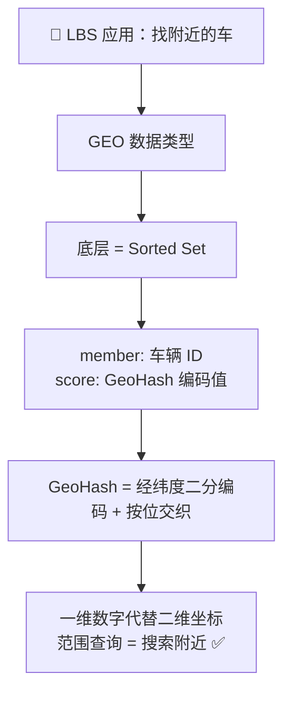
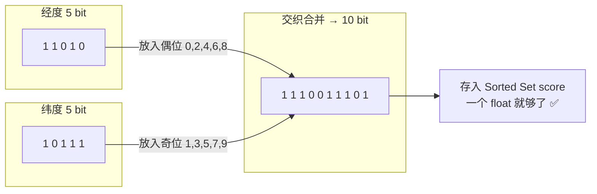
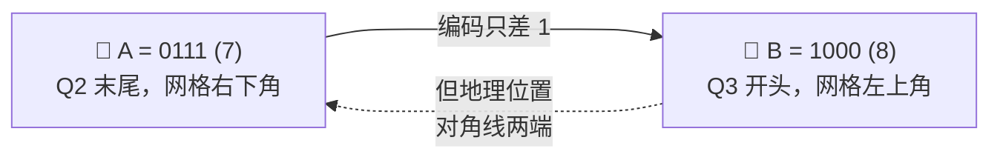
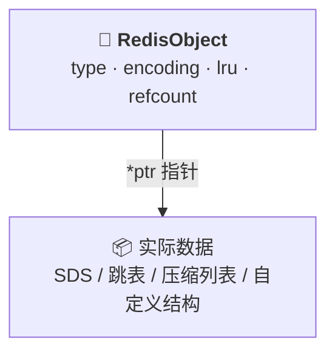
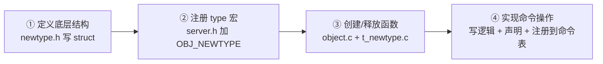

> 💡 **从哪里来？** 上一节 [[12 有一亿个keys要统计，应该用哪种集合？.md|12 集合统计四剑客]] 覆盖了 Bitmap 和 HyperLogLog 两种扩展数据类型，以及 Set、Sorted Set、List、Hash 在统计场景中的选型决策树。但还有一类需求没解决——**地理位置搜索**（「查找附近的 X」）。这就引出了第三种扩展类型：GEO。同时，如果你觉得这 8 种类型还不够用，Redis 还留了一扇后门——**自定义数据类型**。

# 13 GEO 是什么？还可以定义新的数据类型吗？

## 先做一个类比：GEO 就像地图上的邮政编码

GeoHash 的核心思想其实每个人都见过——**邮政编码**。邮编用一串数字编码了二维地理区域：前两位代表省，中间代表市，后面代表区县。邮编相邻的地区，通常在空间上也相邻。

GEO 做的事一模一样：把二维经纬度编码成一维数字，这样就能用 Sorted Set 的「按分数范围查询」来搜索附近位置。

| 生活场景 | 技术概念 |
|---|---|
| 📮 邮政编码：用一串数字代表一片地理区域 | **GeoHash 编码**：把经纬度二维坐标编码为一维数值 |
| 📬 相邻邮编 ≈ 相邻区域（大部分情况） | 相邻 GeoHash 值 ≈ 相邻方格（有例外） |
| 🔍 按邮编范围投递邮件 | **GEORADIUS**：按 GeoHash 范围查找附近元素 |
| 📋 邮编簿 = 区域编号 → 地址 | **Sorted Set**：GeoHash 值（score）→ 车辆/店铺 ID（member） |
| ⚠️ 跨省邮件邮编差很远但地理相邻 | **边界陷阱**：0111 和 1000 数值接近但地理可能很远 |



> **图释**：GEO 没有发明新的底层结构——它本质是 **Sorted Set + GeoHash 编码**。经纬度经过 GeoHash 变成一维数字后，直接存为 Sorted Set 的 score，"附近搜索"就变成了"按分数范围查询"。

---

## 一、GEO 的底层选择：为什么是 Sorted Set？

设计数据结构的底层时，第一步不是想「用什么实现」，而是问「**数据怎么被访问**」。以**网约车匹配**为例来分析。

### 数据的存取模式

1. 每辆车有 ID（如 33），定期上报**经度**（如 116.034579）和**纬度**（如 39.000452）
2. 用户叫车时，以用户的经纬度为中心，查找**一定范围内**的所有车辆
3. 匹配后，根据车辆 ID 获取详细信息

这个模式本质是：**一个 key → 一个 value（经纬度对），并且需要按 value 做范围查询**。

### Hash 为什么不行？

| 维度 | Hash | 需求 | 匹配？ |
|---|---|---|---|
| 存储模式 | key → value，一对一 | 车 ID → 经纬度 | ✅ |
| 更新效率 | HSET 单键更新，O(1) | 车辆位置实时变化 | ✅ |
| **范围查询** | **元素无序，无法按值范围查** | 查找「5 公里内的车」 | ❌ |

Hash 可以完美存储，但**无法排序，做不了范围查询**。就像你把所有快递按收件人姓名排列——找某个人的快递很快，但想找「3 公里内所有快递」就无从下手。

---

**那 Sorted Set 呢？它既能存 key-value，又能按 score 排序——**

### Sorted Set 凭什么行？

| 维度 | Sorted Set | 需求 | 匹配？ |
|---|---|---|---|
| 存储模式 | member（元素）→ score（分数） | 车 ID → 经纬度 | ✅ |
| 排序能力 | 按 score 有序排列 | 范围查询相邻位置 | ✅ |
| 范围查询 | ZRANGEBYSCORE，O(log N) | 查找一定范围内的元素 | ✅ |

Sorted Set 看起来完美！但有一个关键矛盾：

> **Sorted Set 的 score 是一个浮点数（float），而经纬度是**两个值 **——怎么把一个二维坐标塞进一个一维数字里？**

这就是 GeoHash 要解决的问题。

---

## 二、GeoHash 编码：二分区间，区间编码

GeoHash 的基本原理就八个字：**「二分区间，区间编码」**。意思是：把经纬度范围不断对半切分，落在左边记 0、右边记 1，重复 N 次后得到一串二进制编码。

### 经度编码：以 116.37 为例（5 位）

经度范围是 **[-180, 180]**。每次二分区后，看目标值落在左半还是右半：

| 次数 | 当前区间 | 左分区 | 右分区 | 116.37 落在 | 编码位 |
|---|---|---|---|---|---|
| 1 | [-180, 180] | [-180, 0) | [0, 180] | 右 | **1** |
| 2 | [0, 180] | [0, 90) | [90, 180] | 右 | **1** |
| 3 | [90, 180] | [90, 135) | [135, 180] | 左 | **0** |
| 4 | [90, 135] | [90, 112.5) | [112.5, 135] | 右 | **1** |
| 5 | [112.5, 135] | [112.5, 123.75) | [123.75, 135] | 左 | **0** |

结果：经度 116.37 的 5 位 GeoHash 编码 = **11010**，最终定位在 **[112.5, 123.75]** 这个区间。

每多做一次二分，区间范围缩小一半，编码就多一位，定位就更精准。

### 纬度编码：同理

纬度范围是 **[-90, 90]**。对纬度 39.86 做同样的 5 次二分，得到编码 = **10111**。

### 交织合并：偶位经度、奇位纬度

两串编码有了，怎么合并？规则很简单：

> **最终编码的偶数位（从 0 开始）放经度，奇数位放纬度。**

```
经度编码：1     1     0     1     0
         ↓     ↓     ↓     ↓     ↓
位置编号：0  1  2  3  4  5  6  7  8  9
         ↓  ↓  ↓  ↓  ↓  ↓  ↓  ↓  ↓  ↓
纬度编码：   1     0      1    1     1

最终编码：1  1  1  0  0  1  1  1  0  1
```



> **图释**：交织合并是 GeoHash 的精髓——把经度和纬度交叉编织成一个数。这样做的好处是：相邻的经纬度，在编码值上也相邻，这样 Sorted Set 的范围查询自然就能搜到附近位置。

---

**编码完成了，一维数字可以存进 Sorted Set 了。但真的完美了吗？不——GeoHash 有一个反直觉的陷阱。**

---

## 三、GeoHash 的边界陷阱

### 直觉：编码值相邻 = 地理相邻

GeoHash 编码后，地球被划分成了一个个方格。编码位数越多（N 越大），方格越小：

| 编码位数 | 经纬度各分区数 | 方格总数 | 每个方格大约覆盖 |
|---|---|---|---|
| 2 位（经 1 + 纬 1） | 2 × 2 | 4 | 半个地球 |
| 4 位（经 2 + 纬 2） | 4 × 4 | 16 | ≈ 5000 km |
| 6 位（经 3 + 纬 3） | 8 × 8 | 64 | ≈ 1250 km |
| 10 位（经 5 + 纬 5） | 32 × 32 | 1024 | ≈ 625 km |

在大多数情况下，相邻方格的 GeoHash 编码值也相邻——Sorted Set 的范围查询自然就能覆盖到它们。

### 但有一个反直觉的例外：Z 字形空间填充曲线

#### 什么是 Z 字形填充？

GeoHash 的交替位编码（「偶位经度、奇位纬度」）在数学上就是 **Z-order 曲线**（也叫 **Morton 码**）。这条曲线的填充规则是：

> **把整个二维空间切成 4 个象限，在每个象限里画一条小 Z，再用一条大 Z 把这 4 块连起来。**

最小的例子——经度和纬度各用 1 位（共 2 位编码），得到 2×2 = 4 个方格：

```
GeoHash = lat[0] lon[0]

        lon=0      lon=1
lat=0  │ 00 (0)    01 (1) │
lat=1  │ 10 (2)    11 (3) │
```

Z 曲线按编码值从小到大走：**0 → 1 → 2 → 3**，画出的正是一个 Z 形。在这个 4 格的规模里，相邻编码的确都相邻——但这是因为格子太少。

#### 4 位编码：16 个方格的完整走线

当经度和纬度各用 2 位（共 4 位编码）时，得到 4×4 = 16 个方格。这才是真正暴露问题的规模：

```
GeoHash = lat[1] lon[1] lat[0] lon[0]

          经=00      经=01      经=10      经=11
纬=11  │ 1010(10)  1011(11)  1110(14)  1111(15) │ ← 第 4 象限
纬=10  │ 1000(8)⬅B 1001(9)   1100(12)  1101(13) │ ← 第 3 象限
纬=01  │ 0010(2)   0011(3)   0110(6)   0111(7)⬅A│ ← 第 2 象限
纬=00  │ 0000(0)   0001(1)   0100(4)   0101(5)  │ ← 第 1 象限
```

> 格子内：`GeoHash 编码值 (Z 曲线访问序号)`，序号 = 编码值转十进制

Z 曲线遍历的顺序：在每个象限内画小 Z，再画大 Z 把四个象限串起来：

```
Z 曲线访问序号（= 编码值的十进制）：

        经00   经01   经10   经11
纬11 │  10     11     14     15  │ ← Q4
纬10 │   8⬅B    9     12     13  │ ← Q3
纬01 │   2      3      6      7⬅A│ ← Q2
纬00 │   0      1      4      5  │ ← Q1
```

走线路径：0→1→2→3 → 4→5→6→**7** → **8**→9→10→11 → 12→13→14→15



> **图释**：Z 曲线在每个象限内走一个小 Z，走到末尾 7 之后，直接跳到下一象限的起点 8。编码只差 1，但 A 在网格右下（Q2 末尾）、B 在网格左上（Q3 开头）——这是对角线跳跃，不是邻近关系。

#### 为什么 0111 → 1000 是「对角跳」？逐位拆开看

回顾 GeoHash 编码公式（高位在前）：`lat[1] lon[1] lat[0] lon[0]`

| | 方格 A = `0111` (= 7) | 方格 B = `1000` (= 8) |
|---|---|---|
| **GeoHash 编码** | `0111` | `1000` |
| **lat[1]（纬度高位）** | `0` → 属于**下半**区域 | `1` → 属于**上半**区域 |
| **lon[1]（经度高位）** | `1` → 属于**右半**区域 | `0` → 属于**左半**区域 |
| **lat[0]（纬度低位）** | `1` → 该象限内偏上 | `0` → 该象限内偏下 |
| **lon[0]（经度低位）** | `1` → 该象限内偏右 | `0` → 该象限内偏左 |
| **在 4×4 网格中的位置** | 经=11（最右列），纬=01（第二行） | 经=00（最左列），纬=10（第三行） |
| **实际地理关系** | 网约车在**东南角附近** | 网约车在**西北角附近** → **横跨了整个城市！** |

逐位解析发生了什么：

```
0111 → 1000 的每一位变化：

0 1 1 1   ← 第 2 象限，象限内坐标 (11, 01)，是"班末车"
↓ ↓ ↓ ↓
1 0 0 0   ← 第 3 象限，象限内坐标 (00, 00)，是"头班车"

lat[1]: 0→1  纬度高位翻转 → 从下半球跳到上半球
lon[1]: 1→0  经度高位翻转 → 从右半球跳到左半球
lat[0]: 1→0  纬度低位翻转 → 象限内从上跳到下
lon[0]: 1→0  经度低位翻转 → 象限内从右跳到左
```

**4 个位全部翻转！** 这就是「翻页效应」的本质——不是某个位的偶然，而是 Z-order 在象限边界处的**系统性行为**：每当跨过一个大象限边界，高位必然翻转，导致地理位置剧烈跳跃。

#### 更一般地：凡是高位翻转的地方都会跳

在 16 个方格的规模里，Z 曲线共经过 3 个象限边界，每个边界都是一次「翻页」：

| 编码翻转点 | 跨哪个象限 | 关键位变化 | 地理跳跃 |
|---|---|---|---|
| `0011(3) → 0100(4)` | 第 1 → 第 2 象限 | `lon[1]` 从 0→1 | 水平跳 2 格（右半） |
| **`0111(7) → 1000(8)`** | **第 2 → 第 3 象限** | **`lat[1]` 0→1，`lon[1]` 1→0** | **对角跳！水平 + 垂直各跨半网格** |
| `1011(11) → 1100(12)` | 第 3 → 第 4 象限 | `lon[1]` 从 0→1 | 水平跳 2 格（右半） |

编码位数越多（真实场景通常 26 或 52 位），方格越多，这种「翻页点」就越多。每多一位，翻页点数量就翻倍。**这不是偶然的边界 case，而是 Z-order 的固有缺陷。**

#### 还有一个同类陷阱：相邻格子可能编码差很远

除了「编码差 1 但地理跳跃」的反直觉情况，反过来也同样成立：**两个地理上紧挨着的格子，编码值可能差很远**。比如下面两个格子：

```
经=01,纬=01 → GeoHash = 0011 (3)
经=10,纬=01 → GeoHash = 0110 (6)
```

它们水平相邻（同纬度，经度差一个单位），但编码差 3。原因也是四位编码的结构——`0011` 和 `0110` 处在不同象限内，高位不同，编码自然不连续。

这意味着：**在 GeoHash 编码的一维数值空间中，"相邻"和"接近"没有必然联系。** 你永远不能简单地对编码值做 `BETWEEN 0111 AND 1000` 然后指望结果覆盖了地理上连续的区域。

**根因就一句话**：GeoHash 的 Z 字形填充在象限边界处必然产生跳跃——上一象限的最后一个编码值与下一象限的第一个编码值只差 1，但经纬度的高位同时翻转，地理位置横跨了整个空间。查询时如果只看自己方格的编码范围，**边界另一侧的数据就会直接丢失**。

### 解决方案：不只查自己，还要查邻居

| 查询策略 | 覆盖范围 | 适用场景 |
|---|---|---|
| 只查自己的方格 | 仅当前方格 | ❌ 边界数据必然丢失 |
| **自身 + 周围 4 个方格** | 上下左右各一格 | ⚠️ 基本够用 |
| **自身 + 周围 8 个方格** | 完整一圈 | ✅ 最安全，推荐 |

做法：查询目标方格时，同时查它周围的 4 或 8 个相邻方格，合并返回。这样即使目标在方格边缘，也不会漏掉隔壁方格里距离更近的元素。

---

**理论讲完了。回到代码——具体怎么操作？**

---

## 四、GEO 常用命令

两个核心命令覆盖 90% 的场景：

### GEOADD：存入经纬度

```bash
GEOADD cars:locations 116.034579 39.030452 33
#                      ↑ 经度      ↑ 纬度    ↑ 车辆 ID
```

把车辆 33 的当前位置存入 `cars:locations` 这个 GEO 集合中。Redis 内部自动计算 GeoHash 并写入 Sorted Set。

### GEORADIUS：搜索附近

```bash
GEORADIUS cars:locations 116.054579 39.030452 5 km ASC COUNT 10
#          ↑ 集合 key     ↑ 中心经度  ↑ 中心纬度 ↑ 半径 ↑ 单位
#                                                      ↑ 从近到远
#                                                          ↑ 最多 10 条
```

以用户位置为中心，搜索 **5 公里**范围内的车辆，按距离从近到远排列，最多返回 10 条。

| 常用参数 | 作用 | 建议 |
|---|---|---|
| `ASC` / `DESC` | 按距离升序/降序排列 | 推荐 ASC，最近的最前面 |
| `COUNT n` | 限制返回数量 | **强烈建议加**——5 公里可能有几百辆车 |
| `WITHDIST` | 同时返回每个元素的距离 | 调试和前端展示时很有用 |
| `STOREDIST` | 将结果存入另一个 key | 需要缓存搜索结果时使用 |

---

**到这里，5 大基本类型（String、List、Hash、Set、Sorted Set）+ 3 种扩展类型（Bitmap、HyperLogLog、GEO）全部讲完了。**

**但还有个问题——如果这些还不够呢？**

当你的业务需要一个「既能像 Hash 一样快速单键查询，又能像 Sorted Set 一样支持范围查询」的数据结构时，现成的 8 种类型没有一个能同时满足。**Redis 的终极答案是：允许你自己造。**

---

## 五、自定义数据类型：Redis 的终极扩展能力

### RedisObject：所有值的「身份证」

要自定义类型，得先理解 Redis 怎么管理所有 value。Redis 中每个 key-value 对的 value，在内部都是同一个结构体——**RedisObject**：



> **图释**：RedisObject 就像一个快递面单——**type** 告诉你里面是什么东西（String？List？），**encoding** 告诉你用什么方式包装的（SDS？压缩列表？），**\*ptr** 指向包裹里的实际内容。要自定义类型，就是在这张面单上加一种新的 type，然后实现对应的包装和内容。

四个元数据字段的职责：

| 字段 | 作用 | 自定义类型时的角色 |
|---|---|---|
| **type** | 标识数据类型（String/List/...） | **必须新增一个 type 值**，如 `OBJ_NEWTYPE` |
| **encoding** | 底层编码方式（SDS/压缩列表/跳表/...） | 可复用现有的，也可新增 |
| **lru** | 记录最后访问时间，用于淘汰过期键 | 自动处理，无需改动 |
| **refcount** | 引用计数，用于内存共享和回收 | 自动处理，无需改动 |
| **\*ptr** | 指向具体数据的指针 | **指向你自定义的底层结构** |

### 开发新类型的四步走

以开发一个 **NewTypeObject**（底层为 Long 型单向链表）为例：



> **图释**：四步的本质是「定义长相 → 拿到身份证 → 学会出生和死亡 → 学会干活」。定义长相 = 写 struct，身份证 = 注册 type 宏，出生 = create 函数，干活 = 实现命令。

#### ① 定义底层结构（newtype.h）

```c
// 链表节点
struct NewTypeNode {
    long value;               // 存储的实际数据
    struct NewTypeNode *next; // 指向下一个节点
};

// 新类型主体
struct NewTypeObject {
    struct NewTypeNode *head; // 链表头
    size_t len;               // 链表长度
};
```

底层结构是一个 **Long 型单向链表**。当然，你也可以根据需求换成 B+ 树、跳表或任何其他结构，性能特征随你定义。

#### ② 注册 type 宏（server.h）

```c
#define OBJ_STRING  0   /* String */
#define OBJ_LIST    1   /* List */
#define OBJ_SET     2   /* Set */
#define OBJ_ZSET    3   /* Sorted Set */
#define OBJ_HASH    4   /* Hash */
// ...
#define OBJ_NEWTYPE 7   /* 自定义的新类型 */
```

#### ③ 实现创建和释放函数（object.c + t_newtype.c）

创建函数的核心逻辑：初始化底层结构 → 用 createObject 封装成 RedisObject：

```c
robj *createNewTypeObject(void) {
    NewTypeObject *h = newtypeNew();          // 初始化底层链表
    robj *o = createObject(OBJ_NEWTYPE, h);   // 封装为标准 RedisObject
    return o;
}
```

其中 `createObject` 是 Redis 提供的通用函数：

```c
robj *createObject(int type, void *ptr) {
    robj *o = zmalloc(sizeof(*o));
    o->type = type;    // 打上类型标签
    o->ptr  = ptr;     // 指向底层实现
    // ...
    return o;
}
```

释放函数是创建的反过程：用 `zfree` 回收 `NewTypeObject` 占用的内存。

#### ④ 实现命令操作（三文件联动）

1. **t_newtype.c**：写命令实现（如 `ntinsertCommand`，接收客户端参数，往链表插入元素）
2. **server.h**：声明函数原型 `void ntinsertCommand(client *c);`
3. **server.c**：在 `redisCommandTable` 中注册命令映射：

```c
struct redisCommand redisCommandTable[] = {
    // ...已有命令...
    {"ntinsert", ntinsertCommand, 2, "m", ...}
    //  ↑ 命令名    ↑ 实现函数
};
```

此时，`NTINSERT` 命令就可以在 Redis 中使用了。

### 四步速查表

| 步骤 | 修改的文件 | 做什么 |
|---|---|---|
| ① 定义结构 | `newtype.h` | 写 struct，定义类型长什么样 |
| ② 注册 type | `server.h` | 加 `#define OBJ_NEWTYPE 7` |
| ③ 创建/释放 | `object.c` + `t_newtype.c` | 实现 create（分配内存 + 封装 RedisObject）和 free（回收内存） |
| ④ 实现命令 | `t_newtype.c` + `server.h` + `server.c` | 写命令逻辑 → 声明函数 → 注册到命令表 |

> ⚠️ 如果需要**持久化**（RDB/AOF），还要额外增加对新类型的序列化和反序列化代码。

---

## 一句话总结

> 核心概念 = **GEO 不是新的底层数据结构，它是 Sorted Set + GeoHash 编码的产物**：GeoHash 用「二分区间、区间编码」将二维经纬度交织合并为一维数值（偶位经度、奇位纬度），存为 Sorted Set 的 score，借助 Sorted Set 的范围查询能力实现 LBS「搜索附近」。但 GeoHash 存在边界陷阱——数值相邻不代表地理相邻（Z 字形空间填充曲线的翻页效应），需要同时查周围 4 或 8 个方格来补救。当 5 种基本类型 + 3 种扩展类型（Bitmap、HyperLogLog、GEO）都不够用时，Redis 开放了自定义能力：**定义底层 struct → 注册 type 宏 → 实现 create/free → 实现命令**，四步即可为 Redis 增加全新的数据类型。

---

> 🧭 **接下来看什么？** 数据类型篇到这里全部结束——5 种基本类型（String、List、Hash、Set、Sorted Set）+ 3 种扩展类型（Bitmap、HyperLogLog、GEO）+ 自定义类型的方法，你已经掌握了 Redis 数据模型的完整图景。下一篇进入**数据类型实战应用**：如何把多个类型组合起来解决真实场景？以物联网监控为例，用 Hash + Sorted Set 双写方案和 RedisTimeSeries 模块来保存**时间序列数据**，引出 MULTI/EXEC 事务机制——从「学工具」到「用工具」的关键一步。
