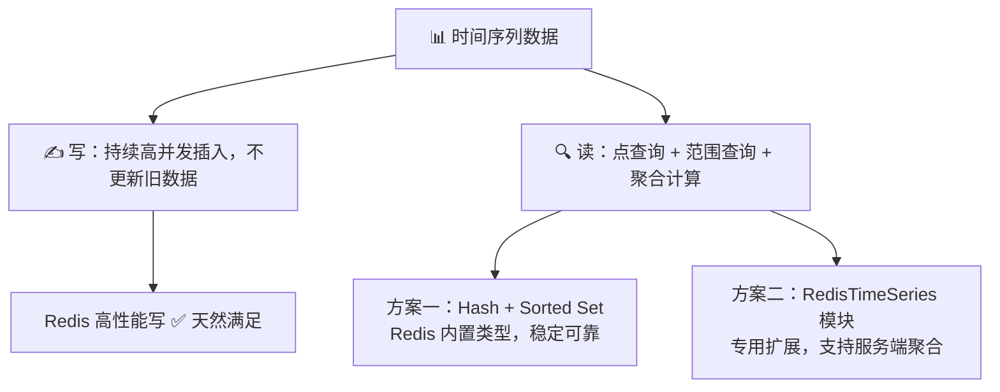
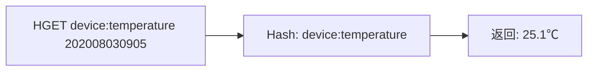
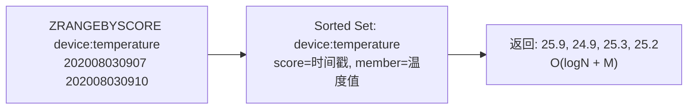
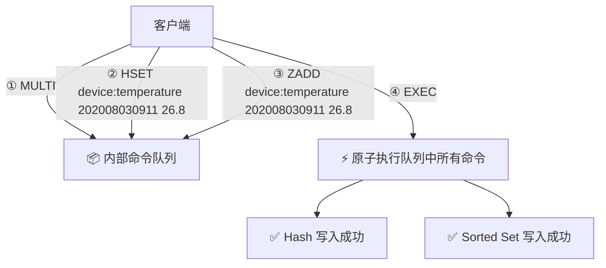
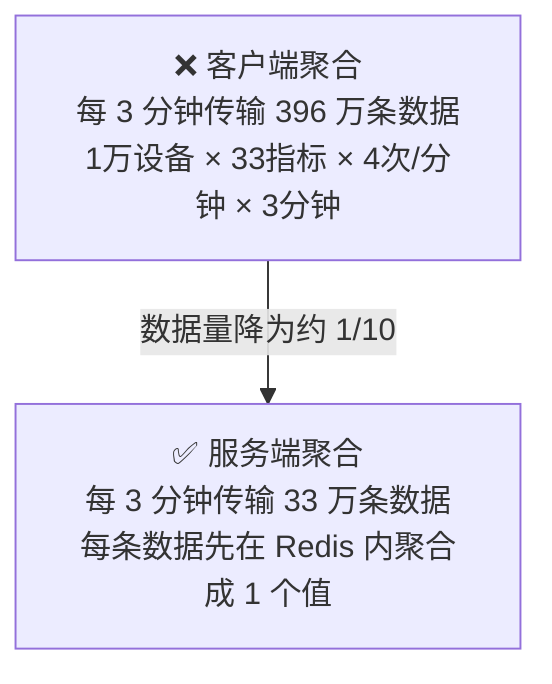
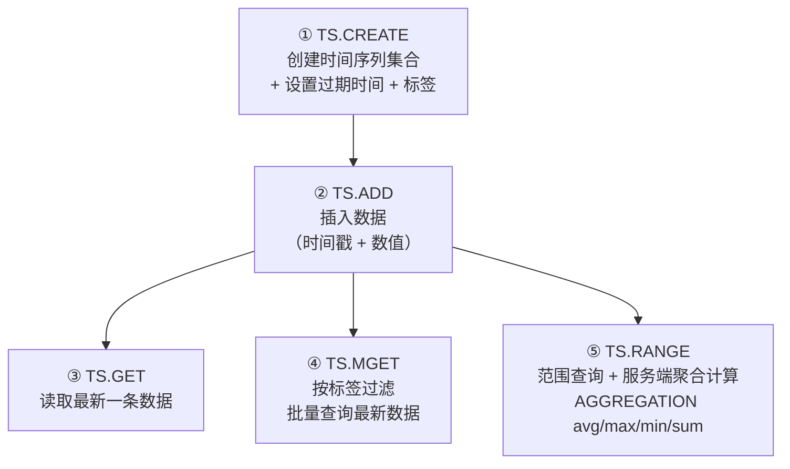
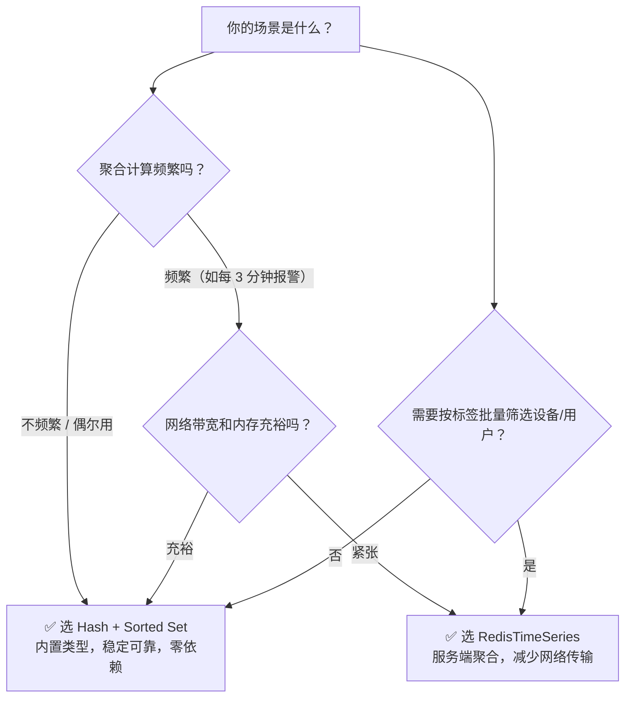

> 💡 **从哪里来？** 上一节 [[13 GEO是什么？还可以定义新的数据类型吗？|13 GEO]] 覆盖了第三种扩展数据类型 GEO，以及自定义数据类型的四步法。至此 Redis 的 8 种数据类型（5 种基础 + 3 种扩展）你已全部掌握。但掌握「工具」和解决「问题」之间还差一步：**如何把多个工具组合起来应对一个真实场景？** 本节以物联网监控为例，展示 Hash + Sorted Set 组合拳，以及专用模块 RedisTimeSeries 的解决方案。

# 14 如何在 Redis 中保存时间序列数据？

## 先做一个类比：时间序列数据就像气象站的观测记录

| 生活场景                                   | 技术概念                                               |
| -------------------------------------- | -------------------------------------------------- |
| 🌡️ 气象站每隔 15 秒自动记录一次温度、湿度、气压           | **时间序列数据**：按时间戳组织的一组指标值（DeviceID + 指标 + Timestamp） |
| 📋 查「8 月 3 日 9:05 的温度是多少」              | **点查询**：HGET — O(1) 查单个时间点的值                       |
| 📅 查「8 月 3 日 9:07 到 9:10 之间的所有温度」      | **范围查询**：ZRANGEBYSCORE — 按时间戳范围取数据                 |
| 📊 统计「今天每 3 分钟的平均温度」用于报警               | **聚合计算**：avg / max / min / sum — 对时间窗口内的多条数据做统计    |
| 📝 气象站用两个账本：一个按日期翻（快查某天），一个按编号翻（快查某时段） | **双写 Hash + Sorted Set**：一个负责精确查找，一个负责范围扫描         |

气象站每天产生海量观测数据——**写入要快**（高并发持续写入）、**查询要多元**（点查 + 范围 + 聚合）。这正是 Redis 时间序列方案要解决的三件事。



> **图释**：时间序列数据的两大需求——写快（Redis 天生能解决）和查询多元（需要选方案）。两种方案各有优劣，接下来逐一拆解。

---

## 一、时间序列数据的读写特点 —— 为什么不能只用一种类型？

在动手选方案之前，先搞清楚这类数据到底「长什么样」。

### 写：持续高并发、只插入不更新

时间序列数据一旦记录就**不会再变**——设备在某个时刻的温度测量值，记下来就是历史事实，不需要修改。所以写入只有一种操作：**插入新数据**。这要求所选数据类型的插入复杂度足够低，绝不能阻塞。

看到这里你可能会想到用 **String** 或 **Hash**——它们插入都是 **O(1)**。但 [[11 万金油的String，为什么不好用了？|第 11 讲]] 说过：String 记录小数据时**元数据开销大**，不适合海量存储。所以 String 直接出局。

### 读：点查询 + 范围查询 + 聚合计算，三种模式缺一不可

| 查询模式 | 场景举例 | 所需能力 |
|---|---|---|
| **点查询** | 查某设备在某个时刻的温度 | 按键精确查找，O(1) |
| **范围查询** | 查某设备在 9:07~9:10 之间的所有温度 | 按时间戳范围扫描，需有序索引 |
| **聚合计算** | 每 3 分钟统计所有设备的温度最大值，判断是否超标 | 对时间窗口内的数据做 avg/max/min/sum |

这就暴露了一个矛盾：**单点查询 Hash 很擅长，但 Hash 不支持范围查询；Sorted Set 支持范围查询，但单点不如 Hash 直接。** 单独用一种类型搞不定全部需求。

---

**那能不能把它们组合起来？** Hash 管点查、Sorted Set 管范围——各取所长。这就引出了第一种方案。

---

## 二、Hash + Sorted Set 组合方案 —— 让两个类型打配合

### 2.1 Hash 解决「点查询」

把**时间戳作为 Hash 的 field**、**设备状态值作为 Hash 的 value**，查某个时间点直接 HGET：



> **图释**：Hash 通过时间戳 field 直接定位——O(1) 点查询，一步到位。

但问题在于：Hash 底层是**哈希表**，数据无序。如果要查「9:07 到 9:10 之间所有温度」，Hash 只能全量扫描 → 取回客户端排序 → 筛选范围——**效率极低**。

### 2.2 Sorted Set 补上「范围查询」

把**时间戳作为 Sorted Set 的 score**，**设备状态值作为 member**，数据自动按时间排序：



> **图释**：Sorted Set 按 score（时间戳）有序排列，ZRANGEBYSCORE 直接定位时间范围——O(logN + M)，比 Hash 全量扫描快了不止一个数量级。

---

**点查询交给 Hash，范围查询交给 Sorted Set，理论上是完美组合**——但这带来一个新问题：

---

### 2.3 MULTI / EXEC —— 如何保证双写原子性？

两条数据要同时写入 Hash 和 Sorted Set，如果一条写成功、另一条写失败，数据就不一致了——Hash 里有但 Sorted Set 里没有，范围查询就漏数据。

这就需要 **Redis 事务**：用 **MULTI** 开启事务 → 命令排队 → **EXEC** 一次性原子执行。



> **图释**：MULTI 后的命令只是入队（返回 QUEUED），EXEC 时才一次性原子执行。要么全成功、要么全不执行——保证 Hash 和 Sorted Set 数据永远一致。

| 命令 | 作用 |
|---|---|
| **MULTI** | 开启事务，后续命令进入队列暂不执行 |
| **EXEC** | 执行队列中所有命令，保证原子性 |

> ⚠️ Redis 事务的原子性有一个边界条件：如果某条命令本身语法错误，整批都不执行；但如果命令语法正确、执行时出错（如对 String 执行 ZADD），其他命令**仍然会执行**——这不是严格的回滚事务。详细异常情况会在第 30 讲展开。

---

**现在点查询、范围查询、原子写入都解决了**——但还剩第三个需求没落地：

---

### 2.4 聚合计算的短板 —— 数据搬运的代价

Sorted Set 能做范围查询，但**没法直接在 Redis 里做聚合计算**（求均值、最大值等）。只能先把时间范围内的数据全部取回客户端，在客户端自己算。

这在数据量大的时候非常危险。以物联网场景为例：



> **图释**：客户端聚合时，**396 万条原始数据**在 Redis 和客户端之间搬运；服务端聚合后只需要传 **33 万条聚合结果**——网络传输量降为原来的约十分之一。

| 计算环节 | 数据量 | 计算位置 |
|---|---|---|
| 每设备每 3 分钟产生 | 33 指标 × 12 条 = **396 条** | — |
| 1 万台设备每 3 分钟 | **396 万条** | 客户端聚合 → 大量网络传输 ❌ |
| 服务端预聚合后 | **33 万条**（仅聚合值） | Redis 实例内计算 ✅ |

---

**频繁的大数据量搬运不仅慢，还会挤占网络带宽，影响其他命令的执行。** 能不能把聚合计算下沉到 Redis 内部、只传结果不传原始数据？这就是 RedisTimeSeries 的设计动机。

---

## 三、RedisTimeSeries 模块 —— 把计算搬到服务端

**RedisTimeSeries** 是 Redis 的扩展模块（非内置），专门为时间序列数据设计了数据类型和访问接口，**核心优势：在 Redis 实例上直接完成聚合计算**。

### 3.1 安装与加载

```bash
# 编译为动态链接库后加载
loadmodule redistimeseries.so
```

### 3.2 五大核心命令



> **图释**：RedisTimeSeries 的五个命令覆盖了时间序列数据的完整生命周期——创建集合 → 写入数据 → 三种查询模式（最新值 / 标签过滤 / 聚合范围）。

### 3.3 命令详解

**① TS.CREATE —— 创建集合 + 标签**

```bash
TS.CREATE device:temperature RETENTION 600000 LABELS device_id 1
```

- `RETENTION 600000`：数据有效期 **600 秒**，过期自动删除（控制内存）
- `LABELS device_id 1`：给集合打标签，后续可按标签批量筛选

**② TS.ADD / TS.GET —— 写入与最新值查询**

```bash
TS.ADD device:temperature 1596416700 25.1   # 插入：时间戳 + 温度值
TS.GET device:temperature                    # 返回：25.1
```

**③ TS.MGET —— 按标签过滤，批量查最新值**

假设 4 个设备各有自己的集合（标签 `device_id` 分别为 1、2、3、4），查询「除设备 2 外所有设备的最新温度」：

```bash
TS.MGET FILTER device_id!=2
# 返回 device:temperature:1 → 最新值
#       device:temperature:3 → 最新值
#       device:temperature:4 → 最新值
```

这在大规模设备管理场景中非常实用——不用逐个查，一个命令按标签过滤全搞定。

**④ TS.RANGE —— 服务端聚合计算**

每 **180 秒**为一个时间窗口，对 2020-08-03 9:05 到 9:12 的数据做**均值聚合**：

```bash
TS.RANGE device:temperature 1596416700 1596417120 AGGREGATION avg 180000
```

| 参数 | 含义 |
|---|---|
| `1596416700 1596417120` | 查询的时间范围（起始 ~ 截止） |
| `AGGREGATION avg` | 聚合计算类型：avg / max / min / sum / count / first / last 等 |
| `180000` | 时间窗口大小（**毫秒**，180000ms = 3 分钟） |

> 🔑 **关键点**：聚合在 Redis 实例内部完成，只返回每个时间窗口的聚合结果——网络传输的是「结果」而不是「全量原始数据」。

---

**RedisTimeSeries 解决了聚合计算的性能问题**——但它不是没有代价的。接下来把两种方案放在一起比较。

---

## 四、两种方案怎么选？—— 一张表说清楚

| 维度 | Hash + Sorted Set | RedisTimeSeries |
|---|---|---|
| **类型来源** | Redis 内置，开箱即用 | 扩展模块，需编译加载 |
| **点查询** | ✅ HGET — O(1) 查任意时间点 | ⚠️ TS.GET 只返回**最新**一条数据 |
| **范围查询** | ✅ ZRANGEBYSCORE — O(logN + M) | ✅ TS.RANGE — O(N)，底层是链表 |
| **聚合计算** | ❌ 需要取回客户端自己算，传输量大 | ✅ **服务端直接聚合**，只传结果 |
| **标签过滤** | ❌ 需自行设计 key 命名规则 | ✅ TS.MGET 原生支持 FILTER |
| **内存开销** | ⚠️ 同一份数据存了两份（Hash + Sorted Set） | ✅ 一份数据，内存更省 |
| **数据过期** | 可分别设置 EXPIRE | ✅ TS.CREATE 自带 RETENTION |
| **稳定性** | 高，Redis 核心代码 | 依赖模块质量 |

---

### 选型建议



> **图释**：关键决策因素是两个——聚合计算频率和网络/内存资源。聚合越频繁、带宽越紧张，越倾向于 RedisTimeSeries。

---

## 一句话总结

> 核心概念 = **时间序列数据的三种查询模式（点查询、范围查询、聚合计算）驱动了两种 Redis 方案**：Hash（O(1) 点查）+ Sorted Set（O(logN) 范围查）通过 MULTI/EXEC 保证原子性双写，稳定可靠但聚合计算需搬运全量数据到客户端，每 3 分钟可达 396 万条；RedisTimeSeries 模块将聚合计算下沉到 Redis 实例内部，传输量降为原来的十分之一（33 万条），原生支持标签过滤和数据过期，但代价是点查询只能取最新值、范围查询为 O(N)、且需额外编译加载——选择取决于聚合频率和网络/内存资源约束。

---

> 🧭 **接下来看什么？** 本节解决了时间序列数据的存取方案，引入了 MULTI/EXEC 事务机制来保证双写原子性。但 Redis 事务的「原子性」和我们熟悉的数据库事务并不完全一样——它不会回滚。接下来的章节将深入 Redis 的**事务与锁机制**，以及更重要的主题：**消息队列**——如何用 Redis 实现生产者-消费者模式。
