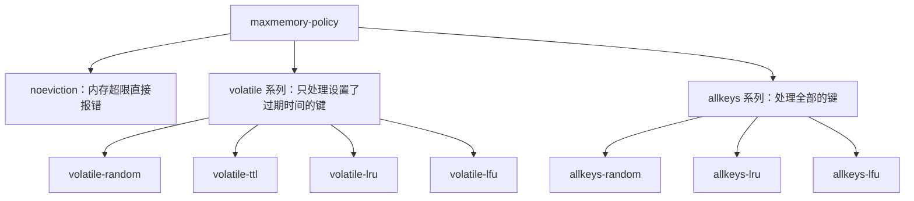

# 过期键删除与内存淘汰

## 一、核心概念前置区分

过期键删除与内存淘汰经常被混为一谈，先把四个维度区分清楚。

- **核心目标**
  - 过期键删除：清理已经到达过期时间的键，释放无效的内存占用。
  - 内存淘汰：当已用内存触碰 `maxmemory` 上限时，主动挑选键删除，保障写入命令可以继续执行。
- **触发条件**
  - 过期键删除：键设置了过期时间，并且已经到期，与内存使用率没有强制关联。
  - 内存淘汰：已用内存大于或者等于配置的 `maxmemory` 上限，与键是否到期没有强制关联。
- **执行顺序**
  - 过期键删除：前置执行，是内存管控的第一道防线。
  - 内存淘汰：后置兜底，过期键清理完成之后内存仍然超限，才会触发。
- **处理范围**
  - 过期键删除：只处理设置了过期时间的键。
  - 内存淘汰：可以配置为处理全部键，也可以配置为只处理设置了过期时间的键。

## 二、过期键的存储与判定

- 每个数据库由 `redisDb` 结构进行描述，其中的 `expires` 字典负责保存过期时间。
- `expires` 字典的键是指向键对象的指针，值是该键对应的过期时间戳。
- 判定一个键是否过期，复杂度为 O(1)。
- 查询一个键时，先判断它是否存在于过期字典之中。
- 如果存在，就取出过期时间，与当前系统时间进行比对。

## 三、三种通用的删除做法

- **定时删除**
  - 做法：为键设置过期时间的同时，创建一个定时器，到期立即执行删除。
  - 优点：对内存友好，过期键能够及时被清理。
  - 缺点：对 CPU 不友好，过期键数量很多时会占用大量 CPU 时间。
- **惰性删除**
  - 做法：键到期之后不立即删除，每次访问键时才检查是否过期，过期就删除。
  - 优点：对 CPU 友好，只在访问时才做检查。
  - 缺点：对内存不友好，过期键长期没有被访问就会一直占用内存。
- **定期删除**
  - 做法：每隔一段时间执行一次检查，随机抽取一部分键，删除其中已经过期的键。
  - 定位：是定时删除与惰性删除之间的折中方案。
  - 难点：难以确定每轮执行的时长，也难以确定执行的频率。

## 四、Redis 的实际用法

- Redis 采用惰性删除与定期删除配合使用的方式。
- 惰性删除由 `db.c` 里面的 `expireIfNeeded` 函数负责实现。
- 访问键或者改动键之前，都会调用 `expireIfNeeded` 进行判断。
- 具体的删除方式由 `lazyfree_lazy_expire` 配置决定。
- 该配置为 1 时，执行异步删除 `dbAsyncDelete`。
- 该配置为 0 时，执行同步删除 `dbSyncDelete`。

## 五、定期删除的实现细节

- `hz` 的默认值为 10，含义是每秒执行 10 次检查任务。
- 每轮随机抽取的键数量，由代码中硬编码的常量 `ACTIVE_EXPIRE_CYCLE_LOOKUPS_PER_LOOP` 决定，数值为 20。
- 如果本轮抽查中已经过期的键比例超过 25%，就继续进入下一轮。
- 单轮执行设置有时间的上限，默认是 25 毫秒。

## 六、内存淘汰的触发与配置

- 只有已用内存超过 `maxmemory` 上限，才会触发内存淘汰。
- 64 位操作系统的默认值为 0，含义是不做限制。
- 32 位操作系统的默认值为 3G。
- `maxmemory-policy` 用于配置具体的淘汰策略。
- `maxmemory-samples` 默认值为 5，用于控制每次采样的键数量。

## 七、八种内存淘汰策略

- `noeviction`：Redis 3.0 之后的默认策略，内存超限时写入命令直接报错。
- `volatile-random`：从设置了过期时间的键中随机挑选删除。
- `volatile-ttl`：从设置了过期时间的键中挑选剩余存活时间最短的删除。
- `volatile-lru`：从设置了过期时间的键中挑选最久未使用的删除，是 Redis 3.0 之前的默认策略。
- `volatile-lfu`：从设置了过期时间的键中挑选访问频次最低的删除，Redis 4.0 新增。
- `allkeys-random`：从全部键中随机挑选删除。
- `allkeys-lru`：从全部键中挑选最久未使用的删除。
- `allkeys-lfu`：从全部键中挑选访问频次最低的删除，Redis 4.0 新增。

两条通用规律：

- `volatile` 系列只处理设置了过期时间的键，`allkeys` 系列处理全部的键。
- `volatile` 系列在当前没有设置过期时间的键可以挑选时，会退化为 `noeviction`。

## 八、LRU 与 LFU 的实现

- `redisObject` 结构里面有一个 24 位的 `lru` 字段，两种模式共用这一段空间。
- LRU 模式：`lru` 字段记录键最后一次被访问的时间戳。
- LRU 淘汰：随机采样若干键，从中淘汰最久没有被使用的那个键。
- LFU 模式：把 24 位拆分成高 16 位的 `ldt` 与低 8 位的 `logc`。
- `ldt` 记录最近一次递减访问频次的时间。
- `logc` 记录访问频次，初始值为 5。
- `logc` 按照概率进行增长，并且按照访问间隔进行衰减。
- `lfu-decay-time` 默认值为 1，单位是分钟。
- `lfu-log-factor` 默认值为 10。

## 九、面试常见追问点

- 定时删除与定期删除的区别在哪里？为什么 Redis 不单独使用其中一种？
- `volatile` 系列策略在键没有设置过期时间时会怎样？为什么会退化？
- LRU 与 LFU 分别适应什么访问模式？什么场景下 LFU 更加合适？
- `maxmemory-samples` 调大或者调小分别会带来什么影响？
- 异步删除 `dbAsyncDelete` 相比同步删除 `dbSyncDelete` 解决了什么问题？
