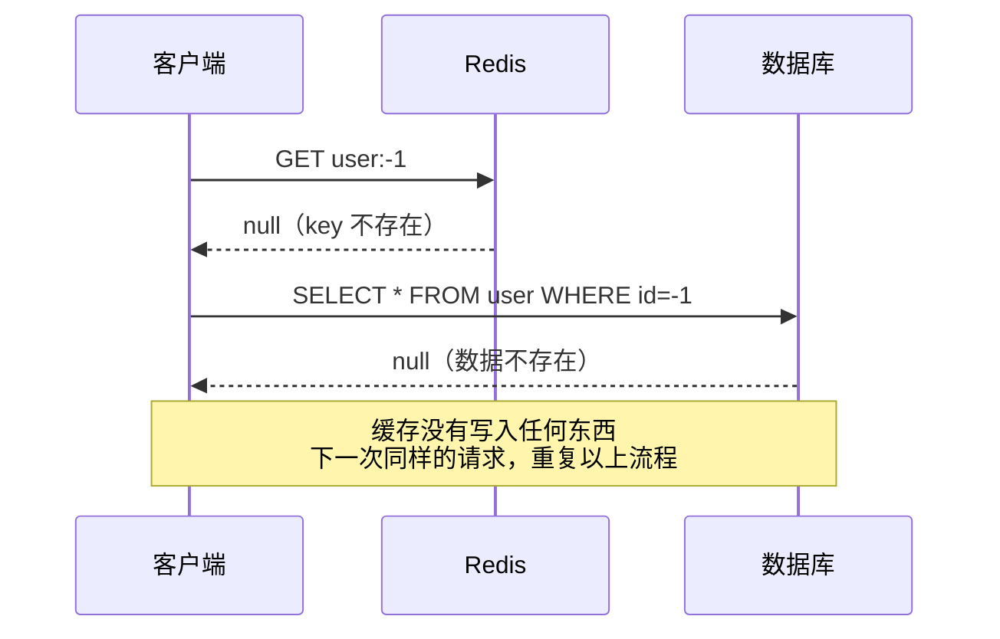
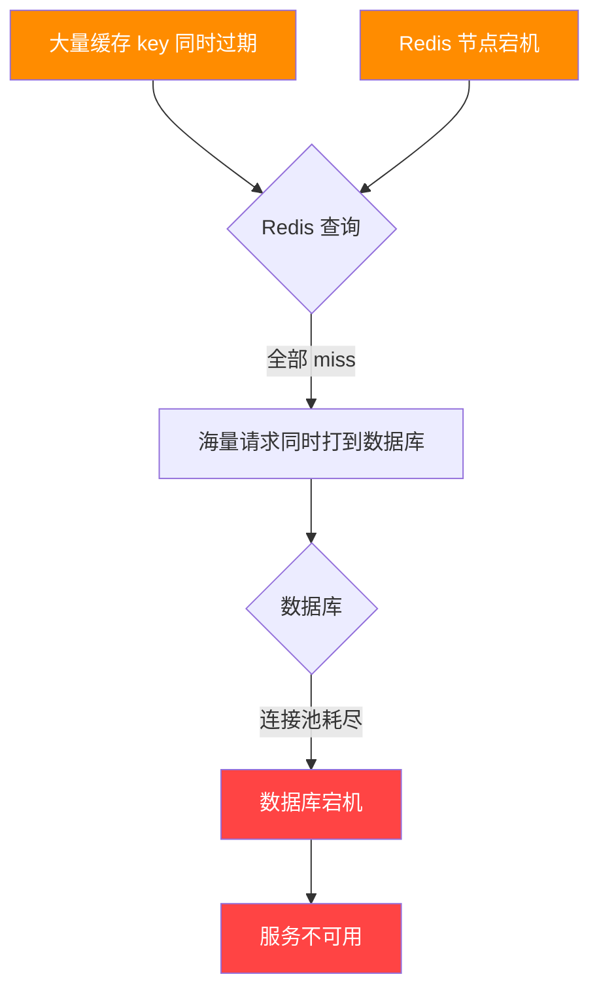
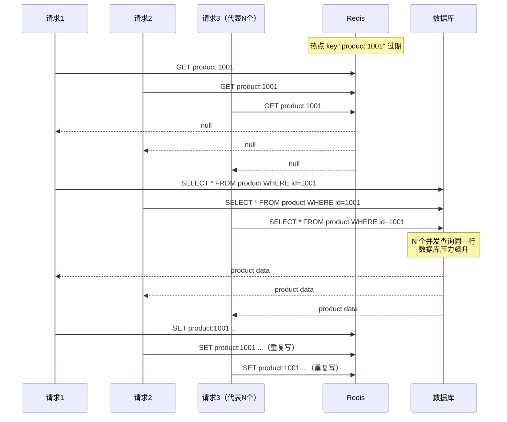
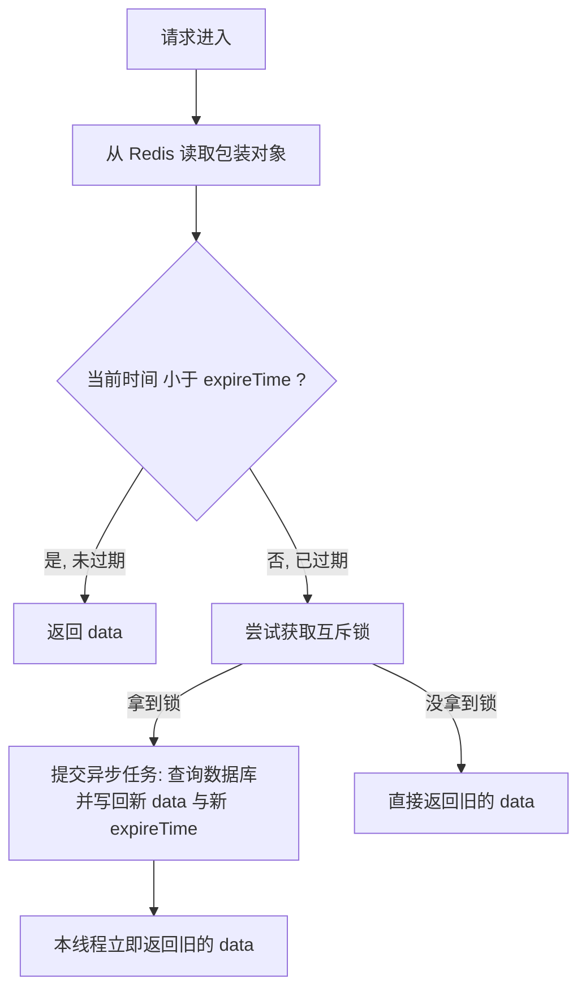
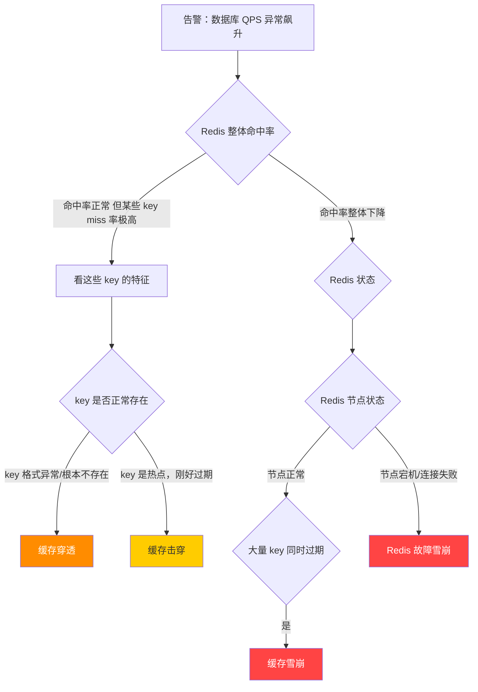

# 缓存穿透雪崩击穿

去年双十一前夕，我们团队做压测时发现一个诡异现象：QPS 才压到 3000，数据库连接池就告警了。

排查了两个小时，最后找到原因——一个活动页面的查询逻辑在 Redis 没有命中时，每次都打穿到数据库，而且这批请求的 key 根本就不存在，全是用户拼出来的无效 ID。

这就是**缓存穿透**。

类似的故障，我在职业生涯里见过不下五次。每次的起因不同，但本质都是缓存没有发挥该有的屏蔽作用，请求打到了数据库。**缓存穿透、缓存雪崩、缓存击穿**，这三个词你可能都背过，但真正在生产环境里遇到时，能不能快速判断是哪种、知道怎么处理，是另一回事。

这篇文章从真实故障场景出发，把三种问题的 根因、排查方法、防御方案和 Java 代码实现 都给你讲清楚。

## 先把三个概念区分清楚

很多人一直分不清这三个词，原因是它们听起来都像是"缓存坏了"。但根因完全不同：

| 问题   | 根因                       | 故障特征                   |
| ---- | ------------------------ | ---------------------- |
| 缓存穿透 | 查询的 key 在缓存和数据库里 都不存在    | 缓存永远 miss，每次都打库        |
| 缓存雪崩 | 大量 key 同时过期 或 Redis 节点宕机 | 数据库瞬间被大量并发请求击穿         |
| 缓存击穿 | 单个热点 key 过期 ，瞬间并发竞争重建    | 一个 key 过期时数据库被大量相同请求打爆 |
记住这个核心区别：
- 穿透 = key 根本不存在，缓存和数据库都没有
- 雪崩 = key 存在过，但一批 key 集体过期
- 击穿 = key 存在过，但是热点 key 在高并发下过期
下面逐个拆开来讲。

## 缓存穿透：恶意请求的无底洞

### 为什么会发生

正常的缓存访问逻辑是这样的：先查 Redis，命中就返回；没命中则查数据库，把结果写入缓存再返回。

这套逻辑有一个隐含前提： 查询的 key 在数据库里存在 。一旦有人构造大量不存在的 key（比如传入 userId=-1 、 productId=9999999999 ），每次请求都会穿过 Redis 直接打到数据库——因为数据库也查不到，所以也没有数据可以写入缓存，下次同样的请求还是继续打库。



#### 两种防御方案

方案一：**缓存空值**

最简单。查数据库结果为空时，把空值也写入 Redis，TTL 设短一些（比如 5 分钟）：

```java
public User getUserById(Long userId){
    String cacheKey = "user:" + userId;

    // 查 Redis
    String cached = redisTemplate.opsForValue().get(cacheKey);
    if (cached != null) {
        // 命中缓存——注意这里要处理"空值标记"的情况
        if ("NULL".equals(cached)) {
            returnnull; // 这是我们主动写入的空值标记，直接返回 null
        }
        return JSON.parseObject(cached, User.class);
    }

    // Redis 没命中，查数据库
    User user = userMapper.selectById(userId);

    if (user == null) {
        // 数据库也没有——写入空值标记，防止下次继续穿透
        // TTL 设短，避免数据库后续新增数据时，缓存空值脏读
        redisTemplate.opsForValue().set(cacheKey, "NULL", 5, TimeUnit.MINUTES);
        returnnull;
    }

    // 正常写入缓存
    redisTemplate.opsForValue().set(cacheKey, JSON.toJSONString(user), 30, TimeUnit.MINUTES);
    return user;
}
```

踩坑记录 ：空值标记不能直接存 null （Redis 的 null 表示 key 不存在， get 返回 null 你没法区分是"key 不存在"还是"你上次存了个 null"）。要存一个**特殊字符串**比如 "NULL" ，或者用专门的序列化方案。

方案二：**布隆过滤器**（应对随机 key 攻击）

缓存空值有个致命缺陷：如果攻击者每次构造的是 不同的随机 key ，缓存空值会把 Redis 塞满，反而造成新的问题。这时候要用布隆过滤器（Bloom Filter）。

布隆过滤器的本质是 **一个 bit 数组 + 多个哈希函数**。用已有数据的所有合法 key 初始化过滤器，每次请求先问过滤器：这个 key 有没有？如果过滤器说"没有"，那一定没有，直接拦截。如果说"有"，才去查缓存和数据库（有一定误判率，但不影响正确性）。

Guava 的 BloomFilter 误判率设为 0.1% 时，100 万条记录只需约 1.8MB 内存——远比缓存 100 万个空值划算。
```java
import com.google.common.hash.BloomFilter;
import com.google.common.hash.Funnels;

@Component
publicclassUserCacheService{

    // 预期数据量 100 万，误判率 0.1%
    // 实际生产中应在启动时从数据库加载所有合法 ID 初始化
    privatestaticfinal BloomFilter<Long> BLOOM_FILTER =
        BloomFilter.create(Funnels.longFunnel(), 1_000_000, 0.001);

    @Autowired
    private RedisTemplate<String, String> redisTemplate;

    @Autowired
    private UserMapper userMapper;

    @PostConstruct
    publicvoidinitBloomFilter(){
        // 应用启动时，把数据库里所有合法的 userId 加载进布隆过滤器
        // 生产环境数据量大时，分批加载，避免启动卡顿
        List<Long> allUserIds = userMapper.selectAllIds();
        allUserIds.forEach(BLOOM_FILTER::put);
    }

    public User getUserById(Long userId){
        // 第一道拦截：布隆过滤器
        // mightContain 返回 false = 一定不存在，直接拦截
        // mightContain 返回 true = 可能存在，继续查（有极小误判率）
        if (!BLOOM_FILTER.mightContain(userId)) {
            returnnull;
        }

        String cacheKey = "user:" + userId;
        String cached = redisTemplate.opsForValue().get(cacheKey);
        if (cached != null) {
            return JSON.parseObject(cached, User.class);
        }

        User user = userMapper.selectById(userId);
        if (user != null) {
            redisTemplate.opsForValue().set(cacheKey, JSON.toJSONString(user), 30, TimeUnit.MINUTES);
        }
        return user;
    }

    // 新增用户时，同步更新布隆过滤器
    publicvoidaddUser(User user){
        userMapper.insert(user);
        BLOOM_FILTER.put(user.getId());
        // 同时更新缓存
        String cacheKey = "user:" + user.getId();
        redisTemplate.opsForValue().set(cacheKey, JSON.toJSONString(user), 30, TimeUnit.MINUTES);
    }
}
```

两种方案怎么选：
- 穿透来源是**固定的无效 key**（比如业务逻辑 bug 导致的）→ 缓存空值足够
- 穿透来源是**随机构造的攻击请求** → 必须用布隆过滤器

## 缓存雪崩：最危险的故障模式

### 为什么比穿透更危险

缓存穿透通常是**部分请求打库**，影响范围有限。缓存雪崩的特点是 **大规模、同时发生** ，整个缓存层集体失效，所有流量同时涌向数据库，很容易导致数据库连接池耗尽、服务宕机。

雪崩有两种触发方式：
1. 大量 key 设置了**相同的过期时间** ，比如在某个时间点集中写入缓存（重启服务、预热数据），导致它们在同一时间集中过期。
2. Redis 节点宕机 ，整个缓存层不可用。


#### 防御方案

方案一：**TTL 加随机偏移量**

最简单有效的预防手段。写入缓存时，给 TTL **加一个随机值**，避免集中过期：

```java
// 避免这样写——所有 key 在同一时间过期
redisTemplate.opsForValue().set(key, value, 30, TimeUnit.MINUTES);

// 应该这样——每个 key 的过期时间有 ±10 分钟的随机偏移
long ttlBase = 30 * 60; // 30 分钟，单位秒
long randomOffset = ThreadLocalRandom.current().nextLong(-600, 600); // ±10 分钟随机偏移
redisTemplate.opsForValue().set(key, value, ttlBase + randomOffset, TimeUnit.SECONDS);
```

方案二：**服务降级 + 限流**
当数据库压力突然上来时，**限流**是最后的保命手段。用 Sentinel 或自己实现令牌桶：
```java
@Component
publicclassCacheService{

    @Autowired
    private RedisTemplate<String, String> redisTemplate;

    @Autowired
    private ProductMapper productMapper;

    // 简单的令牌桶限流（生产用 Sentinel 更合适）
    privatefinal RateLimiter rateLimiter = RateLimiter.create(1000); // 每秒最多 1000 次数据库查询

    public Product getProduct(Long productId){
        String cacheKey = "product:" + productId;
        String cached = redisTemplate.opsForValue().get(cacheKey);

        if (cached != null) {
            return JSON.parseObject(cached, Product.class);
        }

        // 缓存 miss，尝试获取令牌，超时 100ms 没拿到就降级
        if (!rateLimiter.tryAcquire(100, TimeUnit.MILLISECONDS)) {
            // 降级：返回空或者兜底数据，而不是让请求继续打库
            log.warn("Rate limit exceeded for productId: {}", productId);
            return getProductFallback(productId);
        }

        Product product = productMapper.selectById(productId);
        if (product != null) {
            long ttl = 30 * 60 + ThreadLocalRandom.current().nextLong(-600, 600);
            redisTemplate.opsForValue().set(cacheKey, JSON.toJSONString(product), ttl, TimeUnit.SECONDS);
        }
        return product;
    }

    private Product getProductFallback(Long productId){
        // 降级策略：可以从本地缓存、备用存储、或者直接返回 null
        // 业务层面决定是返回错误提示还是空数据
        returnnull;
    }
}
```

方案三：**Redis 集群 + 持久化**（防止宕机雪崩）

如果雪崩是因为 Redis 节点宕机，单点架构下没有救。生产环境至少要：
- Redis Sentinel 或 Redis Cluster 保证高可用
- 开启 RDB/AOF 持久化，节点重启后能快速恢复数据
- 多级缓存：**本地缓存**（Caffeine）作为 Redis 的降级方案

踩坑记录 ：有团队为了防雪崩，直接给所有缓存设置永不过期（TTL = -1），结果内存耗尽，Redis 触发内存**淘汰策略**把热点数据淘汰了，反而造成了更严重的缓存失效。 **内存淘汰配置**（ maxmemory-policy ）和 TTL 策略要一起考虑 ，推荐用 allkeys-lru 。


## 缓存击穿：热点 key 的单点故障

### 和雪崩的本质区别

雪崩是大批 key 集体过期，击穿是 **单个热点 key** 在大并发下过期 。听起来影响范围更小，但对那个 key 对应的数据库查询来说，可能是几百甚至几千个并发请求同时打过来——重建缓存的那一瞬间是致命的。

经典场景：秒杀活动开始前，某个商品详情 key 刚好**在这个时间点**过期。几千个并发请求同时发现缓存 miss，全部去查数据库，全部拿到了同样的数据，全部尝试写入缓存。数据库在这几秒内压力飙升，**并发查询**同一行数据。



#### 防御方案

方案一：互斥锁（只让一个**线程**去重建缓存）

用分布式锁控制，只让第一个拿到锁的请求去查数据库重建缓存，其他请求等待或重试：

```java
@Component
publicclassHotKeyService{

    @Autowired
    private RedisTemplate<String, String> redisTemplate;

    @Autowired
    private ProductMapper productMapper;

    privatestaticfinal String LOCK_PREFIX = "lock:";
    privatestaticfinallong LOCK_EXPIRE = 5L; // 锁超时 5 秒，防止死锁

    public Product getHotProduct(Long productId){
        String cacheKey = "product:" + productId;

        // 查缓存
        String cached = redisTemplate.opsForValue().get(cacheKey);
        if (cached != null) {
            return JSON.parseObject(cached, Product.class);
        }

        // 缓存 miss，尝试用互斥锁防止击穿
        String lockKey = LOCK_PREFIX + productId;

        try {
            // 尝试获取分布式锁（SET NX EX 是原子操作）
            Boolean locked = redisTemplate.opsForValue()
                .setIfAbsent(lockKey, "1", LOCK_EXPIRE, TimeUnit.SECONDS);

            if (Boolean.TRUE.equals(locked)) {
                // 拿到锁，负责重建缓存
                // 注意：拿到锁后必须再查一次缓存（double-check）
                // 因为在你等待拿锁的过程中，可能别人已经重建好了
                cached = redisTemplate.opsForValue().get(cacheKey);
                if (cached != null) {
                    return JSON.parseObject(cached, Product.class);
                }

                Product product = productMapper.selectById(productId);
                if (product != null) {
                    // 写入缓存，TTL 加随机偏移防止雪崩
                    long ttl = 30 * 60 + ThreadLocalRandom.current().nextLong(-60, 60);
                    redisTemplate.opsForValue().set(
                        cacheKey, JSON.toJSONString(product), ttl, TimeUnit.SECONDS
                    );
                }
                return product;

            } else {
                // 没拿到锁，说明有其他线程在重建缓存
                // 短暂等待后重试（自旋，最多等 500ms）
                Thread.sleep(50);
                return getHotProduct(productId); // 递归重试
            }

        } catch (InterruptedException e) {
            Thread.currentThread().interrupt();
            returnnull;
        } finally {
            // 注意：只有持锁的线程才能释放锁
            // 简化版：这里直接删除，生产环境要用 Lua 脚本保证原子性
            redisTemplate.delete(lockKey);
        }
    }
}
```

踩坑记录 ：上面的锁释放有一个隐患——如果业务逻辑执行超过了锁的过期时间（5 秒），锁已经自动过期，此时 delete(lockKey) 会把别人刚获取的锁删掉，造成锁的安全性问题。
	生产环境的正确做法是：加锁时**生成一个 UUID 存入锁的 value**，释放时用 **Lua 脚本**做"比较 + 删除"的原子操作：
```java
// 释放锁的正确姿势——Lua 脚本保证原子性
privatestaticfinal String UNLOCK_SCRIPT =
    "if redis.call('get', KEYS[1]) == ARGV[1] then " +
    "    return redis.call('del', KEYS[1]) " +
    "else " +
    "    return 0 " +
    "end";

publicvoidreleaseLock(String lockKey, String lockValue){
    DefaultRedisScript<Long> script = new DefaultRedisScript<>(UNLOCK_SCRIPT, Long.class);
    redisTemplate.execute(script, Collections.singletonList(lockKey), lockValue);
}
```

方案二：**逻辑过期**（热点 key 永不过期）

对于**超高并发的热点数据**（比如秒杀商品），可以不设**物理过期时间**，而是在 value 里存一个"**逻辑过期时间**"，过期后异步重建缓存，请求不阻塞：

```java
@Data
@AllArgsConstructor
publicclassCacheWrapper<T> {
    private T data;
    private LocalDateTime expireTime; // 逻辑过期时间，存在 value 里
}

@Component
publicclassLogicalExpireService{

    @Autowired
    private RedisTemplate<String, String> redisTemplate;

    @Autowired
    private ProductMapper productMapper;

    // 专用线程池处理缓存重建，避免影响正常业务线程
    privatestaticfinal ExecutorService REBUILD_EXECUTOR =
        Executors.newFixedThreadPool(10);

    privatestaticfinal String LOCK_PREFIX = "lock:";

    public Product getProductWithLogicalExpire(Long productId){
        String cacheKey = "product:" + productId;
        String cached = redisTemplate.opsForValue().get(cacheKey);

        if (cached == null) {
            // key 不存在（未预热），直接返回 null
            // 热点 key 需要在活动开始前预热写入
            returnnull;
        }

        CacheWrapper<Product> wrapper = JSON.parseObject(cached,
            new TypeReference<CacheWrapper<Product>>() {});

        // 检查逻辑过期时间
        if (LocalDateTime.now().isBefore(wrapper.getExpireTime())) {
            // 未过期，直接返回
            return wrapper.getData();
        }

        // 逻辑已过期，尝试异步重建
        String lockKey = LOCK_PREFIX + productId;
        Boolean locked = redisTemplate.opsForValue()
            .setIfAbsent(lockKey, "1", 5L, TimeUnit.SECONDS);

        if (Boolean.TRUE.equals(locked)) {
            // 拿到锁，提交异步重建任务
            REBUILD_EXECUTOR.submit(() -> {
                try {
                    Product freshData = productMapper.selectById(productId);
                    // 重建：新数据 + 新的逻辑过期时间
                    CacheWrapper<Product> newWrapper = new CacheWrapper<>(
                        freshData, LocalDateTime.now().plusMinutes(30)
                    );
                    // 不设物理过期时间（或设一个很长的时间）
                    redisTemplate.opsForValue().set(
                        cacheKey, JSON.toJSONString(newWrapper), 24, TimeUnit.HOURS
                    );
                } finally {
                    redisTemplate.delete(lockKey);
                }
            });
        }

        // 无论是否拿到锁，都先返回旧数据（牺牲短暂一致性，换取不阻塞）
        return wrapper.getData();
    }
}
```



两种方案怎么选：
- 对**数据一致性要求高**（不能返回旧数据）→ 互斥锁，代价是部分请求会短暂等待
- 对可用性要求高（不能有任何等待）→ **逻辑过期**，代价是有短暂数据不一致

## 生产环境的排查思路

遇到"数据库 QPS 飙升"告警时，怎么快速判断是哪种问题：




排查命令参考：


```bash
# 1. 查看 Redis 整体状态和命中率
redis-cli info stats | grep -E "keyspace_hits|keyspace_misses"
# 命中率 = keyspace_hits / (keyspace_hits + keyspace_misses)

# 2. 查看热点 key（要求 maxmemory-policy 为 LFU，即 allkeys-lfu 或 volatile-lfu）
redis-cli --hotkeys

# 3. 查看大 key（可能是缓存 value 过大拖慢 Redis）
redis-cli --bigkeys

# 4. 查看 key 过期情况
redis-cli info keyspace
# 输出示例：db0:keys=100000,expires=50000,avg_ttl=1800000
```


三种方案的完整对比

| 维度   | 缓存穿透         | 缓存雪崩             | 缓存击穿        |
| ---- | ------------ | ---------------- | ----------- |
| 根因   | key 不存在      | 大量 key 同时失效      | 单个热点 key 失效 |
| 影响范围 | 特定无效 key     | 全量缓存             | 单个热点 key    |
| 危险等级 | 中            | 高                | 中高          |
| 预防方案 | 布隆过滤器 / 缓存空值 | TTL 随机偏移 + 集群高可用 | 互斥锁 / 逻辑过期  |
| 兜底方案 | 参数校验         | 限流降级             | 服务降级        |
## 常见问题

Q: 布隆过滤器**误判率**设多少合适？

A: 取决于业务容忍度。**0.1% 是常用值**，意味着每 1000 个不存在的 key 里有 1 个会"漏过"布隆过滤器打到数据库。如果对误判零容忍（比如安全场景），用 Redis 的 SET 结构做白名单更可靠，代价是内存占用大很多。Guava BloomFilter 提供了 expectedInsertions 和 fpp （False Positive Probability）两个参数，可以根据数据量和内存预算调整。

Q: 互斥锁方案里递归重试会不会栈溢出？

A: 理论上会。上面示例代码是简化版，生产环境改用循环重试，并设置最大重试次数（比如 3 次），超过后降级返回 null 或兜底数据，不要无限递归。

Q: 缓存空值会不会导致业务 bug？比如数据库后来新增了数据但缓存还是 null？

A: 会，这叫"缓存与数据库不一致"。解决方法：一是空值 TTL 设短（5-10 分钟），过期后自动从数据库重新读取；二是新增数据时主动删除或更新对应的缓存 key（Cache-Aside 模式的标准做法）。

Q: 逻辑过期方案，活动开始前的"缓存预热"怎么做？

A: 在活动开始前（比如提前 10 分钟），用定时任务或脚本把所有热点数据批量写入 Redis，设置好逻辑过期时间。代码层面就是遍历热点 ID 列表，调用你的写入逻辑。注意分批写入，避免集中写入时数据库压力过大。

Q: 这三个问题，哪个在实际生产中最常见？

A: 雪崩最危险，但现在大家都知道要用 **TTL 随机偏移**，实际触发的反而少。**穿透**是我见过最多的，原因通常是业务逻辑漏洞（参数没校验）或者爬虫/攻击流量。击穿在高并发活动（大促、秒杀）时容易中招，平时不太会遇到。

如果你们现在的项目里 Redis 缓存没有做任何穿透/雪崩防护，建议从 TTL 随机偏移开始，5 分钟就能做完，但能消灭大多数雪崩风险。其他的防护可以按优先级排期做。
