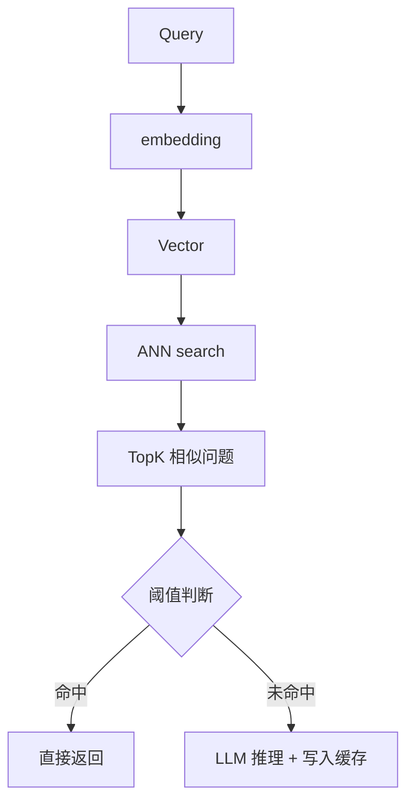
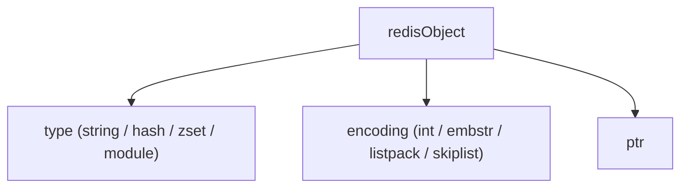
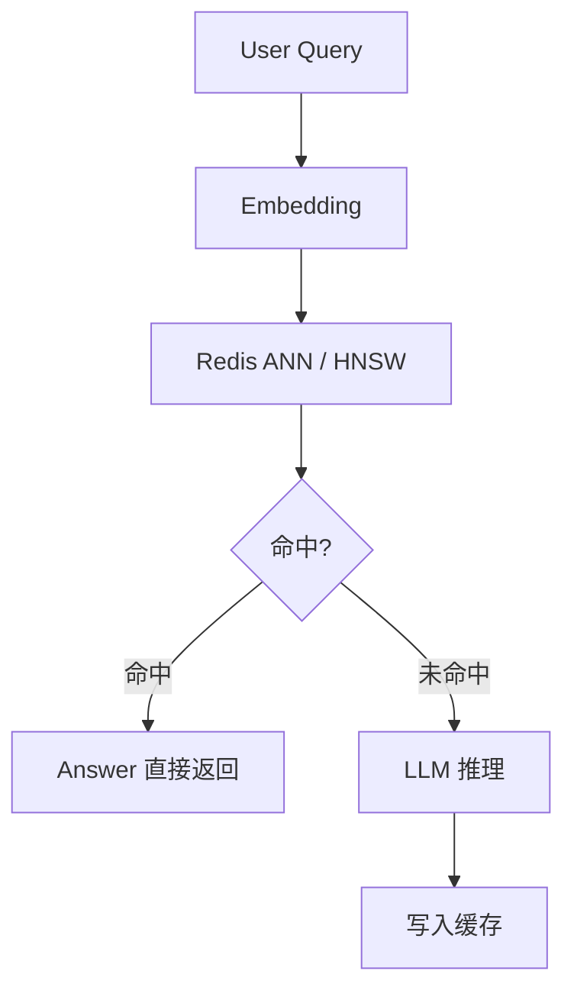

# 语义缓存与大模型应用

> 来源：cnblogs《利用语义缓存，优化AI Agent性能 - 实践》，作者 gccbuaa，原文地址见 frontmatter 的 url 字段。

在传统缓存体系中，Redis 的核心价值是 **Key 精确命中**。  
但在 **大模型 / RAG / 智能问答** 场景下，问题的本质已经发生变化：

> 用户的问题不是“是否完全一样”，而是“语义是否相近”。

这催生了一种新的缓存形态：**语义缓存（Semantic Cache）**。

### 一、Redis 语义缓存

#### 1.1 传统缓存的问题

```text
Q1: 更换轮胎需要多少钱？
Q2: 汽车换一个轮胎大概费用？
```

在 Key-Value 缓存里：

```text
key1 != key2 → cache miss
```

但在语义上：

```text
sim(Q1, Q2) ≈ 0.95 → 应该命中
```
#### 1.2 语义缓存的定义

**语义缓存 = 向量化 + 相似度检索 + Redis 高速存储**

基本流程：



### 二、Redis 发展史与为什么它能做语义缓存

#### 2.1 Redis 版本演进（关键节点）

| 版本        | 时间  | 关键能力                                                                                                        |
| ----------- | ----- | --------------------------------------------------------------------------------------------------------------- |
| Redis 2.x   | 2012  | 单线程 KV，引入基础数据结构                                                                                     |
| Redis 3.x   | 2015  | Cluster，分片与高可用                                                                                           |
| Redis 4.x   | 2017  | Modules API（模块化能力基石）                                                                                   |
| Redis 6.x   | 2020  | IO 多线程，提升网络吞吐                                                                                         |
| Redis 7.x   | 2022  | 内存 / 协议 / Cluster 优化                                                                                      |
| Redis 8.x   | 2024+ | 性能与内存模型持续优化；Query Engine、JSON、TimeSeries 与概率数据结构并入核心，新增 vector set 数据类型（预览） |
| Redis Stack | 2023  | Search / JSON / Vector（语义检索实际落地形态）                                                                  |

**真正让 Redis 能做语义缓存的，是：**

> **Redis Modules + Vector Similarity Search**

Redis 从 RediSearch 2.4（2022）开始支持**向量相似度检索**（FLAT / HNSW），这才真正具备“语义检索”能力。

##### Redis 7.x + Redis Stack 支持语义检索（2022–至今）

- Redis 核心版本：7.x
- 通过 **Redis Stack** 统一集成：
    - RediSearch
    - RedisJSON
    - Vector Search

> 工程上我们通常说：
> 
> **“Redis 7 + Redis Stack = 可用的语义检索 Redis”**

#### 什么是Redis Stack

> **Redis Stack 是 Redis 官方推出的“能力集合发行版”，在不修改 Redis 内核的前提下，通过官方模块，把搜索、JSON、向量检索等高级能力标准化、产品化。**

它不是一个新 Redis，也不是一个新版本。

**Redis Stack 为什么出现？**

过去 Redis 生态是这样的：
- 模块版本碎片化
- 编译复杂
- 线上环境难以维护
Redis Stack 的目标是：

> **把“可用于生产的模块组合”标准化**

##### Redis 内核（Redis OSS）

| 分类   | 内容                                                      |
| ---- | ------------------------------------------------------- |
| 负责   | - 内存管理  <br>- 网络 IO  <br>- 数据结构（String / Hash / ZSet …） |
| 目标   | - 极致性能  <br>- 核心最小化                                     |
| 不直接做 | - 搜索  <br>- 向量索引  <br>- JSON 查询                         |
##### Redis Stack 包含哪些组件（核心）

###### 1️⃣ RediSearch

**最重要的模块**

- 全文检索
- 二级索引
- 聚合查询
- **向量相似度检索（FLAT / HNSW）**

```text
FT.CREATE
FT.SEARCH
FT.AGGREGATE
```

语义检索能力 = **100% 来自 RediSearch**

###### 2️⃣ RedisJSON
- 原生 JSON 存储
- 支持：
    - JSONPath
    - 局部更新
- 解决 Hash 表达能力不足的问题

适合：
- RAG 元数据
- 结构化 Prompt
- 会话状态

###### 3️⃣ RedisTimeSeries（可选）
- 高性能时序数据
- 常用于：
    - 监控
    - 指标
    - 特征统计

---
###### 4️⃣ RedisBloom（可选）
- Bloom / Cuckoo Filter
- HyperLogLog
- TopK

常用于：
- 去重
- 防缓存穿透
- 热点统计

### 三、Redis 底层数据结构

#### 3.1 Redis 对象模型



Vector 本质是：

```text
module 类型对象
```
#### 3.2 向量在 Redis 中的存储

在 Redis Stack（Search 模块）中：
- 向量字段并非 String
- 而是 **专用 Vector Index**
- 支持：
    - FLAT（暴力）
    - HNSW（近似）
### 四、向量检索算法（见 RAG 篇）

> 向量检索的算法细节（FLAT、HNSW、NSW、概率跳表、参数调优）见 [[3.3 向量索引]]。
### 五、Redis 语义缓存整体架构




### 七、Go 语言实现语义缓存（工程示例）

#### 7.0 创建索引（Redis Stack）

```bash
# 创建名为 semantic_cache 的搜索索引
FT.CREATE semantic_cache
  # 索引 Redis Hash 类型的数据
  ON HASH
  # 只索引键名前缀为 "qa:" 的键；1 表示后面有 1 个前缀
  PREFIX 1 "qa:"
  # 定义字段结构
  SCHEMA
    # vector 字段：向量字段
    # HNSW：使用 HNSW 近邻索引
    # 6：后面有 6 个参数
    # TYPE FLOAT32：向量元素类型为 float32
    # DIM 768：向量维度为 768
    # DISTANCE_METRIC COSINE：使用余弦距离
    vector VECTOR HNSW 6 TYPE FLOAT32 DIM 768 DISTANCE_METRIC COSINE
    # answer 字段：文本字段，可用于全文检索/过滤
    answer TEXT
```
#### 7.1 数据结构设计

```go
type CacheItem struct {
ID       string
Vector   []float32
Question string
Answer   string
}
```

#### 7.2 向量写入 Redis

```go
func Store(ctx context.Context, rdb *redis.Client, item CacheItem) error {
vecBytes := floatsToBytes(item.Vector)
key := "qa:" + item.ID
return rdb.HSet(ctx, key, map[string]interface{}{
"question": item.Question,
"answer":   item.Answer,
"vector":   vecBytes,
}).Err()
}
```

```go
func floatsToBytes(vec []float32) []byte {
buf := new(bytes.Buffer)
for _, v := range vec {
_ = binary.Write(buf, binary.LittleEndian, v)
}
return buf.Bytes()
}
```

---

#### 7.3 向量检索（KNN）

```go
func Search(ctx context.Context, rdb *redis.Client, vector []float32) (string, float64, error) {
vecBytes := floatsToBytes(vector)
cmd := []interface{}{
"FT.SEARCH", "semantic_cache",
"*=>[KNN 1 @vector $vec AS score]",
"PARAMS", 2, "vec", vecBytes,
"SORTBY", "score",
"RETURN", 2, "answer", "score",
"DIALECT", 2,
}
res, err := rdb.Do(ctx, cmd...).Result()
if err != nil {
return "", 0, err
}
// 解析结果（略）
return answer, score, nil
}
```

---

#### 7.4 命中策略（工程关键）

```go
const HitThreshold = 0.85
if score >= HitThreshold {
return cachedAnswer
}
// fallback to LLM
```

**实践经验：**
- 技术问答：0.85～0.9
- 闲聊类：0.75～0.8
- 汽修 / 医疗：宁高勿低
### 八、语义缓存 vs 向量数据库

|维度|Redis 语义缓存|专用向量库|
|---|---|---|
|延迟|极低（<5ms）|中|
|数据规模|百万级|千万~亿|
|事务|支持|弱|
|运维|简单|偏复杂|
|适合场景|热问题|冷知识|

**结论：**

> Redis 语义缓存 ≠ 向量数据库  
> 它是 **RAG 架构里的第一层“语义 L1 Cache”**

### 九、常见工程坑

##### 向量版本漂移：

embedding 模型升级 → 缓存需失效，或者维护embedding模型版本。

##### 缓存污染:

低质量回答进入缓存

##### 阈值静态：

不同业务应动态调整

##### 并发写入：

建议异步写缓存

##### 命中率忽高忽低/相同问题结果不稳定

**原因 90% 是：**

```text
EF_RUNTIME 太小
```

`EF_RUNTIME` 是 HNSW 算法的一个关键参数，它控制查询时的搜索精度与延迟之间的权衡。 查询阶段 EF 小，等于“搜索半途就停了”
