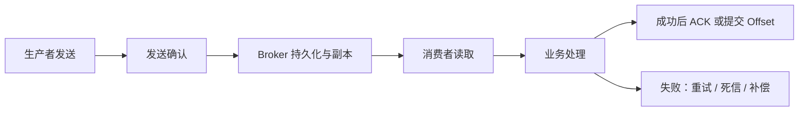

# 消息队列 · 可靠性工程：不丢、不重、不积压

> **承接**：[[消息队列基础知识]]。本篇回答 MQ 引入后最核心的工程问题——**消息在什么环节会丢、会重、会积压，分别怎么防**。
> **学完你能回答**：可靠性为什么是"链路级"的？消费者什么时候才能 ACK？重复消费怎么用幂等挡？积压先查哪？

---

## 一个中心：可靠性是整条链路的，不是某个开关

"开启持久化"只解决了很小一部分问题。可靠性应该沿着整条链路检查：



> **图释**：确认发生在业务处理成功之后；如果先确认、后处理，进程崩溃时可能造成消息丢失。

### 按链路拆解：每个环节丢什么、怎么防

| 阶段 | 可能发生什么 | 常见做法 |
|---|---|---|
| **生产者发送** | 网络超时、发送失败、发送结果未知 | 发送确认、超时重试、业务唯一键 |
| **本地业务与消息之间** | 本地事务成功，但消息没有发出去 | 本地消息表、Outbox、事务消息 |
| **Broker 存储** | Broker 宕机、磁盘损坏、数据丢失 | 持久化、副本、高可用集群、合理刷盘策略 |
| **消费者读取** | 消费者进程崩溃或网络断开 | 处理成功后 ACK/提交 Offset |
| **业务处理** | 慢、失败、第三方接口异常 | 重试、退避、死信队列、补偿任务 |
| **长期运行** | 小概率异常无人发现 | 对账、告警、监控、人工处理入口 |

---

## 防线一：不丢——"业务成功但消息没发出"怎么防

例如订单数据库已经写入成功，但发送 `OrderCreated` 消息时网络断了。下游不知道订单已创建，就会出现数据不一致。

常见解决方案：

- **本地消息表 / Outbox：** 在同一个本地事务中写入业务数据和待发送消息，再由后台任务可靠投递。
- **事务消息：** 先发送半消息，确认本地事务结果后再决定提交或回滚。
- **发送确认与重试：** 处理明确失败，但对"结果未知"的情况要结合业务唯一键防止重复。

### 消费者：什么时候才能 ACK？

推荐顺序：

```text
读取消息
  ↓
执行业务处理
  ↓
数据库提交成功
  ↓
ACK 或提交 Offset
```

不要在业务处理前确认消息，否则消费者刚确认就宕机，Broker 会认为消息已经完成，不再投递。

### 重试、死信与补偿

并不是所有失败都应该立即无限重试：

| 失败类型 | 例子 | 处理方式 |
|---|---|---|
| **临时失败** | 网络抖动、数据库短暂不可用 | 延迟重试，逐步增加间隔 |
| **业务冲突** | 库存不足、状态不合法 | 业务处理或进入人工审核 |
| **永久失败** | 消息格式错误、字段缺失 | 进入死信队列，修复后重放 |
| **未知失败** | 第三方接口结果不确定 | 查询结果、幂等重试、补偿 |

> 死信队列不是垃圾桶，而是**可观测、可修复、可重放的异常消息存储区**。

---

## 防线二：不重——重复消费与幂等

生产环境最常见的投递语义是**至少一次（At-least-once）**：消息不会轻易丢，但可能被投递多次。

例如消费者处理完订单后还没来得及 ACK 就宕机，Broker 不知道它是否成功，于是重新投递。消费者可能再次扣款、再次发货，所以业务必须具备**幂等性**。

> **幂等**：同一条业务操作执行一次和执行多次，最终结果相同。

### 常见幂等方案

| 方案 | 做法 | 适用场景 |
|---|---|---|
| **唯一索引** | 用订单号、支付单号等业务唯一键防止重复写入 | 创建订单、支付记录 |
| **状态机** | 只允许状态按合法方向流转 | 已支付 → 已发货，不能反向覆盖 |
| **消费记录表** | 记录业务事件是否处理过 | 需要完整审计的关键业务 |
| **Redis 去重** | 在短时间窗口记录处理过的业务键 | 短期去重，不适合单独承担永久可靠性 |
| **接口幂等键** | 下游接口按相同幂等键返回相同结果 | 支付、外部服务调用 |

幂等键应该优先使用**业务唯一键**，而不是只依赖 MQ 自动生成的消息 ID。因为同一业务事件重试或补偿时，可能会生成不同的消息 ID。

---

## 防线三：不积压——生产速度 > 消费速度

消息积压的本质是：

$$
\text{生产速度} > \text{消费速度}
$$

短时间的积压可以是正常缓冲，持续增长则说明系统处理能力不足或出现故障。

### 先判断积压来自哪里

| 原因 | 典型表现 | 排查方向 |
|---|---|---|
| **生产突增** | 活动、大促、爬虫或上游异常 | 生产速率、入口限流、业务流量 |
| **消费者变慢** | 慢 SQL、外部接口慢、锁竞争 | 单条耗时、线程池、数据库和下游接口 |
| **并行度不足** | 增加消费者也没有明显提升 | Queue/Partition 数量、消费组并行限制 |
| **Broker 异常** | 网络、磁盘、复制或控制器异常 | Broker 指标、磁盘、网络、集群状态 |

### 推荐处理顺序

1. **先止血：** 限流、暂停非核心生产者，避免积压继续扩大。
2. **再扩容：** 增加消费者实例或提高并行度，但先确认 Queue/Partition 足够。
3. **定位慢点：** 优化慢 SQL、第三方调用、锁竞争和批量大小。
4. **临时处理：** 对历史消息做批量消费、重放或降级处理。
5. **最后复盘：** 增加容量评估、告警、自动扩缩容和压测。

> 不要一上来只说"加消费者"。如果队列数量不足，或者消费逻辑本身是串行的，加再多实例也不会提升吞吐。

---

> **下一步**：可靠性是"怎么做对"，选型是"选哪个产品"→ [[消息队列-03-价值与选型]]
