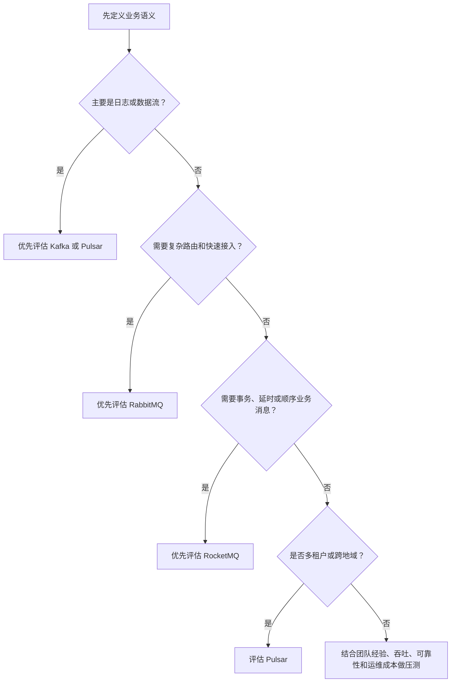

# 消息队列 · 价值与选型：该不该用，用哪个

> **承接**：[[消息队列基础知识]]。本篇回答两个决策问题——**这个场景到底该不该用 MQ？如果该用，选哪个产品？**
> **学完你能回答**：异步/削峰/解耦分别解决什么？什么时候不该用 MQ？RPC 和 MQ 怎么选？Kafka / RocketMQ / RabbitMQ / Pulsar 各适合什么？

---

## 一、为什么要用 MQ？——三个核心价值

真正使用 MQ 的理由，不是"能传消息"，而是：**让系统不必在同一个时间、以同一种速度、通过直接调用的方式完成所有工作。**

### 价值 1：异步处理——先响应，后处理

同步调用像这样：

```text
用户请求 → 订单服务 → 财务服务 → 仓储服务 → 通知服务 → 返回用户
```

只要其中一个下游服务变慢，用户就要一直等待。

异步处理改成：

```text
用户请求 → 订单服务 → 写入消息 → 快速返回
                         ↓
                  财务/仓储/通知服务稍后处理
```

![[mq-async-processing.png]]

**适合的场景：** 发邮件、发短信、生成报表、记录日志、异步审核、订单后续处理。
**必须注意：** "消息已经写入队列"不等于"业务已经完成"。如果用户需要看到最终结果，就应该返回"已受理"，而不是直接返回"处理成功"。

> **一句话：** 异步解决的是"用户不用一直等"，但会引入最终一致性和失败补偿问题。

### 价值 2：削峰——把瞬时洪水变成稳定水流

假设平时每秒只能处理 1,000 个订单，但秒杀活动开始时突然来了 10,000 个请求：

```text
没有 MQ：10,000 个请求直接冲击订单/库存服务 → 服务可能被打垮
使用 MQ：请求先进入消息队列 → 下游按照每秒 1,000 个慢慢消费
```

![[mq-traffic-peaking.png]]

消息队列相当于一个缓冲区，但它不是无限容量的水库。生产速度长期大于消费速度时，消息最终仍会积压，甚至撑爆磁盘。因此削峰必须配合限流、扩容、监控和积压处理。

> **一句话：** 削峰解决"瞬间处理不了"，不代表系统永久拥有更高的处理能力。

### 价值 3：解耦——新增消费者不用修改生产者

如果订单服务直接调用财务、仓储、物流和通知服务，调用关系会越来越复杂：

```text
订单服务 ──→ 财务服务
       ├──→ 仓储服务
       ├──→ 物流服务
       └──→ 通知服务
```

使用消息队列后：

```text
订单服务 ──→ OrderCreated 消息
                    ├──→ 财务服务
                    ├──→ 仓储服务
                    ├──→ 物流服务
                    └──→ 通知服务
```

![[mq-decoupling-example.png]]

新增风控服务时，只需要订阅 `OrderCreated`，通常不需要修改订单服务。

> **一句话：** 解耦解决的是"服务之间绑得太死"，但也让调用链变得更隐式，排查问题需要依赖链路追踪和消息监控。

### 其他常见用途（简要）

| 用途 | 怎么做 | 需要注意 |
|---|---|---|
| **分布式事务** | 用事务消息、Outbox 或事件最终一致性保证跨服务协作 | MQ 不是万能事务，仍需要回查、重试和补偿 |
| **顺序处理** | 让同一业务键进入同一 Queue/Partition，并由消费者按顺序处理 | 通常只能保证局部有序，顺序会限制并发 |
| **延时/定时任务** | 消息到指定时间后再投递或消费 | 需要处理取消、重复和时间精度问题 |
| **即时通讯** | 使用 MQTT 等发布/订阅协议传输消息 | 要考虑弱网、重连和离线消息 |
| **数据流处理** | 持续采集日志、埋点和用户行为，交给流处理引擎 | 要关注吞吐、分区、回放和存储成本 |

---

## 二、什么时候不应该用 MQ？——先判断，再上

判断一个**链路是否适合异步化**，可以先问下面 5 个问题：

| 判断问题 | 如果答案是"是" | 更可能的选择 |
|---|---|---|
| 调用方必须立刻拿到下游结果吗？ | 必须同步返回 | RPC 或 HTTP |
| 业务能接受稍后完成和最终一致吗？ | 不能接受 | 同步调用或强一致方案 |
| 短时间流量是否明显超过下游处理能力？ | 是 | MQ + 限流 + 监控 |
| 下游失败后是否需要重试、补偿或人工介入？ | 是 | MQ 很适合沉淀恢复链路 |
| 团队是否能运维 Broker、监控积压并处理故障？ | 不能 | 先不要引入复杂 MQ |

### 使用 MQ 的 3 类代价

1. **可用性下降：** 多了 Broker，Broker 挂掉、网络中断、磁盘故障都要处理。
2. **系统复杂度上升：** 需要处理丢失、重复、顺序、积压、重试和死信。
3. **数据一致性变难：** 生产者已经成功，但消费者可能还没处理，甚至最终处理失败。

> **判断口诀：** MQ 适合"可以晚一点完成，但不能丢、能重试、要解耦"的场景；不适合所有同步链路无脑改异步。

---

## 三、RPC 和消息队列怎么选？

| 对比维度 | RPC | 消息队列 |
|---|---|---|
| 通信方式 | 服务之间直接调用 | 通过 Broker 间接通信 |
| 是否等待结果 | 通常等待响应 | 通常先投递，稍后处理 |
| 是否暂存消息 | 通常不负责长期存储 | 核心能力就是暂存和投递 |
| 适合场景 | 查询、实时校验、必须立即得到结果 | 异步任务、事件通知、削峰和解耦 |
| 主要风险 | 超时、重试、级联故障 | 丢失、重复、积压、最终一致性 |
| 调用关系 | 直接、清晰 | 间接、需要监控消息链路 |

一个简单判断方法：

```text
必须马上知道结果？       → RPC
可以稍后处理？            → MQ
流量会瞬间超过下游能力？  → MQ + 限流
需要查询当前数据？        → RPC
需要广播一个业务事件？    → MQ
```

> RPC 和 MQ 不是互相替代的技术。一个完整系统里，查询链路常用 RPC，事件和异步任务常用 MQ。

---

## 四、常见产品怎么选？

先记住：**没有绝对最好的 MQ，只有更适合当前业务、团队和运维能力的 MQ。**

### 4.1 常见产品定位

| 产品 | 更常见的优势 | 适合关注的场景 | 主要代价或注意点 |
|---|---|---|---|
| **Kafka** | 高吞吐、分区扩展、日志和流处理生态成熟 | 日志、埋点、行为数据、实时流处理 | 需要理解 Partition、Consumer Group 和 Offset |
| **RocketMQ** | 业务消息能力丰富，支持事务、延时和顺序消息 | 订单、交易、业务事件、Java 生态 | 需要理解 NameServer、Broker 和消费模式 |
| **RabbitMQ** | 路由灵活、协议生态好、管理界面友好 | 中等规模业务、复杂路由、快速接入 | 高吞吐和超大规模场景要谨慎评估队列模型 |
| **Pulsar** | 云原生、计算存储分离、多租户和多订阅模式 | 多租户、跨地域、长周期消息流 | 架构和运维组件更多，学习成本更高 |
| **ActiveMQ** | 老牌 JMS 生态 | 维护已有旧系统 | 新项目应先评估社区活跃度和长期维护，不建议仅因熟悉而选用 |

### 4.2 按场景快速选择

| 业务场景 | 常见候选 | 重点关注 |
|---|---|---|
| 日志、埋点、实时数据流 | Kafka、Pulsar | 吞吐、分区扩展、回放和流处理生态 |
| 订单、支付、业务事件 | RocketMQ、Kafka、Pulsar | 事务消息、顺序、延时、可靠性和补偿 |
| 路由灵活、接入简单 | RabbitMQ | Exchange、确认机制、队列类型和运维能力 |
| 多租户、跨地域、云原生 | Pulsar | 存储分离、跨集群复制、运维复杂度 |
| 已有 Java/JMS 老系统 | ActiveMQ 或兼容方案 | 迁移成本、版本维护和长期演进 |

### 4.3 选型决策树



> **图释：** 决策树只能缩小候选范围，最终仍要用真实消息大小、峰值流量、消费模型和故障演练验证。

---

> **下一步**：选型定产品后，深入某产品的机制（Partition/Offset/Exchange）→ 见 [[消息队列学习路径与定位]]
