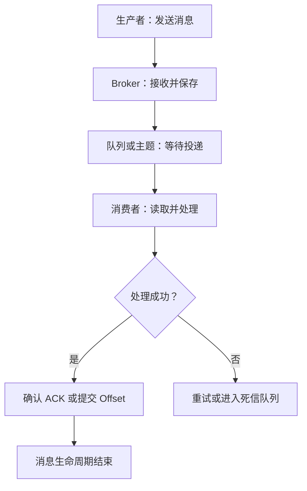

# 消息队列：一个核心矛盾

> **适合谁？** 想知道 RabbitMQ、Kafka、RocketMQ、Pulsar 到底是什么，以及什么时候应该使用消息队列的初学者。
>
> **这一篇只回答一个问题：消息队列到底解决了什么？**

---

## 先记住一句话：MQ 用一个"中间层"换来了什么

消息队列的本质，是给生产者和消费者之间增加一个**可以暂存、重试、削峰和解耦的中间层**。它不是"把消息放进去再取出来"这么简单。

用餐厅类比，一看就懂：

| 餐厅里的角色 | 消息队列中的角色 | 做什么 |
|---|---|---|
| 顾客下单 | **生产者 Producer** | 发送消息 |
| 订单小票 | **消息 Message** | 记录要处理的事情 |
| 取餐台/后厨订单区 | **Broker / Queue / Topic** | 暂存和管理消息 |
| 厨师或服务员 | **消费者 Consumer** | 读取并处理消息 |
| 取餐确认 | **ACK / Offset** | 告诉系统"我处理到这里了" |
| 失败订单区 | **重试队列 / 死信队列** | 保存暂时处理不了或多次失败的消息 |

一条消息的生命周期：



> **图释：** 一条消息只有在消费者处理成功并确认后，才算完成；失败消息不能简单丢掉，而要进入重试、死信或补偿链路。

---

## 核心主线：用"异步、解耦"换灵活，用"可靠性工程"换安心

MQ 的全部知识，都围绕这一条主线展开：

```text
为什么用？ → 异步、削峰、解耦         （引入 MQ 的动机）
代价是什么？ → 丢、重、乱、积压、不一致 （引入后必须承担的风险）
怎么解决？ → 可靠性工程：确认/持久化/重试/幂等/补偿
```

**三个价值**：异步（用户不用等）、削峰（瞬时洪峰变稳定）、解耦（新增消费者不改生产者）。
**五个代价**：丢失、重复、顺序、积压、一致性。
**可靠性五件套**：确认、持久化、重试、幂等、补偿。

> **一句话总结**：消息队列 = 在生产者和消费者之间增加一个可暂存、可重试、可削峰的中间层；它用异步和间接通信换来了更低耦合与更强缓冲能力，但也必须用确认、持久化、重试、幂等、监控和补偿来承担丢失、重复、积压与最终一致性的复杂度。

---

## 四个问题，对应四份文档

| 你想解决什么问题 | 去哪篇 | 核心内容 |
|---|---|---|
| ① MQ 由哪些角色组成？消息怎么组织？JMS/AMQP 是什么？ | [[消息队列-01-概念与协议]] | 消息流动链路、5 个角色、Queue vs Topic、JMS/AMQP |
| ② 消息为什么会丢、重、积压？怎么防？ | [[消息队列-02-可靠性工程]] | 链路可靠性、ACK 时机、幂等、死信、积压排查 |
| ③ 该不该用 MQ？RPC 和 MQ 怎么选？选哪个产品？ | [[消息队列-03-价值与选型]] | 三大价值、3 类代价、RPC vs MQ、产品选型决策树 |
| ④ 接下来怎么学？当前学到哪了？ | [[消息队列学习路径与定位]] | 四层楼模型、30 天排期、产品机制进阶 |

---

## 30 秒讲清 MQ（面试/复习用）

> 消息队列是位于生产者和消费者之间的中间件。生产者把消息发送到 Broker，消费者稍后读取并处理。它主要用于**异步处理、流量削峰和系统解耦**，也可以支持延时消息、顺序消息、事务消息和数据流处理。引入 MQ 后，必须额外处理**消息可靠性、重复消费、幂等、积压和最终一致性**。RPC 适合必须立即拿到结果的同步调用，MQ 适合可以稍后完成但需要解耦、缓冲和恢复的业务。

### 记忆助手

```text
MQ 三个价值：异步、削峰、解耦
MQ 五个难点：丢失、重复、顺序、积压、一致性
可靠性五件套：确认、持久化、重试、幂等、补偿
```

---

## 参考资料

1. [JavaGuide：消息队列基础](https://javaguide.cn/high-performance/message-queue/message-queue.html)
2. [中间件概念补充](https://www.zhihu.com/question/19730582/answer/1663627873)
3. [Kafka 官网](https://kafka.apache.org/)
4. [RocketMQ 官网](https://rocketmq.apache.org/)
5. [RabbitMQ 官网](https://www.rabbitmq.com/)
6. [Pulsar 官网](https://pulsar.apache.org/)
