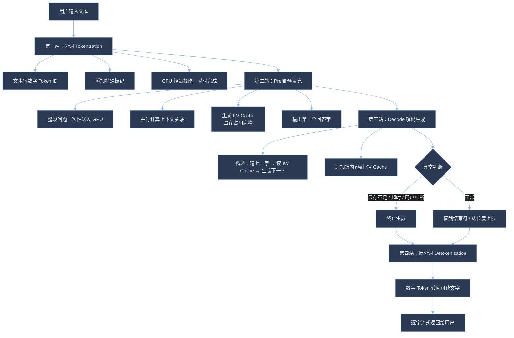

在基于 Transformer 的大模型推理中，整个**生成过程**可分为两大阶段：
1. **预填充（Prefill）阶段**：对完整的输入prompt进行**一次性并行计算**，为每一个token生成并缓存 **键（Key）和值（Value）向量**（即KV cache）。这一步只需运行**一**次，缓存内容将用于后续的生成步骤；
2. **解码（Decode）阶段**：模型以**自回归方式** **逐步** 生成新 token。每一轮仅需计算当前要生成的 token，并与此前缓存的 KV （包括用户查询和已经生成的token）进行注意力计算，从而避免对整个历史序列重复计算，显著降低了计算量。


# [Prefill和Decode ](https://www.cnblogs.com/everfight/p/20041328)

大家有没有想过，当你和 ChatGPT、豆包、通义千问聊天时，输入问题后，模型不会一次性弹出完整回答，而是逐字逐句输出。
这背后是大语言模型（LLM）推理生成内容的核心逻辑——**推理全流程**，核心分为两个截然不同的阶段：**Prefill（预填充）** 和 **Decode（解码）**。简单说，就是模型先“一口气读完、吃透你的问题”，再“逐字逐句写回答”。

## 一、生活化类比：把推理比作一场开卷考试

理解这两个阶段，先看一个好懂的比喻：

- **Prefill（预填充）= 通读材料+做笔记**：拿到试卷（你的问题）和参考资料，快速通读全文，在草稿纸上记下**要点**、逻辑关联，全程费脑力，但**不写任何答案**。
- **Decode（解码）= 逐题逐字写答案**：看着草稿纸上的笔记，逐字书写答案，每写一个字都核对上下文，过程轻松，但**只能一个字一个字写，没法跳步**。

这里的“草稿纸”，就是工程里关键的 **KV Cache（键值缓存）**——模型理解问题后的核心记忆，后续生成回答全靠它。

## 二、Prefill（预填充）：一次性吃透你的问题

**Prefill** 是推理的第一步，也是决定“你多久能看到第一个字”的关键阶段，核心是**一次性、并行处理你输入的整段问题**，完成“理解+记笔记”。

### 2.1 它具体在做4件事

1. **分词（Tokenization）**：把你的文字拆成模型能懂的最小语义单元（Token），比如中文里一个词、半个词都是1个Token，再转换成数字ID，相当于把人类语言翻译成模型的“数学语言”。
2. **全序列并行计算**：把整段输入一次性送入模型，通过自注意力机制，**同时计算所有Token之间的上下文关联**（比如理清“它”指代橘子还是桌子）。
3. **建立记忆（KV Cache）**：把计算好的关键信息（Key和Value矩阵）存入显存，生成KV Cache——相当于把理解好的问题逻辑，记在“草稿纸”上。
4. **产出第一个字**：基于最后一个Token的隐状态，生成回答的**第一个Token**，完成Prefill闭环。

### 2.2 Prefill的4个核心特点

| 特征               | 通俗说明                                     |
| ---------------- | ---------------------------------------- |
| **计算密集型**        | 要做大规模矩阵乘法，输入越长计算量越大，**GPU算力**是瓶颈（长文本会陡增） |
| **高度并行**         | 整段问题的所有Token同时计算，速度快                     |
| **显存峰值高**        | 一次性给整段输入分配KV Cache，长文本会瞬间占用大量显存          |
| **决定首字延迟（TTFT）** | 你发完问题到看到第一个字的等待时间，完全由**Prefill**决定       |
一句话总结：Prefill 是模型“**埋头苦读、吃透问题**”的过程，读得越快，你看到首字就越早。

## 三、Decode（解码）：自回归逐字写回答

Prefill生成第一个字后，模型立刻进入Decode阶段，核心是**串行、逐字生成后续回答**，全程依赖Prefill留下的KV Cache。

### 3.1 它具体在做循环操作

1. 把**刚生成的1个Token（及位置编码偏移）** 作为新输入；
2. 读取Prefill缓存的KV Cache，以及之前**Decode新增的缓存**；
3. 计算当前字与历史上下文的关联，**不用重新算旧内容**；
4. 采样生成下一个Token；
5. 把新字的信息追加到KV Cache，更新“草稿纸”；
6. 重复以上步骤，直到遇到结束符（**EOS**）、达到**长度上限**，或触发**异常终止**（显存不足、用户中断）。

### 3.2 Decode的4个核心特点

| 特征                | 通俗说明                              |
| ----------------- | --------------------------------- |
| **显存带宽密集型**       | 每次要读取庞大的KV Cache，瓶颈是**显存带宽**，不是算力 |
| **严格串行**          | 必须等第N个字生成，才能生成第N+1个字，没法并行         |
| **单步计算量小**        | 每次只处理1个Token，计算简单、耗时短             |
| **决定输出流畅度（TPOT）** | 每个字的间隔时间，决定你感知的“打字速度”             |

一句话总结：Decode 是模型“奋笔疾书写回答”的过程，受限于**显存带宽**，只能一个字一个字往外“吐”。

## 四、完整流程：从输入到输出的四站旅程



## 五、为什么必须分成两个阶段？

核心原因：**Prefill和Decode的计算模式、资源瓶颈完全不同**，强行合并会导致资源浪费、效率暴跌。

### Prefill vs Decode 核心对比

| 对比维度 | Prefill（预填充）        | Decode（解码）                |
| ---- | ------------------- | ------------------------- |
| 输入规模 | 成百上千个Token并行处理      | 每次仅1个Token串行处理            |
| 计算类型 | 大规模矩阵乘法（算力瓶颈）       | 小矩阵+大量缓存读取（带宽瓶颈）          |
| 并行性  | 高度并行，效率高            | 严格串行，效率低                  |
| 优化方向 | FlashAttention、算子融合 | KV Cache压缩、PagedAttention |

简单说：Prefill适合“批量干重活”，Decode适合“串行干轻活”，分开处理才是最高效的方式。

## 六、关键影响：理解两阶段，看懂模型体验与优化

### 6.1 显存规划：长文本的“隐形杀手”

Prefill是**显存占用高峰**，输入越长，KV Cache占用越大。比如72B大模型处理128K超长文本，KV Cache会占用数十GB显存，**显存不够直接接不了长问题**。  
不同模型架构差异明显：GQA（分组查询头）模型比普通模型，KV Cache显存占用低30%~70%，选型时要重点关注。
### 6.2 体验权衡：首字快 vs 输出顺

- **长文档问答**（长Prefill+短Decode）：优先看**首字延迟（TTFT）**，建议控制在1~3秒内；
- **日常聊天**（短Prefill+长Decode）：优先看**输出流畅度（TPOT）**，建议控制在50~100ms/字，接近人类打字速度。

### 6.3 现代优化手段：解决痛点、提升效率

| 技术              | 解决问题         | 作用阶段    | 小说明             |
| --------------- | ------------ | ------- | --------------- |
| FlashAttention  | 降显存占用、提计算速度  | Prefill | 需Ampere及以上GPU支持 |
| PagedAttention  | 避免显存碎片、高效管缓存 | Decode  | 推理引擎核心优化        |
| Chunked Prefill | 超长问题不阻塞聊天请求  | Prefill | 牺牲少量首字延迟，换并发    |
| 投机解码            | 加速逐字生成       | Decode  | 小模型打草稿、大模型批改    |
| KV Cache量化      | 降显存带宽压力      | Decode  | 轻微精度损失，需场景验证    |
| Prefix Caching  | 重复问题不用反复读    | Prefill | 缓存常见问题前缀，省算力    |

大模型和你聊天，从来不是“边读边写”，而是**先精读吃透、再慢写输出**的精密流水线：Prefill决定模型理解深度和首字速度，Decode决定回答长度和阅读流畅度。


# [Prefill、Decode、KV Cach](https://wdkang123.github.io/ai-infra-handbook/01-llm-fundamentals/02-prefill-decode-kv-cache)

如果你只把大模型理解成“**输入一段文字，然后输出一段文字**”，后面看推理服务会很容易卡住。 因为真正影响服务性能、成本和体验的，不是“这次调用有没有返回”，而是这次调用在模型内部经历了哪几个阶段。

在 LLM serving 里，最重要的第一组工程直觉就是：

- 输入不是一次性“变成答案”的
- 生成通常可以拆成 prefill 和 decode 两段
- KV cache 是 decode 能持续高效进行的关键状态
- 很多 serving 框架的优化，本质上都在围绕这三件事做管理
这一页先不追求公式和论文级细节，而是建立你后面读 vLLM、SGLang、prefix caching、batching、streaming 时最需要的系统直觉。


## 一次请求到底发生了什么

假设用户发来这样一条消息：

```
请解释一下什么是 AI Gateway，并给一个简单例子。
```

模型不会像传统函数一样直接“算出一整段答案”。 更接近真实过程的是：

1. 先读取整段输入，把输入中的 token 转成模型可以继续推理的内部状态。
2. 再从第一个输出 token 开始，一个 token 一个 token 地生成。
3. 每生成一个新 token，模型都要基于“输入上下文 + 已经生成的 token”继续决定下一个 token。

这就自然分成了两个阶段：

| 阶段      | 做什么                       | 更容易被什么影响                 |
| ------- | ------------------------- | ------------------------ |
| Prefill | 处理完整输入上下文，建立后续生成所需的状态     | 输入长度、batch 大小、prompt 复杂度 |
| Decode  | 一个 token 一个 token 地继续生成输出 | 输出长度、KV cache、调度、并发请求数   |


你可以把 prefill 想成“读题”，decode 想成“边想边写答案”。 读题阶段一次性处理较长文本；写答案阶段每次只写一点，但会持续很多步。

## Prefill：读完整个输入

prefill 阶段处理的是 prompt 中已有的 token。

如果输入很短，例如一句简单问候，prefill 很轻。 如果输入包含长文档、历史对话、检索结果、工具输出或几千 token 的系统提示，prefill 就会变重。

这解释了一个很常见的现象：

> 明明只让模型回答一句话，为什么请求一开始等了很久？

很可能不是 decode 慢，而是 prefill 在处理很长的上下文。

在真实系统里，prefill 变重通常来自：

- 聊天历史没有裁剪
- RAG 检索塞入太多片段
- system prompt 过长
- 工具调用结果被完整塞回上下文
- 多轮对话不断把旧内容追加进去

这也是为什么上下文管理不是“产品提示词问题”，而是基础设施问题。 平台层、网关层、评测层都要知道：输入 token 越长，prefill 压力越大，首 token 等待越可能变长。

## Decode：一个 token 一个 token 生成

decode 阶段负责生成新 token。

假设模型要输出：

```
AI Gateway 是位于应用和模型服务之间的一层平台组件。
```

它不是一次性吐出整句话，而是依次生成：

```
AI
 Gateway
 是
 位于
 应用
 ...
```

每一步都要基于前面的上下文继续判断下一个 token。 所以 decode 的成本和输出长度强相关。

这解释了另一个常见现象：

> prompt 不长，但回答很长时，为什么总耗时还是很高？

这通常不是 prefill 问题，而是 decode 要走很多步。

对用户体验来说，decode 还决定了 streaming 的手感：

- 第一个 token 什么时候出来，影响“有没有反应”
- 后续 token 间隔是否稳定，影响“流式输出顺不顺”
- 输出很长时，总 decode 步数会决定请求持续时间

所以后面你看 [TTFT、ITL、吞吐](https://wdkang123.github.io/ai-infra-handbook/01-llm-fundamentals/03-ttft-itl-throughput) 时，会发现这些指标几乎都能回到 prefill / decode 两段来理解。

## KV Cache：为什么不能每一步都从头算

如果 decode 每生成一个 token，都重新处理一遍完整上下文，那会非常浪费。

例如输入有 2000 个 token，模型已经生成了 100 个 token。 现在要生成第 101 个输出 token。 如果完全从头算，模型需要反复处理前面 2100 个 token 的历史。 下一步生成第 102 个 token，又要再处理 2101 个 token。

这显然不可接受。

KV cache 的作用，就是把前面 token 在 attention 中已经计算出的关键中间状态**保存**下来。 后续 decode 时，模型可以复用这些状态，不必每一步都把过去上下文完整重算。

你可以先把它理解成：

> KV cache 是模型为了继续生成而保存的“上下文计算状态”。

它带来的好处很直接：

- decode 阶段不需要每一步重算全部历史
- 长上下文续写变得可行
- streaming 输出可以更稳定

但它也带来代价：

- KV cache 会占**显存**
- 请求越多，占用越多
- 上下文越长，占用越多
- 输出越长，cache 也会继续增长

所以 KV cache 本质上是在**用空间换时间**。 这也是 LLM serving 和传统 HTTP 服务非常不同的地方：请求结束前，它不是无状态的。

## 为什么 KV Cache 会变成 serving 难题

如果只有一个用户、一个请求，KV cache 看起来只是一个**内部优化**。 但真实服务里同时有很多请求，每个请求的输入长度、输出长度、到达时间都不同。

这时候 serving 系统要回答很多问题：

- 哪些请求的 cache 还要留着
- cache 放在哪里
- 显存不够时如何淘汰或迁移
- 多个请求如何一起 batch
- streaming 请求能不能和非 streaming 请求共存
- 长上下文请求会不会拖慢短请求

这些问题就是推**理服务框架**真正复杂的地方。

所以当你听到 vLLM、PagedAttention、prefix caching、continuous batching 这些词时，不要只把它们当成“性能优化名词”。 它们背后共同面对的是：

> 如何在很多请求同时生成时，管理好 token、cache、显存和调度。

## Prefix Caching 和它有什么关系

prefix caching 是一个很容易和 KV cache 混在一起的概念。

可以先这样区分：

- KV cache：一次请求内部，为后续 decode 保存上下文状态
- Prefix caching：多个请求之间，如果前缀相同，尽量复用已经处理过的前缀

例如很多请求都共享同一段 system prompt：

```
你是一个严格、可靠的 AI Infra 学习助手……
```

如果每个请求都重新 prefill 这段相同前缀，就会浪费。 prefix caching 的目标就是识别这种**可复用部分**，减少重复 prefill。

这在真实系统里很有价值，因为很多应用都有固定模板：

- 固定 system prompt
- 固定工具说明
- 固定输出格式要求
- 固定角色设定
- 固定安全策略提示词

但 prefix caching 也不是魔法。 如果前缀稍微变化、上下文拼接顺序不稳定，命中率就会下降。 这就是为什么 prompt 模板管理、gateway 请求规范和 serving cache 策略会互相影响。


## 和 Batching 的关系

batching 是把多个请求放在一起执行，提高**硬件利用率**。

但 LLM 的 batching 比普通模型服务更麻烦。 因为每个请求可能处在不同阶段：

- 有的请求还在 prefill
- 有的请求已经开始 decode
- 有的请求快结束
- 有的请求会生成很长
- 有的请求只生成几个 token

如果调度不好，就会出现：

- 长请求拖住短请求
- 显存被长上下文占满
- streaming 输出不稳定
- GPU 利用率不高
- 用户等待时间波动很大

所以现代 LLM serving 框架往往会做更细的调度。 你后面看到 continuous batching、iteration-level scheduling 这类说法时，可以先把它们放回这个问题：

> 怎么让不同阶段、不同长度的请求共享硬件，而不是互相拖垮？


## 如何判断慢在哪一段

学习阶段最重要的不是立刻会调优，而是开始形成分段排查能力。

当一个请求慢时，不要只问：

```
模型为什么慢？
```

要拆成：

| 现象                   | 更可能的问题                   |
| -------------------- | ------------------------ |
| 等很久才出现第一个 token      | prefill 重、排队久、batch 调度慢  |
| 第一个 token 出来后，后续输出很慢 | decode 慢、并发高、cache/调度压力大 |
| 长上下文请求明显拖慢           | prefill 和 KV cache 占用压力大 |
| 短请求也波动很大             | batching、队列、限流或资源隔离问题    |
| streaming 一顿一顿       | decode 调度不稳定或下游传输链路有阻塞   |

这张表不是为了替代真实 profiler，而是让你从“感觉慢”进入“知道该看哪一段”。

## 常见误区

### 误区 1：只看总耗时

总耗时当然重要，但它太粗。 同样是 8 秒，一个请求可能是 prefill 等了 6 秒、decode 用了 2 秒；也可能是 prefill 0.5 秒、decode 7.5 秒。 两者的优化方向完全不同。

### 误区 2：以为上下文越长一定越好

长上下文能容纳更多信息，但它也会带来 prefill 成本和 KV cache 压力。 工程上经常要做取舍：该放进上下文的才放，不该放的要摘要、裁剪或外部存储。

### 误区 3：把 streaming 当成性能优化

streaming 不一定减少总计算量。 它更多改善的是用户感知：先看到第一个 token，体验会更好。 如果 decode 本身很慢，streaming 只能让用户更早看到进度，不能让模型凭空算得更少。

### 误区 4：忽略 cache 的资源成本

KV cache 提升 decode 效率，但会消耗显存。 高并发、长上下文、长输出叠加时，cache 可能成为主要资源压力。


https://gongshangzheng.github.io/llm-inference-infra-intro.html 还没有看