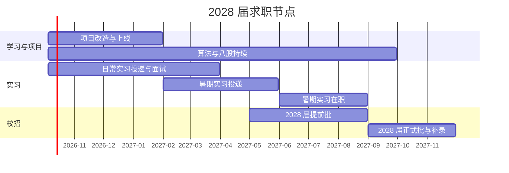

# AI Agent 方向：学习路线与求职路线

检索日期：2026 年 10 月 4 日

## 研究问题与依据

这份研究要回答三件事：

1. 2026 年下半年，Agent 开发与大模型开发这两个方向实际要什么样的人。
2. 你手上的学习材料与项目，对照这些要求差在哪里。
3. 下一步的学习与求职按什么节奏推进。

来源分三类，可信程度不同：

- **企业官方招聘信息**：腾讯招聘官网、网易校园招聘、阿里云与高德 2027 届简章、上海人工智能实验室招聘页。这类可以当作硬要求看待。
- **媒体与平台数据**：人民网四川频道、信息时报、前程无忧与脉脉数据经媒体转述、猎头行业报告。这类看趋势可以，具体数字有口径差异。
- **技术与面经**：InfoQ 对 QCon 纽约站演讲的整理、牛客面经汇总、个人博客的模拟面试复盘、若干工程博客。这类属于个人经验与二手整理，能反映考查方向，不能当作某家公司的公开面试流程。招聘平台上在挂岗位的薪资区间只能说明市场上存在这个价位，不能当作你能拿到的数字。

来源清单在第九节，每条都附链接。

---

## 一、2026 年下半年这个方向要什么样的人

### 1.1 需求总量在涨，具体坑位极少

- AI 岗位招聘呈"顶端紧缺、中端饱和、底端收缩"三层格局。AI 应用实现、基础算法调试、提示词优化这类中层岗位需求增速只有 6.2%，供需比升到 1.25，大量计算机专业应届生与跨行转岗人员扎堆投递（信息时报，2026-08-12，引脉脉与前程无忧数据）。
- 2026 年上半年人工智能工程师需供比 2.62，AI 智能体开发人才需求同比增长 244%，AI 产品经理职位数同比增速 87.7%（人民网四川频道，2026-09-15，引智联招聘数据）。
- 62.4% 的企业 AI 专项岗位校招人数在 5 人以内；招 5 到 20 人的占 31.7%；招 30 人以上的全国只有 5.9% 的企业（前程无忧校招体量调研，经媒体转述）。

三条合起来的意思是：总量确实在涨，但你投的那一个岗位很可能只招 2 到 3 人，而和你竞争的有几千人。能不能过，取决于你在同一批人里的差别，不取决于你"学过"什么。

### 1.2 岗位分成两条路线，要求完全不同

**路线一：Agent 应用开发（工程向）**

在招岗位的实际要求：

- 深圳亿道控股 Agent 算法实习生：通过预训练、微调、强化学习提升模型效果；参与 agent 项目研发，包括上下文工程、memory、skill；大模型 harness 工程实现及调优，包括 prompt 实现与调优、RAG 检索效果及性能优化；Agent eval 工作、benchmark 建设、系统化的评测方法。
- 重庆索格深材 AI 研发实习生：参与 Agent 功能设计、开发与测试；实现任务规划、工具调用、上下文管理与多 Agent 协作；参与 RAG、文档解析、知识检索与结构化信息提取；接入 MCP Server、数据库与第三方工具；调研 Codex、Claude Code、LangGraph 等产品与开源项目。
- 合肥人工智能与大数据研究院 AI agent 算法实习生：设计并开发基于 Agent 架构的智能体；基于 MCP 规范与 SKILL 插件机制开发并对接工具链；参与 RAG 系统搭建与优化，处理复杂格式文档解析、数据清洗与检索召回。

需求关键词集中在：上下文工程、工具调用、MCP、Skills、RAG、harness、评测。学历门槛本科及以上，硕士优先。判据是你的作品与工程能力。

**路线二：大模型算法 / 后训练 / Agentic RL**

在招岗位的实际要求：

- 网易 2027 届大模型算法工程师（AI Agent 方向）：负责智能体的强化学习与后训练算法研发，覆盖 SFT、奖励模型、RLHF / DPO / GRPO 全链路；设计长程任务的奖励建模机制（过程奖励、结果奖励、规则奖励）；解决稀疏奖励、错误累积与策略漂移；构建训练数据基础设施与评测基线；参与分布式强化学习训练框架的性能调优。
- 腾讯微信基础大模型算法工程师（Agent 方向）：负责微信内垂类大模型 Agent 方向的研究与实际应用，包括上下文工程、多任务分解与多工具调用；通过后训练技术解决专项问题；熟悉主流后训练技术，具备模型微调与强化学习的实践经验。
- 上海人工智能实验室智能体强化学习青年科学家：面向智能体场景开展强化学习前沿研究，探索长程规划、多轮交互、工具调用等 Agentic RL 的核心算法与训练范式；掌握 PPO、GRPO、DPO、DAPO、GSPO、SAO；熟悉 veRL、OpenRLHF、TRL、slime 等训练框架；要求博士学历，特别优秀的应届博士或博后亦可。

门槛：硕士及以上，博士优先；顶会论文为优先项；要求有"训练智能体的一手经验"。

### 1.3 两条路线的选择

你的条件是：软件工程本科，计算机技术硕士在读，没有顶会论文，没有模型训练经验，没有 GPU 训练经历，但有三到四个完整的 Agent 应用项目，其中有评测复盘、缺陷记录、消融实验。

路线二的岗位把"一手训练经验"和"训练技术报告署名"写成了硬要求，这是你短期补不上的条件。因此主攻路线一。

路线二的技术名词你要能讲清楚，并且主动在面试里提到（SFT、LoRA、DPO、GRPO、过程奖励模型、稀疏奖励、策略漂移）。作用有两个：证明你没有只盯着应用层；在面试官问到相关问题时不会断线。

### 1.4 成都的情况

- 2026 年上半年成都人工智能行业招聘岗位增速 16.5%（智联招聘，经人民网四川频道转述）。
- 成都天府软件园 2026 年秋季人才招聘释放约 3000 个岗位需求，数字媒体与游戏方向是重点专业之一。
- 成都 AI 产业的核心方向包括大模型、AIGC、多模态、AI Infra、NLP、推荐算法、Agent、具身智能、AI 芯片、AI+游戏、AI+医疗、AI+金融、AI+制造。2026 年竞争从"抢算法工程师"升级为"抢技术负责人、产品负责人、商业化负责人和复合型人才"（猎头公司行业报告）。
- 在挂岗位的价位（招聘平台数据，仅作参考）：AI 应用工程师（RAG / Agent）20–45K·13 薪；AI 平台工程师 30–50K；大模型应用开发工程师 15–25K；AI 智能体 Agent 开发工程师 30–60K·16 薪。成都四方伟业高级大模型算法工程师 25–50K/月，大模型算法工程师 8–25K/月（四川公共招聘网，2026-07-22）。

结论：成都有岗位，价位可以接受。地域不必成为第一顾虑，但大厂核心岗位仍然集中在北上深杭。

---

## 二、技术范式现在是什么样

### 2.1 Harness 成为行业共同押注的方向

InfoQ 在 2026-06-15 整理了 Thoughtworks 全球 AI 辅助软件交付负责人 Birgitta Böckeler 在 QCon 纽约站的演讲，要点如下：

- Context Engineering 是一个很强的放大器，好的工程实践与坏的结构问题会被同等放大。
- Harness 由两部分组成。前置输入包括原则、编码规范、参考文档、工具接口；后置反馈包括静态分析、日志、启动应用检查、浏览器检查。两侧都可以加入确定性的工具：CLI、bootstrap 脚本、Codemod、语言服务器的重构能力。用确定性工具增强推理型工具，Agent 做对的概率会明显提高。
- 判断一个任务该不该交给 Agent，看三个维度：出错的概率、出错的后果、你能不能发现它出错。这三个维度同时决定你给多少自主权、审查到什么程度。
- Agent 出错的概率在有缺陷的代码库里会升高，因为它会照着已有的模式走。可检测性同样取决于代码库质量：没有可靠的测试自动化，人和 Agent 都更难验证结果。
- 一家企业团队的实践记录（OpenAI 内部团队，五个月维护一个从零开始的代码库）显示：即便把上下文工程与确定性机制都做到位，代码库仍然会持续积累混乱，需要额外引入持续清理的过程。

### 2.2 Skills 与子代理改变了上下文的用法

同一篇整理里关于 Skills 与子代理的内容：

- Skills 把规则模块化，按功能分成小的子目录，不再把所有内容塞进一个大文件全量发送。
- Skills 支持按需加载，也就是渐进式披露。Agent 一开始只看到简短描述（例如"从测试环境获取日志，用于故障排查"），判断需要时才加载完整内容。这样不会在会话一开始就把上下文窗口塞满。
- Skill 是一个文件夹，除文档之外可以放脚本，可以直接让 Agent 调用机器上已经安装的 CLI 工具。很多场景因此从 MCP 转向 CLI，因为不需要额外维护一个后台进程。
- 子代理把高消耗的动作隔离开。最常见的是会话开始时研究代码库：读大量文件、筛选相关内容会消耗很多 token，交给子代理很合理，子代理只把结论汇报回主会话，中间的过程不会全部进入主上下文。
- 上下文预算进入设计约束。会话刚开始，system prompt、skills、各类工具定义就已经占用了一部分窗口。设计能力时必须同时考虑占用。

面试官在这一块的现场问法是：Skill、MCP、Function Calling、CLI 工具四者各自解决什么问题、彼此什么关系、Skill 怎么被 Agent 感知到、数量有没有上限、怎么缓解。答案的骨架是渐进式披露与分层加载。

### 2.3 评测从加分项变成岗位职责

- 离线评测、实时拦截、在线评测三层，职责不同（延迟预算与风险容忍度不同）。离线在上线前当检查用；实时拦截发现输出有问题就挡住或修正；在线评测持续监控，用来发现系统正在悄悄退化。
- 轨迹评测既看最终结果也看走的路。一条轨迹可能每一步都正确却在任务层失败；也可能结果正确，但过程里有多余的权限调用、错误的重试、不该发生的子代理交接。只看最后一句话，这些缺陷在被放大之前都是不可见的。
- 关键指标族：任务完成（成功率、升级率、放弃率）、轨迹（轮数、工具调用数、重复调用、无效参数、重试、循环深度）、性能（端到端延迟、模型延迟、工具延迟）、成本（token、模型费用、单次成功成本）、质量（评估分数、答案与来源的一致性、合规）、风险（被拒绝的动作、注入检测、敏感数据事件）。
- 一项覆盖 500 名以上企业 AI 从业者的调查显示：72% 的团队认为充分测试能提升可靠性，但只有 15% 达到较高的评测覆盖水平；覆盖 90%–100% 行为的团队中，超过三分之二报告可靠性优秀，覆盖不到一半的团队只有 32.4% 报告优秀。
- 同一调查给出的参照标准：测试至少 70% 的行为，把至少 40% 的开发时间投入测试与评测。
- 84.9% 的组织在过去六个月里发生过 AI 事故。
- 只有 5% 的企业级 Agent 进入生产（LyZer 2026 数据，经工程博客转述）。
- 行业普遍做法：把线上失败转成回归用例，改完重跑同一批数据，未通过就不允许发布。可观测性如果不接评测，就只是昂贵的日志。

### 2.4 安全与权限进入运行时

- OWASP 把"过度自主"列为大模型应用风险，三条：功能过多、权限过多、自主度过高。
- Simon Willison 在 2025 年 6 月提出的"致命三要素"：Agent 同时接触不可信内容、能访问私有数据、能对外通信，风险就在高位。企业场景一开始接入邮箱系统（通常是读写权限），这三个条件立刻同时满足。
- 权限检查要落在应用侧。过滤用户输入解决不了"Agent 从页面、文档或工具返回值里读到恶意指令"这条路径。
- 三条配套做法：确定性的策略层检查动作是否放行；不可逆动作与金融动作需要显式授权，超出批准范围时交人复核；审计日志保留重建事件所需的上下文、工具调用、权限与策略决定。

### 2.5 RAG 的位置变了

长上下文与工具调用让"先切片、再向量化、再检索"不再是唯一答案。面试官的实际观察是：简历上写"用了 RAG"不再是加分项，写它就要能说清这个场景为什么用 RAG 而不是让 Agent 自己检索文件。已有产品（例如 Claude Code）不使用 RAG，靠文件检索与读取解决代码库问题。

你的差别化做法：把差旅出行助手的混合检索实验讲成一个判据故事——在什么语料规模与查询类型下，加权 RRF 把 R@1 从 70% 拉回 86.67%、R@3 拉到 96.67%，以及为什么项目这个规模下不引入独立向量库。

### 2.6 从多 Agent 编排回归单个强 Agent

- 面试官的实际判断标准：固定路由分发到若干独立处理器再汇总，属于 workflow，不属于多 Agent。多 Agent 需要自主决策、互相调用、互相通信。
- 2026 年的研究给出更硬的证据：墨尔本大学的 Dennis 等人在旅行预订（14 节点）、Zoom 技术支持（14 节点）、保险理赔（55 节点）三个流程上做了对比，把整条流程序列化进系统提示让模型自编排，在 1200 组对话里全面优于外部编排器；编排引入了新的失败模式（路由误判、多条件同时匹配、节点指令与全局上下文冲突）。用 GPT-4.1 作为独立评审重复实验，结论一致。
- 清华的 Pan 等人提出自然语言 Agent Harness，把 Harness 的设计层从框架代码里拿出来写成可读、可移植的文档（约定、角色、阶段结构、确定性钩子、失败分类），再配一个解释该文档的运行时。
- 这条不是要你放弃多 Agent，是要求你在面试里说得出"我这个场景为什么需要多 Agent"或者"为什么不需要"。你的医疗助手有 SwarmCoordinator 按复杂度分流，这个设计本身站得住，前提是你能说清分流的判据与收益。

---

## 三、你手上的资产

### 3.1 学习材料

**覆盖完整：**

- 大模型基础 8 篇：Transformer 与 LLM 基础、推理机制与采样参数、上下文窗口与 KV Cache 与长上下文、幻觉与指令跟随、Prompt Engineering、Context Engineering、结构化输出与 Function Calling、模型选型与路由。
- Agent 工程 12 篇：概述、分类、Planning、Memory、Tool、MCP、Function Calling 实战、Skills、MCP 客户端实战、Hermes、OpenClaw 原理、Harness Engineering、Harness 综述。
- RAG 4 篇：RAG、向量索引、ReRank、Chunking-free RAG（标注为暂缓）。
- 推理 3 篇：Prefill 与 Decode 两阶段、KV Cache、vLLM。
- 后端：Redis 15 篇（架构、单线程与 IO 模型、AOF、RDB、主从复制、哨兵、哨兵集群、切片集群、String 弊端、基数统计、GEO、时间序列）+ 大模型场景 2 篇（语义缓存与 Redis Stack、缓存穿透雪崩击穿）；数据库 18 条资料（PostgreSQL JSONB、pgvector、MongoDB、Checkpoint 与持久化）；消息队列 4 篇（含大模型与 Agent 场景资料清单，覆盖 RocketMQ 的百万级多 Agent 会话协作、Redis Streams 做工具调用、Checkpoint 断点自愈、Token 熔断）。

**部分覆盖：** 微调（SFT 1 篇 + 微调智能客服项目）、Python 基础、API 设计与通信协议。

**缺口：**

- 可观测性与追踪（trace / span / thread 三层、OpenTelemetry GenAI 语义约定、Langfuse / LangSmith / Arize Phoenix）
- 生产评测体系（轨迹评测、在线采样、回归门禁、线上失败转测试用例）
- 上线部署与真实用户
- 安全清单（OWASP Agentic 风险、NIST AI Agent 标准工作、致命三要素、least agency）
- 成本量化（每任务 token 与费用、prefix 缓存命中带来的节省、step 数与 token 的增长关系、重试限流）
- 前端与全栈
- Agentic RL 实操

判断：你的阅读面已经超过绝大多数同届候选人。缺口全部在"证明"这一环，不在"知道"这一环。

### 3.2 项目

**tether（Agent 运行时 / harness）**

- 规模：源码 6715 行 24 个文件，测试 3293 行 17 个文件，设计文档 `00` 到 `08` 共 3076 行，逐字面试话术 819 行覆盖 7 类 25 个问题，缺陷记录 271 行。
- 模块齐全：仓库上下文、运行时主循环与执行编排、工具接入与调用（含 `security.py`、审批策略）、提示词形态与缓存复用、结构化记忆、上下文收缩、会话状态与恢复、评测框架。
- 价值最高的素材是缺陷记录里的 6 处平台级问题：GBK 编码导致 git 输出解码失败、子目录漏读 `.env` 导致 401、工具调用标记解析失败导致工具静默不执行、推理模式耗尽 512 输出预算、Windows 原子写偶发 PermissionError、临时工作区 `repo_root` 解析偏移导致记忆全空。这 6 条是真实的第一手调试经历。

**医疗助手（MediX Agent Swarm）**

- Skills 9 个 + LeadAgent 与 Coordinator 分层 + Milvus 知识库 + 短期会话历史与 Mem0 长期记忆 + YAML 白名单约束（warn→enforce）+ 评测集。质量优化复盘记录了 exact 从 29% 到 91% 的过程。

**差旅出行助手**

- 多意图识别（挑战集 Exact Match 99.33%）、混合检索加权 RRF（R@1 86.67% / R@3 96.67%）、Redis 偏好缓存命中 99.01%、调度并行 P50 约 3 倍。`docs/metrics-final.md` 已经把废弃口径逐条列出，这个做法本身就是一个可以讲的工程习惯。

**备用素材：** 行政助手 Agent、微调智能客服。

### 3.3 求职素材

- 一页简历（Tether + 医疗助手 + 专业技能 + 荣誉奖项）。
- 八股文两份：`八股文/Agent.md` 约 51KB、`八股文/Agent篇.md`。
- `Agent求职面试全攻略/`：10 章 HTML + 完整版 PDF。
- 日记里的主线与复习清单，算法 hot100 正在进行。

---

## 四、缺口，按"面试会被问倒的顺序"排

1. **项目没有上线，面试官无法体验。** 面试官的现场反馈是"项目如果是自己做的、没上线，可能不太感兴趣"。
2. **没有可观测性与追踪。** 讲不出 trace、span、thread 三层，没有工具截图，讲不出在线采样率。
3. **评测只做到离线的一半。** 没有轨迹评测，没有回归门禁，没有把线上失败转成测试用例的机制。
4. **成本治理停留在原理。** 能讲 prefix caching 应该放前面，但讲不出"每任务 token 与费用"和"缓存命中带来的节省比例"这两个数字。
5. **安全只到代码层。** tether 有 `security.py` 与审批策略，但你没有读过 OWASP Agentic 清单，讲不出"功能过多、权限过多、自主度过高"三条分别对应代码里的哪一处。
6. **没有全栈。** 简历没有前端，而面试官明确说招全栈。
7. **没有实习经历。**
8. **没有固定的一手信息源。**
9. **时间点可能算错。** 你按 2027 届的节奏准备，会浪费半年。

---

## 五、学习路线

### 阶段零：先把时间点算清楚

你是成都理工大学 2025–2028 计算机技术硕士，毕业时间落在 2028 年，属于 2028 届。

参照 2027 届已经发生的实际节点：

- 暑期实习招聘在 2026 年 2 月到 3 月集中启动，实习期安排在 2026 年 5 月到 8 月；百度开放 5000 个以上实习 offer、腾讯超过 1 万名、字节跳动 7000 个以上，AI 相关占比很高。
- 校招提前批从 2026 年 5 月起陆续开放，阿里云与高德的 2027 届网申在 2026 年 8 月 5 日开启，面试与笔试同期开始，Offer 从 9 月起发放。
- 正式批是 2026 年 9 月到 11 月；10 月中旬到 11 月是补录阶段。

往前推一年，你的节点是：

- 暑期实习投递：2027 年 2 月到 5 月
- 暑期实习：2027 年 6 月到 8 月
- 秋招提前批：2027 年 5 月到 8 月
- 秋招正式批：2027 年 9 月到 11 月

从现在到暑期实习投递窗口，只有大约 4 个月。这段时间里拿到的第一段实习，直接决定 2027 年春季你拿什么去投暑期实习。

### 阶段一（2026 年 10 月 – 2027 年 1 月，约 14 周）：把项目变成证明

- **第 1–2 周：统一数字口径。** 按 `tether/学习路径.md` 第四节列出的三处隐患处理，做出一张数据卡片，四列：结论、数字、来源文件、复现命令。所有对外材料只留一套口径。    差不多了 
- **第 3–4 周：给 tether 加追踪。** 接入 Langfuse 或 OpenTelemetry 的 GenAI 语义约定，输出 span、trace、thread 三层，留下截图。
- **第 5–6 周：加轨迹评测。** 在现有评测框架上补 per-step 工具选择正确率、重试次数、循环深度、无效调用数。把缺陷记录里的 6 个平台级问题各写成一个回归用例。
- **第 7–8 周：加成本卡片。** 测出每任务 token、费用、prefix 缓存命中带来的节省比例，写进 `08-评测框架与实验方法设计.md`。
- **第 9–10 周：上线。** tether 与医疗助手各做一个不需要登录的演示页面，部署到公网。给医疗助手加前端，补齐全栈缺口。
- **第 11–12 周：补安全。** 读 OWASP Agentic 风险清单与 NIST 的 AI Agent 标准工作，做一张对照表：每条风险对应 tether 或医疗助手代码里的哪一处，缺哪一处。
- **第 13–14 周：重写简历与项目讲稿。** 用"真实问题 × 现成方案的不足"这个判据先自查每个项目。
- **贯穿全程每周：** 算法 5 题（hot100 收尾加复习四轮）、项目 10 小时、投递 5 到 10 家、录一段 3 分钟项目口述。

### 阶段二（2027 年 2 月 – 5 月）：暑期实习投递

- 2 月初：简历定稿，准备两个版本（Agent 应用开发、大模型应用算法）。
- 2 月到 3 月：集中投递。参照 2027 届的实际情况，这个窗口是全年岗位最多的时段。
- 4 月到 5 月：面试与复盘。每场录音、转录、补八股。
- 如果阶段一结束还没有日常实习，一边面暑期实习一边继续投日常实习。

### 阶段三（2027 年 6 月 – 8 月）：暑期实习，目标是转正

- 大厂暑期实习的转正率约在 15% 到 30%（新东方前途出国对 2027 届的规划指南）。
- 实习期间继续面试，为秋招留后手。

### 阶段四（2027 年 8 月起）：2028 届秋招

### 明确不做

- 不刷 AI 新闻、不追新模型
- 不囤课、不漫无目的地"学框架"
- 不为 RAG 而 RAG训练
- 不搭 Agentic RL 的环境（时间投入与回报不成比例，改成能讲清楚原理与算法名字）

---

## 六、项目改造的具体做法

### 6.1 先过"这个项目为什么必须存在"这一关

判据：真实问题 × 现成方案的不足。面试官的现场问法是"如果是我，用豆包就能解决，为什么一定要做这个"。

**tether**

- 现成方案是闭源 CLI 产品。项目成立的理由：需要理解并改造运行时本身（上下文预算、记忆分层、恢复、安全边界），这在闭源产品里做不到。
- 讲的时候要主动说明它是按某个开源项目的设计复现的。你做的真实工作是复现、发现并修复 6 处平台级缺陷、跑消融实验、把数字口径统一。这条比伪称原创安全得多，也更有说服力。

**医疗助手**

- 现成方案是通用对话模型。项目成立的理由：医疗问答要求来源可追溯、要求拒答、要求约束边界、要求本地知识库不出域。
- 主动把"为什么不是直接调通用模型"这个问题自己回答一遍。

### 6.2 每个项目要能回答的追问

- 为什么用 Milvus，不用 pgvector、Qdrant、ChromaDB？数据量到多少才值得单独起向量库？
- 多 Agent 里每个 Agent 是不是同一个模型？为什么？如果换成分级模型能省多少？
- 我的多 Agent 是真的多 Agent，还是固定路由的 workflow？判据是什么？
- 意图识别 99.33% 这个数字是怎么算的？测试集怎么构建、覆盖哪些分布、指标只看了准确率还是也看了精确率与召回率、有没有回归？
- 为什么用 Redis？TTL 用来做什么？用户长期记忆为什么不能当缓存淘汰？
- 记忆怎么分层、什么该记、什么不该记、记多久、冲突怎么处理？
- 记忆放在 system prompt 的哪个位置，为什么？prefix 缓存命中怎么算？
- 上下文怎么裁剪？预算不够时先丢哪一段、哪一段永远不丢？
- 一次任务花多少 token、多少钱？重试怎么限流？
- 轨迹评测怎么做的？工具选择正确率是多少？线上失败怎么变成测试用例？
- 工具的权限边界在哪一层检查？不可逆动作怎么处理？
- Agent 怎么发现 Skill 的存在？Skill 数量有没有上限？怎么缓解？
- 你的 AI Coding 工作流是什么？AGENTS.md、Skills、上下文怎么管？

### 6.3 简历改法

- 一页不变，把"技术名词罗列"换成"问题、判据、数字、可复现"。
- 加部署链接。
- 加评测与可观测性（2026 年的筛选项）。
- 加 AI Coding 工作流。面试官的原话是"简历上的成果大家都大同小异，真正区分候选人的是过程"。
- 删掉任何答不上"为什么用它"的技术名词。面试官的实际观察是"他们喜欢堆技术，Redis、RAG、向量库、图谱、微调一通堆，然后简历上每一个技术写下来都答不出来'为什么用'"。

---

## 七、求职路线

### 7.1 渠道与节奏

- 渠道：Boss 直聘（主流，全面投递）、实习僧（实习岗位集中）、牛客（面经与内推）、官网（大厂官方入口）、内推。
- 分层投递：成都本地企业（四方伟业、康诺亚、友邦资讯、宏利金融服务中心、中科芯）→ 全国中小厂 → 大厂。
- 节奏：先投小厂拿面试经验，复盘后投中厂，最后投大厂。核心岗位招满即关，不要等截止日期。
- 时间分配：每天固定时段投递，不要攒到周末集中投。

### 7.2 面试考察的四个板块

**项目追问（三层）**

第一层：业务背景、你负责哪一块、优化过程、实际效果。第二层：为什么这样设计、代价是什么、边界在哪。第三层：换成另一种做法会怎样、什么情况下会失效、极端情况测过没有。

**Agent 与 RAG 基础**

这部分正好落在你 `八股文/Agent.md` 与 `Agent篇.md` 的覆盖范围内。需要补的是：轨迹评测、可观测性三层、成本控制的三类手段、安全清单。

**系统设计**

典型题目：设计一个处理退款请求的 Agent；为调研助手设计工具集；设计一个能在多文件代码库里定位构建缺陷、写补丁、跑集成测试的 Agent。回答要按顺序覆盖：范围（这个 Agent 做什么、绝不能做什么、哪些步骤应该用固定代码）、工具（每个工具的参数、返回值、错误形态，工具要窄不要一个万能工具）、权限（身份与权限在哪一层检查）、状态（步骤之间存什么、崩溃后什么能恢复、结果未知的动作怎么处理）、停止（步数上限、时限、不确定时怎么找人）、评测（上线前后怎么知道它有效）。

**手撕代码与基础**

Python 基础（元组与列表、装饰器、函数是不是对象）、后端基础（数据库分库分表、深分页、Redis 并发控制、消息队列选型）、算法题（hot100 范围，会出现不在 hot100 里的题）。

### 7.3 复盘机制

录音 → 转录 → 没答上的题回填到八股文 → 下一场被问到时能答。这个机制你已经在用了，继续。

### 7.4 表达

- 先说结论，再给理由。面试官反复提到的问题是"回答前面会有两句没意义的废话，要很久才抓到问题核心"。
- 用准确术语。把"那个东西"换成 `prefix caching`、`trajectory eval`、`least agency`、`渐进式披露`。有些候选人的答案本身是对的，因为没用术语，被判断成不熟。
- 不熟就说不熟。绕弯子的本质是没把握，而说多错多。
- 不要嘴硬。被钓鱼问题问到不确定的领域时，承认比硬撑安全。

---

## 八、需要立刻处理的风险

1. **时间点算错。** 你可能按 2027 届的节奏准备。按 2028 届算，你只有约 4 个月到暑期实习投递窗口。
2. **数据口径不统一。** 同一个结论有多套数字，这是面试现场最容易露馅的一处。`tether/学习路径.md` 已经列出三处隐患，包括压缩率有三个数字、重复读文件有三组数字。
3. **项目未上线。** 面试官无法体验，等于少掉一半说服力。
4. **无实习经历。** 超过 60% 的大中型企业把线上笔试与 AI 测评当作第一道筛人关卡，简历上没有垂直的 AI 项目实习与业务成果，容易被系统直接筛掉。
5. **信息源单一。** 一手信息源（官方文档与 changelog、X 上的一线开发者、Hacker News）没有固定习惯。面试官把这看作入场券。

---

## 九、来源

**企业官方招聘信息**

- 腾讯招聘：微信基础-大模型算法工程师-Agent 方向，2026-04-02 更新，https://careers.tencent.com/jobdesc.html?postId=2033866876492349440
- 网易校园招聘：大模型算法工程师（AI Agent 方向），2027 届，2026-08-15，https://campus.163.com/app/detail/index?id=4800
- 上海人工智能实验室：智能体强化学习青年科学家，2026-09-21，https://www.shlab.org.cn/joinus/detail/7687962435164522793
- 高德地图 2027 届应届生招聘简章（网申 2026-08-05 启动），https://www.upcv.tech/xiaozhao/cmshbhwu2000tm9wnihaf82t0.html
- 阿里云 2027 届应届生招聘简章，http://fjrclh.fzu.edu.cn/cmss/zpxx/62077
- 深圳亿道控股 Agent 算法实习生，2026-09-23，http://liaobu.job1001.com/mobile/jobdetail_53709275.htm
- 重庆索格深材 AI 研发实习生，2026-09-16，https://www.yingjiesheng.com/job-008-081-607.html
- 合肥人工智能与大数据研究院 AI agent 算法实习生，2026-09-01，https://job.ustc.edu.cn/Internship/list.aspx?itemid=318081
- 成都四方伟业高级大模型算法工程师，2026-07-22，https://cd.sc91.org.cn/app/home/jobdetail/2974563.shtml
- 成都四方伟业大模型算法工程师，2026-07-22，https://www.sc91.org.cn/app/home/jobdetail/2968846.shtml

**媒体与平台数据**

- 信息时报《下半年找工作，转向"AI+实体"新赛道更靠谱》，2026-08-12，https://search.xxsb.com/html/node/2026-08/12/A3.html
- 人民网四川频道《能解决什么问题比"会用什么AI"更重要》，2026-09-15，https://sc.people.com.cn/n2/2026/0915/c345167-41696077.html
- 新东方前途出国《二〇二七届人工智能专业毕业生求职规划指南》（暑期实习转正率 15%–30%），https://liuxue.xdf.cn/blog/blog_8034508.shtml
- 猎头行业报告《中国AI大模型人才报告2026》（AI 应用开发工程师 P50 年薪 45 万，同比 +30%），https://www.hendersonexecutive.com/news/179.html
- 成都猎头行业报告《2026 行业报告：游戏与 AI 人才薪酬趋势》，https://www.nfxhlt.com/news/63640.html
- 前程无忧校招 AI 岗位体量调研（62.4% 企业 AI 岗位校招人数在 5 人以内），经今日头条转述，https://www.toutiao.com/a7679019786570875432

**技术与面经**

- InfoQ《Coding Agent 技术全景图：Context Engineering、Subagents 与 Harness，一年范式转移全解析》，2026-06-15，https://www.infoq.cn/article/UFLm5D5VDPmu9Ykc9CdJ
- 牛客《大模型、Agent 面经总结》腾讯与百度岗位面经汇总，收录 2026 年 4 月面试记录，https://www.nowcoder.com/discuss/878600528970735616
- Joye Huang《一场 1 小时 19 分钟的 Agent 工程师模拟面试，我们到底聊了什么》，2026-05-12，https://www.joyehuang.me/blog/20260512---agentmockinterview/post
- 夜雨聆风《AI Agent 一面真题：RAG、智能体架构高频考点整理》，https://www.yeyulingfeng.com/a/1038774.html
- ClavePrep《Agentic AI Interview Questions 2026》（评测被描述为 2026 年招聘中最大的能力缺口），https://claveprep.com/blog/agentic-ai-interview-questions-2026
- AI App Lab《AI Agent Observability in 2026: Tracing, Evaluation, and Production Monitoring》，https://app-lab.ai/blog/ai-agent-observability
- AI Agent Insights《Reliability Now Depends on Eval Loops, Not One-Off Demos》，2026-09-01，https://insights.reinventing.ai/articles/ai-agents-reliability-evals-production-2026-09-01
- Galileo《Measuring Production Agent Performance》（覆盖 500 名以上企业 AI 从业者的调查），2026-09-22，https://galileo.ai/blog/ai-agent-metrics
- Context.dev《16 Agentic AI Trends for 2026》（含 OWASP Top 10 for Agentic Applications 与 NIST AI Agent Standards Initiative，2026-02-17），https://www.context.dev/blog/agentic-ai-trends-2026
- Zarif《Agent Engineer Interview Guide》（岗位要求信号归纳），2026-09-26，https://www.zarifautomates.com/blog/agent-engineer-interview-guide

**本地材料**

- `D:\md\AI实习\简历\基本情况.md`
- `D:\md\AI实习\tether\学习路径.md`
- `D:\md\AI实习\project\居丽叶简历项目6：差旅出行助手\docs\metrics-final.md`
- `D:\md\AI实习\project\居丽叶简历项目7：医疗助手\medix-agent-swarm\README.md`
- `D:\md\AI实习\找实习-精华总结.md`

---

## 十、这份研究的局限

- 招聘平台的薪资数据来自在挂岗位，样本与统计口径不透明，只能反映市场价位区间。
- 面经类来源是个人经验，包含的面试流程不能推广到其他公司。
- 猎头行业报告的原始数据未公开，数字需要打折看待。
- 2027 届的招聘节点是已经发生的事实，2028 届的节点按同一规律推演，实际可能有 1 到 2 个月的前移。建议在 2027 年 1 月重新核对一次目标企业的官方公告。
- 你的毕业年份是据简历中"成都理工大学 2025–2028 计算机技术"推得的 2028 届。如果实际毕业时间不同，第五节的整条时间线要重算。
